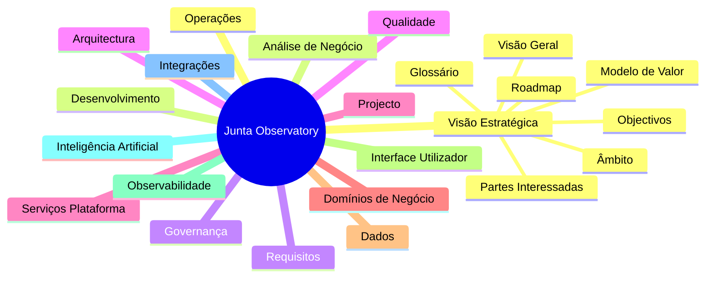

# 00 — Visão Estratégica

## Propósito

Esta secção define a visão, os objectivos, o âmbito, as partes interessadas, o glossário, o roadmap e o modelo de valor da Junta Observatory Platform. Constitui a camada fundacional de toda a documentação, alinhando a equipa de desenvolvimento, a administração das Juntas de Freguesia e restantes stakeholders quanto ao propósito e direcção estratégica da plataforma.

## Responsabilidades

- Estabelecer o contexto e a justificação para a existência da plataforma
- Definir o âmbito e os limites do sistema
- Identificar e caracterizar todas as partes interessadas
- Fornecer um glossário unificador de termos de negócio e técnicos
- Traçar o roadmap evolutivo da plataforma
- Clarificar o modelo de valor e a proposta de valor para cada stakeholder

## Documentos

| Documento | Descrição |
|---|---|
| [Visão Geral](visao-geral.md) | Descrição de alto nível da plataforma |
| [Objectivos](objetivos.md) | Objectivos estratégicos, tácticos e operacionais |
| [Âmbito](ambito.md) | Inclusão, exclusão e limites do sistema |
| [Partes Interessadas](partes-interessadas.md) | Mapeamento e caracterização dos stakeholders |
| [Glossário](glossario.md) | Glossário unificado de termos |
| [Roadmap](roteiro.md) | Roadmap evolutivo por fases |
| [Modelo de Valor](modelo-de-valor.md) | Proposta de valor e modelo de negócio |

## Relacionamentos

## Documentos Relacionados

- [01 — Análise de Negócio](../01-analise-de-negocio/index.md)
- [02 — Requisitos](../02-requisitos/index.md)
- [15 — Projecto](../15-projeto/index.md)
