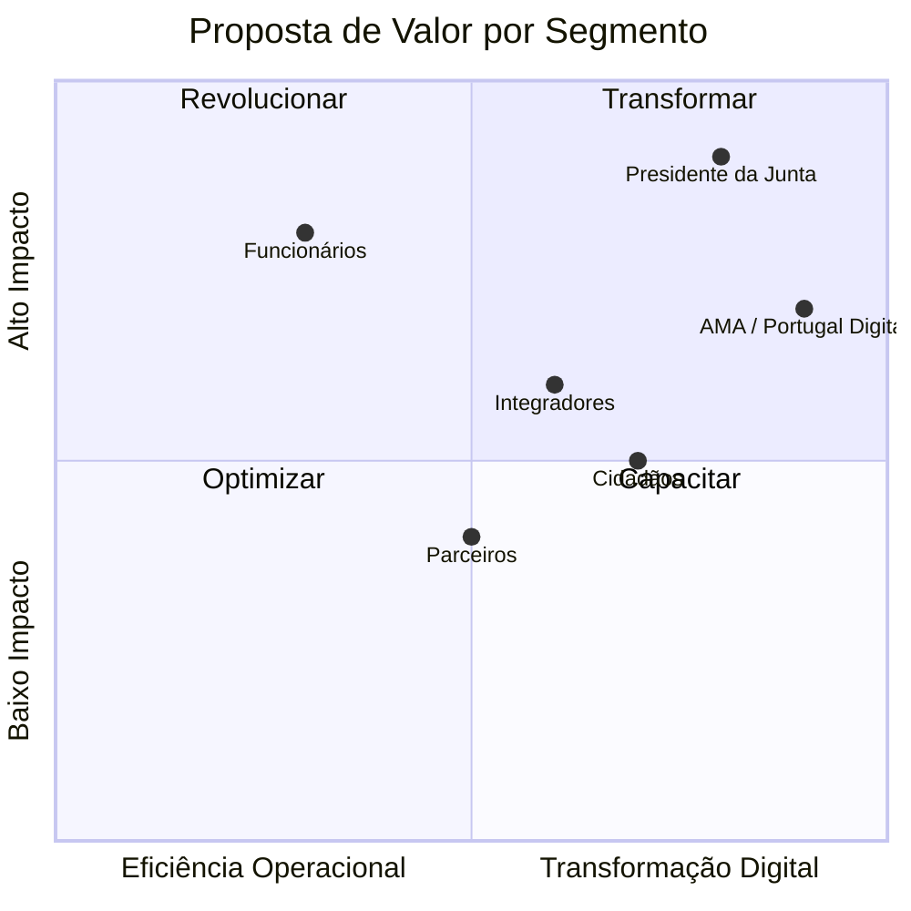

# Modelo de Valor

## Propósito

Descrever a proposta de valor da Junta Observatory Platform para cada segmento de stakeholders, o modelo de negócio e os mecanismos de criação, entrega e captura de valor.

## Responsabilidades

- Articular o valor que a plataforma oferece a cada stakeholder
- Definir o modelo de negócio SaaS multi-inquilino
- Estabelecer os mecanismos de medição de valor entregue

## Descrição Detalhada

### Proposta de Valor por Stakeholder

| Stakeholder | Proposta de Valor |
|---|---|
| **Presidente da Junta** | Visibilidade total da gestão; relatórios executivos automáticos; cumprimento de prazos legais; redução de custos operacionais; imagem de modernidade e eficiência |
| **Funcionários** | Eliminação de tarefas repetitivas e papel; interface unificada; pesquisa rápida; automatização de tarefas manuais; redução de erros |
| **Cidadãos** | Submissão digital 24/7; acompanhamento do estado do pedido; notificações proactivas; redução de deslocações presenciais |
| **AMA / Portugal Digital** | Conformidade com padrões nacionais; interoperabilidade com ePortugal; contribuição para a agenda de transformação digital |
| **Integradores/Parceiros** | API documentada e estável; ecossistema extensível via domínios plugin; marketplace para comercialização de módulos |

### Modelo de Negócio

**Modelo:** SaaS multi-inquilino por subscrição

**Planos de Subscrição (propostos):**

| Plano | Inclui | Público-Alvo |
|---|---|---|
| **Core** | Domínios core + motor workflows + gestão documental + API | Juntas de pequena dimensão (< 5.000 habitantes) |
| **Profissional** | Core + todos os domínios plugin + dashboards + SLAs + automação | Juntas de média dimensão |
| **Enterprise** | Profissional + AI + process mining + integrações nacionais + SLA premium | Juntas de grande dimensão (> 20.000 habitantes) |

**Modelo de Preço:**
- Taxa base mensal por Junta (escalonada por plano)
- Taxa variável por número de utilizadores activos
- Taxa de setup para configuração inicial e migração de dados

### Criação de Valor

A plataforma cria valor através de:

1. **Redução de TAT** — workflows automatizados reduzem o tempo de resposta
2. **Eliminação de papel** — redução de custos de impressão, arquivo e espaço físico
3. **Redução de erros** — formulários inteligentes com validação automática
4. **Visibilidade** — dashboards em tempo real para tomada de decisão
5. **Conformidade** — garantia de cumprimento regulatório
6. **Satisfação do cidadão** — canais digitais com acompanhamento

### Métricas de Valor

| Métrica | Como Medir |
|---|---|
| TAT médio por serviço | Tempo entre pedido e conclusão |
| Percentagem de processos digitais | Processos sem papel / total |
| Satisfação do funcionário | NPS interno trimestral |
| Satisfação do cidadão | Inquérito pós-atendimento |
| Taxa de adopção | Utilizadores activos / total |
| Conformidade RGPD | Não-conformidades em auditoria |

## Requisitos

- O modelo de subscrição deve ser configurável por inquilino
- A plataforma deve suportar trial gratuito por período definido
- As métricas de valor devem estar disponíveis no dashboard executivo

## Regras de Negócio

- Cada inquilino começa no plano Core com possibilidade de upgrade
- A migração entre planos não deve implicar perda de dados
- O preço deve ser transparente e comunicado antes da contratação

## Critérios de Aceitação

- A proposta de valor está validada com pelo menos três Presidentes de Junta
- O modelo de subscrição está definido e documentado
- As métricas de valor são mensuráveis a partir dos dados da plataforma

## Melhorias Futuras

- Modelo freemium para Juntas de muito pequena dimensão
- Pay-per-use para serviços específicos (ex: process mining)
- Marketplace com revenue share para domínios de terceiros

## Documentos Relacionados

- [Visão Geral](visao-geral.md)
- [Objectivos](objetivos.md)
- [Âmbito](ambito.md)
- [Partes Interessadas](partes-interessadas.md)
