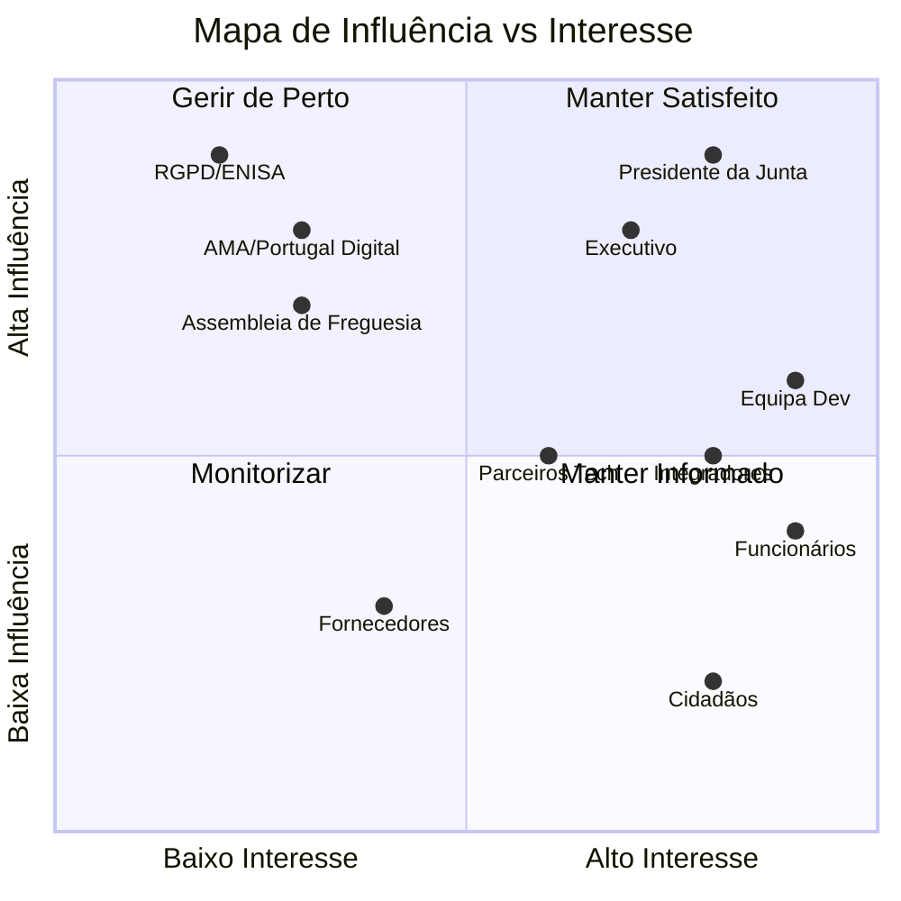

# Partes Interessadas

## Propósito

Identificar, mapear e caracterizar todas as partes interessadas (stakeholders) da Junta Observatory Platform, incluindo os seus interesses, influência,expectativas e necessidades de envolvimento.

## Responsabilidades

- Garantir que todos os stakeholders são conhecidos e considerados no design da plataforma
- Estabelecer o nível de envolvimento adequado para cada stakeholder
- Identificar conflitos de interesse e necessidades divergentes

## Descrição Detalhada

### Mapa de Stakeholders

### Tabela de Stakeholders

| ID | Stakeholder | Descrição | Interesse | Influência | Estratégia |
|---|---|---|---|---|---|
| SH-01 | Presidente da Junta | Dirigente máximo da Junta de Freguesia | Muito Alto | Muito Alta | Gerir de Perto (co-criação, validação) |
| SH-02 | Executivo (Vogais) | Vereadores com pelouros específicos | Alto | Alta | Gerir de Perto |
| SH-03 | Assembleia de Freguesia | Órgão deliberativo | Médio | Média-Alta | Manter Informado |
| SH-04 | Funcionários | Secretaria, atendimento, técnicos | Muito Alto | Média | Gerir de Perto (formação, feedback) |
| SH-05 | Cidadãos / Munícipes | Utilizadores finais dos serviços | Alto | Baixa | Manter Satisfeito (UX, acessibilidade) |
| SH-06 | RGPD / CEPD | Autoridade de protecção de dados | Baixo | Muito Alta | Manter Satisfeito (conformidade) |
| SH-07 | AMA (Portugal Digital) | Agência para a Modernização Administrativa | Médio | Alta | Manter Informado |
| SH-08 | Equipa de Desenvolvimento | Arquitectos, devs, QA, DevOps | Muito Alto | Alta | Gerir de Perto |
| SH-09 | Integradores | Parceiros que integram a plataforma | Alto | Média | Manter Informado (API docs) |
| SH-10 | Parceiros Tecnológicos | Fornecedores de infraestrutura cloud | Médio | Médio | Monitorizar |
| SH-11 | Fornecedores | Prestadores de serviços (SMS, email, etc.) | Baixo | Baixo | Monitorizar |

### Necessidades por Stakeholder

| Stakeholder | Necessidades Principais |
|---|---|
| Presidente da Junta | Visibilidade total da gestão, relatórios executivos, cumprimento de SLAs |
| Funcionários | Interface intuitiva, redução de trabalho manual, pesquisa rápida |
| Cidadãos | Submissão digital de pedidos, acompanhamento do estado, notificações |
| AMA | Conformidade com padrões nacionais, interoperabilidade com ePortugal |
| RGPD | Mecanismos de consentimento, direito ao esquecimento, auditoria |

## Requisitos

- O mapa de stakeholders deve ser revisto anualmente
- Cada stakeholder deve ter representação nos testes de aceitação
- Os requisitos de cada stakeholder devem ser rastreáveis nos RFs

## Regras de Negócio

- Decisões de produto que afectem cidadãos devem ser validadas com um painel de munícipes
- Decisões que afectem o Presidente da Junta requerem apresentação executiva

## Critérios de Aceitação

- Todos os stakeholders identificados têm representação nos testes de usabilidade
- Existe um canal de feedback operacional para cada stakeholder

## Melhorias Futuras

- Portal de feedback integrado com métricas de satisfação por stakeholder
- Comunidade de prática entre Juntas para partilha de configurações

## Documentos Relacionados

- [Visão Geral](visao-geral.md)
- [01 — Análise de Negócio](../01-analise-de-negocio/index.md)
- [02 — Requisitos](../02-requisitos/index.md)
