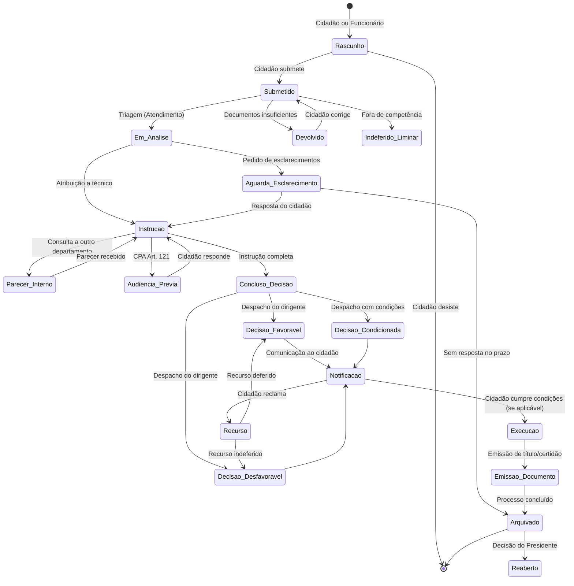

# Ciclo de Vida de Processos

## Propósito

Descrever o ciclo de vida padrão dos processos numa Junta de Freguesia, desde a submissão até ao arquivo, incluindo os estados, transições e regras aplicáveis.

## Responsabilidades

- Definir o ciclo de vida genérico aplicável a todos os processos
- Estabelecer os estados e transições permitidas
- Identificar os pontos de decisão e intervenientes em cada fase
- Servir como base para a modelação de workflows específicos

## Descrição Detalhada

### Ciclo de Vida Padrão

### Estados Detalhados

| Estado | Descrição | Responsável | Duração Típica |
|---|---|---|---|
| **Rascunho** | Pedido iniciado mas não submetido | Cidadão | Indeterminada |
| **Submetido** | Pedido submetido, aguarda triagem | Sistema | 0-2 dias |
| **Devolvido** | Pedido devolvido para correcção | Cidadão | 10 dias (prazo legal) |
| **Em Análise** | Triagem e distribuição | Atendimento | 1-3 dias |
| **Instrução** | Análise técnica e recolha de informação | Técnico | Variável |
| **Aguarda Esclarecimento** | Pedido de informação adicional | Cidadão | 10 dias (prazo legal) |
| **Parecer Interno** | Consulta a outro departamento/entidade | Departamento | 15 dias |
| **Audiência Prévia** | Direito de participação do cidadão | Cidadão | 10 dias |
| **Concluso para Decisão** | Instrução completa, pronto para despacho | Chefe/Vogal | 5 dias |
| **Decisão Favorável** | Despacho favorável ao pedido | Dirigente | — |
| **Decisão Desfavorável** | Despacho desfavorável | Dirigente | — |
| **Decisão Condicionada** | Despacho com condições | Dirigente | — |
| **Notificação** | Comunicação da decisão ao cidadão | Sistema | 0-5 dias |
| **Execução** | Cumprimento das condições (se aplicável) | Cidadão | 30 dias |
| **Emissão de Documento** | Emissão do título/certidão final | Administrativo | 1-5 dias |
| **Recurso** | Reclamação do cidadão | Dirigente | 30 dias |
| **Arquivado** | Processo concluído e arquivado | Sistema | — |
| **Reaberto** | Processo reaberto por decisão superior | Presidente | — |

### Prazos Legais (CPA)

| Acção | Prazo | Artigo CPA |
|---|---|---|
| Decisão sobre pedido | 60 dias (salvo disposição especial) | Art. 128.º |
| Audiência prévia | 10 dias para resposta | Art. 122.º |
| Devolução para correcção | 10 dias para corrigir | Art. 103.º |
| Recurso hierárquico | 30 dias para decidir | Art. 167.º |
| Arquivo | Após conclusão | Art. 95.º |

### Deferimento Tácito

Aplicável a certos tipos de processo definidos em lei especial:

- O silêncio da Administração decorrido o prazo legal constitui deferimento
- O sistema deve identificar automaticamente os processos em risco de deferimento tácito
- Alerta é enviado ao responsável 5 dias antes do prazo limite

## Requisitos

- O ciclo de vida deve ser configurável por tipo de processo (dentro dos limites legais)
- O sistema deve calcular prazos automaticamente e emitir alertas
- O deferimento tácito deve ser identificado e comunicado automaticamente
- A reabertura de processos arquivados requer justificação e autorização

## Regras de Negócio

- As transições entre estados devem respeitar o diagrama de estados definido
- Estados críticos (Decisão, Arquivado, Reaberto) requerem justificação obrigatória
- O sistema deve impedir saltos de estado inválidos

## Critérios de Aceitação

- O diagrama de estados está implementado no motor de workflows
- As transições inválidas são bloqueadas com mensagem de erro
- Os alertas de prazo são emitidos com 5 dias de antecedência
- O deferimento tácito é detectado e comunicado automaticamente

## Melhorias Futuras

- Predição de duração por tipo de processo com base em dados históricos
- Optimização automática do fluxo com base em process mining
- Workflows paralelos para processos complexos

## Documentos Relacionados

- [Regras de Negócio Globais](regras-de-negocio-globais.md)
- [04 — Serviços Plataforma / Workflow](../04-servicos-plataforma/plataforma-workflow.md)
- [08 — Observabilidade / Process Mining](../08-observabilidade/process-mining.md)
