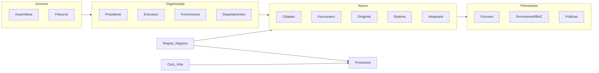

# 01 — Análise de Negócio

## Propósito

Esta secção descreve a estrutura organizacional, o modelo de governo, os actores, as permissões, as regras de negócio globais e o ciclo de vida dos processos no contexto de uma Junta de Freguesia portuguesa. Constitui a base de conhecimento de domínio que a plataforma deve modelar e suportar.

## Responsabilidades

- Modelar a estrutura organizativa das Juntas de Freguesia
- Identificar e descrever todos os actores do sistema
- Definir a matriz de permissões global
- Estabelecer as regras de negócio transversais a todos os domínios
- Descrever o ciclo de vida típico dos processos

## Documentos

| Documento | Descrição |
|---|---|
| [Organização](organizacao.md) | Estrutura organizativa, departamentos e competências |
| [Modelo de Governo](modelo-de-governo.md) | Governo executivo e deliberativo, pelouros |
| [Mapeamento de Atores](mapeamento-atores.md) | Identificação e caracterização de todos os actores |
| [Matriz de Permissões](matriz-permissoes.md) | Matriz RBAC global |
| [Regras de Negócio Globais](regras-de-negocio-globais.md) | Regras transversais a todos os domínios |
| [Ciclo de Vida de Processos](ciclo-de-vida-processos.md) | Ciclo de vida padrão dos processos na Junta |

## Relacionamentos

## Documentos Relacionados

- [00 — Visão Estratégica](../00-visao-estrategica/index.md)
- [02 — Requisitos](../02-requisitos/index.md)
- [05 — Domínios de Negócio](../05-dominios-negocio/index.md)
