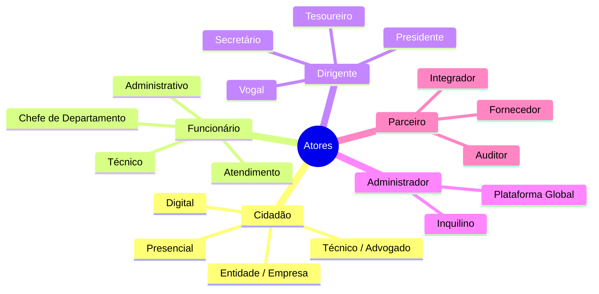

# Mapeamento de Atores

## Propósito

Identificar e caracterizar todos os actores que interagem com a Junta Observatory Platform, incluindo os seus objectivos, necessidades, competências digitais e padrões de interacção.

## Responsabilidades

- Listar exaustivamente todos os actores do sistema
- Caracterizar cada actor quanto ao seu perfil e necessidades
- Definir os casos de uso primários por actor
- Identificar actores externos (sistemas) e as suas interfaces

## Descrição Detalhada

### Actores Humanos

#### Cidadão (Munícipe)

| Atributo | Descrição |
|---|---|
| **Perfil** | Pessoa singular ou colectiva que solicita serviços à Junta |
| **Canais** | Presencial (balcão), digital (portal), telefónico |
| **Competência Digital** | Variável (baixa a alta) |
| **Autenticação** | Chave Móvel Digital, Cartão de Cidadão, Autenticação.gov |
| **Objectivos** | Submeter pedidos, acompanhar estado, obter documentos |
| **Casos de Uso** | Submeter requerimento, consultar processo, pagar taxa, agendar atendimento |

#### Funcionário

| Atributo | Descrição |
|---|---|
| **Perfil** | Colaborador da Junta com funções administrativas ou técnicas |
| **Canais** | Interface Web, notificações, email |
| **Competência Digital** | Média |
| **Autenticação** | Credenciais internas, Autenticação.gov (funcionário público) |
| **Objectivos** | Gerir processos, emitir documentos, atender cidadãos |
| **Casos de Uso** | Criar processo, tramitar processo, emitir certidão, arquivar documento |

#### Dirigente

| Atributo | Descrição |
|---|---|
| **Perfil** | Presidente, Vogal, Secretário, Tesoureiro |
| **Canais** | Interface Web, dashboards, notificações |
| **Competência Digital** | Variável |
| **Autenticação** | Credenciais internas + 2FA |
| **Objectivos** | Decidir processos, monitorizar desempenho, aprovar relatórios |
| **Casos de Uso** | Despachar processo, consultar dashboard, aprovar relatório |

### Actores Sistema

| Actor | Descrição | Interface |
|---|---|---|
| **Chave Móvel Digital** | Serviço nacional de autenticação | API REST |
| **Autenticação.gov** | Plataforma de autenticação da AP | SAML / OIDC |
| **Sistema Contabilístico** | ERP financeiro da Junta | API / Ficheiro |
| **SIG** | Sistema de Informação Geográfica | WMS / API |
| **ePortugal** | Portal de serviços públicos | API |
| **Gateways de Pagamento** | Multibanco, referências, MB Way | API |
| **SMS Gateway** | Envio de SMS | API |
| **Email Gateway** | Envio de email | SMTP / API |
| **Plataformas Nacionais** | RNID, RNPC, Conservatórias | API |

### Matriz Actor vs Funcionalidade

| Funcionalidade | Cidadão | Funcionário | Dirigente | Admin |
|---|---|---|---|---|
| Submeter pedido | ✓ | ✓ (em nome) | — | — |
| Consultar processo | ✓ | ✓ | ✓ | ✓ |
| Tramitar processo | — | ✓ | — | — |
| Despachar | — | — | ✓ | — |
| Gerir utilizadores | — | — | — | ✓ |
| Configurar sistema | — | — | — | ✓ |
| Gerir catálogo | — | ✓ | ✓ | ✓ |
| Gerir workflows | — | ✓ | — | ✓ |
| Consultar dashboards | — | ✓ | ✓ | ✓ |

## Requisitos

- O sistema deve suportar todos os actores identificados com as respectivas interfaces
- A experiência do cidadão deve ser adaptável ao seu nível de competência digital
- O funcionário deve poder actuar em nome do cidadão no atendimento presencial

## Regras de Negócio

- Um cidadão pode ser representado por terceiro (advogado, técnico) com procuração
- O funcionário pode submeter pedidos em nome do cidadão no atendimento presencial
- Cada actor tem um perfil de permissões associado (RBAC)

## Critérios de Aceitação

- Todos os actores identificados conseguem executar os seus casos de uso principais
- O cidadão consegue submeter um pedido digital de ponta a ponta
- O funcionário consegue gerir o ciclo completo de um processo

## Melhorias Futuras

- Perfil "cidadão empresarial" com gestão de múltiplos colaboradores
- Integração com o Registo Civil para verificação automática de dados do cidadão

## Documentos Relacionados

- [Organização](organizacao.md)
- [Modelo de Governo](modelo-de-governo.md)
- [Matriz de Permissões](matriz-permissoes.md)
- [02 — Requisitos Funcionais](../02-requisitos/funcionais/index.md)
