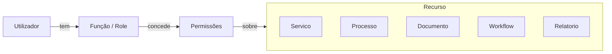

# Matriz de Permissões

## Propósito

Definir a matriz global de controlo de acesso baseado em funções (RBAC), estabelecendo as permissões associadas a cada função (role) em cada área funcional da plataforma.

## Responsabilidades

- Definir o modelo RBAC global da plataforma
- Mapear funções para permissões em cada domínio
- Garantir segregação de funções (SoD) quando exigida por lei
- Fornecer base para a configuração de autorização na plataforma

## Descrição Detalhada

### Modelo RBAC

### Funções (Roles)

| ID | Função | Nível | Descrição |
|---|---|---|---|
| R01 | **Cidadão** | Externo | Acede a serviços públicos e consulta os seus processos |
| R02 | **Representante** | Externo | Advogado/técnico que age em nome do cidadão |
| R03 | **Funcionário Atendimento** | Operacional | Regista pedidos, digitaliza documentos, informa cidadãos |
| R04 | **Funcionário Administrativo** | Operacional | Tramita processos, emite documentos, arquiva |
| R05 | **Funcionário Técnico** | Técnico | Emite pareceres técnicos, executa tarefas especializadas |
| R06 | **Chefe de Departamento** | Chefia | Supervisiona, distribui tarefas, aprova |
| R07 | **Vogal** | Dirigente | Decide sobre processos do pelouro |
| R08 | **Presidente** | Dirigente | Decisão final, delegação, representação |
| R09 | **Administrador Inquilino** | Administração | Configura a plataforma para a sua Junta |
| R10 | **Administrador Global** | Super Admin | Configuração global, gestão de inquilinos |

### Matriz de Permissões

| Área | Acção | Cidadão | Func.Atend | Func.Admin | Func.Técn | Chefe Dep | Vogal | Presidente | Admin Inq |
|---|---|---|---|---|---|---|---|---|---|
| **Serviços** | Consultar catálogo | ✓ | ✓ | ✓ | ✓ | ✓ | ✓ | ✓ | ✓ |
| | Gerir catálogo | — | — | ✓ | — | ✓ | — | — | ✓ |
| | Publicar serviço | — | — | — | — | ✓ | — | ✓ | ✓ |
| | Desactivar serviço | — | — | — | — | ✓ | — | ✓ | ✓ |
| **Processos** | Criar pedido | ✓ | ✓ | ✓ | — | ✓ | — | — | — |
| | Consultar (próprio) | ✓ | ✓ | ✓ | ✓ | ✓ | ✓ | ✓ | ✓ |
| | Consultar (qualquer) | — | — | ✓ | ✓ | ✓ | ✓ | ✓ | ✓ |
| | Tramitar | — | ✓ | ✓ | ✓ | — | — | — | — |
| | Decidir (despachar) | — | — | — | — | — | ✓ | ✓ | — |
| | Arquive | — | — | ✓ | — | ✓ | — | — | ✓ |
| **Documentos** | Consultar | ✓* | ✓ | ✓ | ✓ | ✓ | ✓ | ✓ | ✓ |
| | Criar | — | ✓ | ✓ | ✓ | ✓ | — | — | ✓ |
| | Assinar | — | — | — | — | — | ✓ | ✓ | — |
| | Eliminar | — | — | ✓ | — | ✓ | — | — | ✓ |
| **Workflows** | Consultar | — | ✓ | ✓ | ✓ | ✓ | ✓ | ✓ | ✓ |
| | Modelar | — | — | ✓ | — | ✓ | — | — | ✓ |
| | Publicar versão | — | — | — | — | ✓ | — | ✓ | ✓ |
| **Relatórios** | Consultar próprios | ✓ | ✓ | ✓ | ✓ | ✓ | ✓ | ✓ | ✓ |
| | Consultar todos | — | — | — | — | ✓ | ✓ | ✓ | ✓ |
| | Criar relatórios | — | — | ✓ | ✓ | ✓ | ✓ | ✓ | ✓ |
| **Administração** | Gerir utilizadores | — | — | — | — | — | — | — | ✓ |
| | Gerir funções | — | — | — | — | — | — | — | ✓ |
| | Configurar sistema | — | — | — | — | — | — | — | ✓ |
| | Gerir facturação | — | — | — | — | — | — | ✓ | ✓ |

* Apenas documentos do processo do próprio cidadão.

### Segregação de Funções (SoD)

Para cumprir a Lei Administrativa, as seguintes combinações de funções são **mutuamente exclusivas**:

- Quem **instrui** o processo não pode **decidir** sobre ele
- Quem **decide** o processo não pode **arquivar** definitivamente
- Quem **cria** o documento não pode **assinar** como entidade decisora
- Quem **elabora** o parecer técnico não pode ser o **despachante** do mesmo processo

## Requisitos

- O modelo RBAC deve ser configurável por inquilino
- As regras de SoD devem ser aplicadas automaticamente pelo motor de workflows
- Novas funções podem ser criadas por composição de permissões existentes
- As permissões devem ser hereditárias (função superior herda permissões das inferiores)

## Regras de Negócio

- Um utilizador pode ter múltiplas funções simultaneamente
- As restrições de SoD impedem atribuição simultânea de funções conflituantes
- A matriz de permissões é revista anualmente ou quando exigido por alteração legal

## Critérios de Aceitação

- O sistema impede a atribuição de funções conflituantes (SoD)
- A configuração de permissões pode ser feita sem código
- As permissões são avaliadas em tempo real para cada acção
- O administrador do inquilino não pode alterar as próprias permissões

## Melhorias Futuras

- Controlo de acesso baseado em atributos (ABAC) para cenários avançados
- Revisão periódica automática de acessos com relatório para auditoria
- Integração com sistemas de identidade externos (LDAP, Azure AD)

## Documentos Relacionados

- [Mapeamento de Atores](mapeamento-atores.md)
- [Regras de Negócio Globais](regras-de-negocio-globais.md)
- [03 — Arquitectura / Autorização](../03-arquitetura/autorizacao.md)
- [06 — Dados / Utilizador](../06-dados/nucleo/entidade-utilizador.md)
