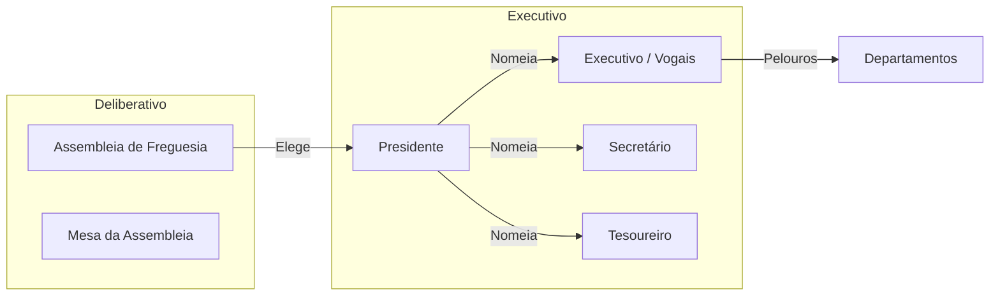
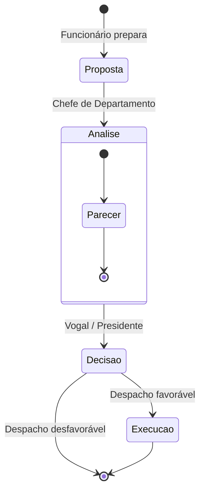

# Modelo de Governo

## Propósito

Descrever o modelo de governo de uma Junta de Freguesia, incluindo os órgãos executivo e deliberativo, o sistema de pelouros, o processo de tomada de decisão e o fluxo de delegação de competências.

## Responsabilidades

- Modelar o funcionamento do executivo da Junta de Freguesia
- Descrever o sistema de pelouros e respectivas competências
- Definir o fluxo de tomada de decisão (despacho)
- Estabelecer os níveis de delegação de competências

## Descrição Detalhada

### Órgãos

### Pelouros

Os pelouros são as áreas de responsabilidade atribuídas pelo Presidente aos Vogais do Executivo:

| Pelouro | Áreas |
|---|---|
| **Administrativo e Financeiro** | Contabilidade, tesouraria, orçamento, compras, recursos humanos |
| **Obras e Serviços Urbanos** | Obras municipais, manutenção, cemitérios, feiras e mercados |
| **Acção Social e Saúde** | Apoio social, terceira idade, juventude, voluntariado, saúde |
| **Cultura, Desporto e Tempos Livres** | Eventos culturais, actividades desportivas, biblioteca, espaços |
| **Ambiente e Sustentabilidade** | Limpeza urbana, espaços verdes, resíduos, protecção civil |
| **Educação e Juventude** | Apoio às escolas, programas juvenis, ATL |

### Delegação de Competências

O Presidente pode delegar competências nos Vogais através de **despacho de delegação**:

| Nível | Pode decidir | Exemplo |
|---|---|---|
| **Presidente** | Tudo, sem limites | Emissão de posturas municipais |
| **Vogal com delegação** | Matérias do pelouro até certo valor | Licenciamento de obras ≤ 10.000€ |
| **Chefe de Departamento** | Actos de mero expediente | Emissão de certidões |
| **Funcionário** | Actos preparatórios | Recepção de pedidos |

### Fluxo de Despacho

## Requisitos

- A plataforma deve suportar a configuração de pelouros por inquilino
- O fluxo de despacho deve ser configurável por tipo de processo
- A delegação de competências deve ser registada e validada automaticamente
- O sistema deve impedir decisões acima do nível de delegação do utilizador

## Regras de Negócio

- Cada processo deve ter um responsável pela decisão (despachante)
- O despacho pode ser favorável, desfavorável ou condicionado
- O despacho condicionado exige o cumprimento de condições antes da execução
- A ausência de decisão dentro do prazo legal constitui **deferimento tácito** (quando aplicável por lei)
- O despacho com delegação deve referenciar o despacho de delegação correspondente

## Critérios de Aceitação

- É possível configurar a árvore de pelouros e delegações para cada inquilino
- O sistema valida o nível de delegação antes de permitir uma decisão
- O fluxo de despacho é registado integralmente para auditoria

## Melhorias Futuras

- Fluxos de decisão colegial (parecer vinculativo de comissão)
- Assinatura digital qualificada para despachos
- Notificação automática ao cidadão do resultado do despacho

## Documentos Relacionados

- [Organização](organizacao.md)
- [Mapeamento de Atores](mapeamento-atores.md)
- [Matriz de Permissões](matriz-permissoes.md)
- [Regras de Negócio Globais](regras-de-negocio-globais.md)
