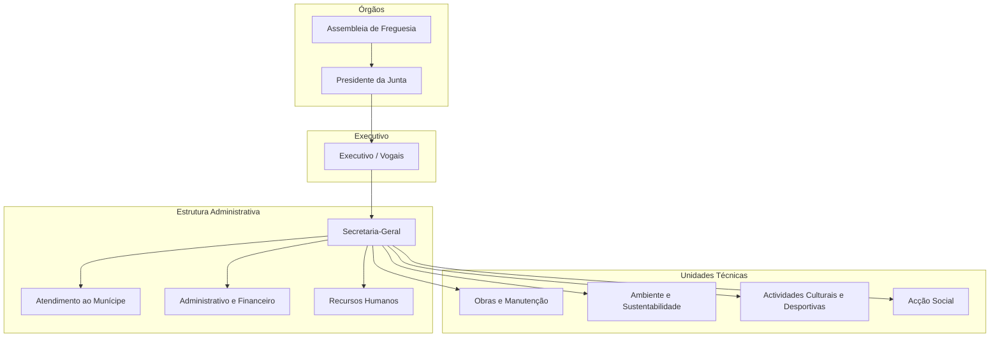

# Organização

## Propósito

Modelar a estrutura organizativa de uma Junta de Freguesia portuguesa, identificando os departamentos típicos, as suas competências e as relações hierárquicas e funcionais.

## Responsabilidades

- Descrever a estrutura organizacional padrão de uma Junta de Freguesia
- Identificar os departamentos e secções
- Mapear as competências e responsabilidades de cada unidade
- Servir como base para a configuração de cada inquilino na plataforma

## Descrição Detalhada

### Estrutura Organizacional Típica

### Departamentos

| Departamento | Sigla | Competências Principais |
|---|---|---|
| **Presidência** | PRES | Direcção estratégica, representação, comunicação |
| **Executivo / Vogais** | EXEC | Gestão de pelouros, decisão sobre processos |
| **Secretaria-Geral** | SG | Coordenação administrativa, arquivo, expediente |
| **Atendimento ao Munícipe** | ATEND | Balcão único, recepção de pedidos, informação |
| **Administrativo e Financeiro** | ADFIN | Contabilidade, tesouraria, compras, execução orçamental |
| **Recursos Humanos** | RH | Gestão de pessoal, formação, assiduidade |
| **Obras e Manutenção** | OBRAS | Obras municipais, conservação de equipamentos, cemitérios |
| **Ambiente e Sustentabilidade** | AMB | Limpeza urbana, espaços verdes, resíduos |
| **Actividades Culturais e Desportivas** | ACD | Organização de eventos, gestão de espaços, biblioteca |
| **Acção Social** | ACSOC | Apoio social, terceira idade, juventude, voluntariado |

### Configuração por Inquilino

A estrutura organizacional é **configurável por inquilino**:

- Departamentos obrigatórios: Presidência, Atendimento, Secretaria-Geral
- Departamentos opcionais: os restantes, activáveis por configuração
- É possível criar departamentos personalizados para Juntas com estrutura específica
- A hierarquia pode ser adaptada (níveis adicionais, sub-departamentos)

## Requisitos

- A plataforma deve permitir configurar a estrutura organizacional por inquilino
- A configuração deve incluir criação, edição e desactivação de departamentos
- A hierarquia deve suportar níveis adicionais de sub-departamentos

## Regras de Negócio

- Cada departamento tem obrigatoriamente um responsável (chefe de departamento)
- Um funcionário pode pertencer a múltiplos departamentos (acumulação de funções)
- A alteração da estrutura organizacional requer autorização do administrador do inquilino

## Critérios de Aceitação

- É possível configurar a estrutura organizacional para corresponder à realidade de cada Junta
- Departamentos podem ser activados e desactivados sem perda de dados históricos
- A hierarquia suporta até 4 níveis de profundidade

## Melhorias Futuras

- Importação automática da estrutura organizacional a partir de sistemas externos (RH)
- Sincronização com a Direcção-Geral das Autarquias Locais (DGAL)
- Modelo organizacional temporário para cenários de transição

## Documentos Relacionados

- [Modelo de Governo](modelo-de-governo.md)
- [Mapeamento de Atores](mapeamento-atores.md)
- [Matriz de Permissões](matriz-permissoes.md)
- [06 — Dados / Organização](../06-dados/nucleo/entidade-organizacao.md)
