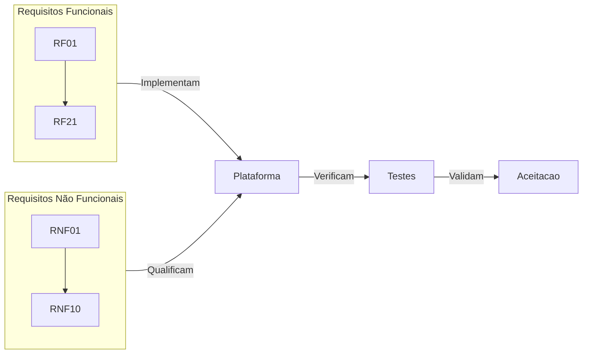

# 02 — Requisitos

## Propósito

Esta secção documenta os requisitos funcionais e não funcionais da Junta Observatory Platform, seguindo a norma IEEE 29148 para Especificação de Requisitos de Software. Os requisitos funcionais descrevem o que a plataforma deve fazer; os não funcionais definem as propriedades de qualidade do sistema.

## Responsabilidades

- Especificar de forma clara, completa e verificável todos os requisitos da plataforma
- Garantir rastreabilidade entre requisitos, casos de uso e implementação
- Servir como base para planeamento, desenvolvimento, testes e aceitação

## Estrutura

## Documentos

| Secção | Descrição |
|---|---|
| [Requisitos Funcionais](funcionais/index.md) | 21 RF numerados de RF-001 a RF-021 |
| [Requisitos Não Funcionais](nao-funcionais/index.md) | 10 RNF numerados de RNF-001 a RNF-010 |

## Documentos Relacionados

- [00 — Visão Estratégica](../00-visao-estrategica/index.md)
- [01 — Análise de Negócio](../01-analise-de-negocio/index.md)
- [03 — Arquitectura](../03-arquitetura/index.md)
- [14 — Qualidade](../14-qualidade/index.md)
