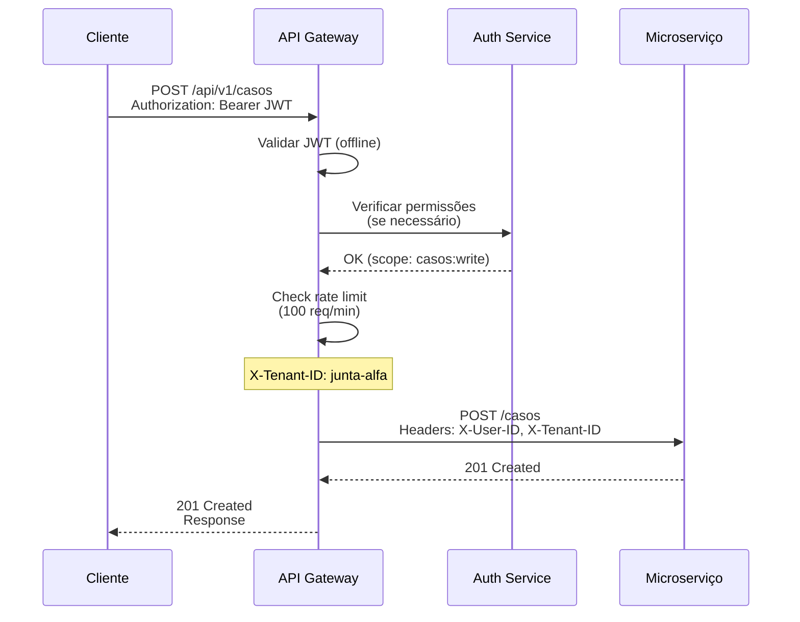

# API Gateway

## Propósito

Descrever o papel e a configuração do API Gateway na Junta Observatory Platform, responsável por rotear pedidos, autenticar, limitar taxa, registar métricas e servir como ponto único de entrada para clientes externos.

## Responsabilidades

- Roteamento de pedidos para os microserviços correctos
- Autenticação e autorização centralizada
- Rate limiting e protecção contra abuso
- Registo de métricas e logs de acesso
- Agregação de respostas (quando necessário)

## Descrição Detalhada

### Fluxo de Pedido

### Funcionalidades

| Funcionalidade | Descrição | Implementação |
|---|---|---|
| **Roteamento** | Redireccionar pedidos para o serviço correcto | Path-based routing |
| **Autenticação** | Validar JWT offline (JWKS) | Token introspection |
| **Autorização** | Verificar scopes/permissões | OAuth 2.0 scopes |
| **Rate Limiting** | Limitar pedidos por cliente/IP | Token bucket (Redis) |
| **CORS** | Gerir Cross-Origin Resource Sharing | Configurável por cliente |
| **TLS Termination** | Terminar TLS 1.3 | Certificado wildcard |
| **Request/Response Transformation** | Adicionar headers, normalizar | Lua plugins (Kong) |
| **Caching** | Cache de respostas GET | Redis cache |
| **Health Check Routing** | Redireccionar para serviços saudáveis | K8s service discovery |
| **Logging** | Registo de todos os pedidos | JSON estruturado |
| **Metrics** | Latência, taxa de erro, throughput | Prometheus |

### Configuração de Rotas

| Rota | Serviço | Métodos | Autenticação | Rate Limit |
|---|---|---|---|---|
| `/api/v1/servicos` | Catálogo | GET, POST, PUT, DELETE | Obrigatória | 1000/min |
| `/api/v1/workflows` | Workflows | GET, POST, PUT | Obrigatória | 500/min |
| `/api/v1/casos` | Casos | GET, POST | Obrigatória | 500/min |
| `/api/v1/documentos` | Documentos | GET, POST, DELETE | Obrigatória | 200/min |
| `/api/v1/pesquisa` | Pesquisa | GET | Obrigatória | 300/min |
| `/api/v1/notificacoes` | Notificações | GET, POST | Obrigatória | 200/min |
| `/api/v1/admin` | Administração | GET, POST, PUT, DELETE | Obrigatória + Admin | 100/min |
| `/api/v1/ai` | Assistente IA | POST | Obrigatória | 50/min |
| `/api/v1/public/servicos` | Catálogo (público) | GET | Opcional | 2000/min |
| `/health` | — | GET | Não | 100/min |

### Headers de Contexto

| Header | Descrição | Obrigatório |
|---|---|---|
| `X-Tenant-ID` | Identificador do inquilino | Sim |
| `X-User-ID` | Identificador do utilizador autenticado | Sim (após auth) |
| `X-Request-ID` | ID único do pedido (traceability) | Recomendado |
| `X-Correlation-ID` | ID de correlação entre sistemas | Opcional |
| `Authorization` | Bearer token JWT | Sim (excepto público) |
| `Accept-Language` | Idioma (pt-PT, en) | Opcional |

### Rate Limiting

| Plano | Limite | Burst |
|---|---|---|
| Core | 100 req/min | 20 |
| Profissional | 500 req/min | 50 |
| Enterprise | 2000 req/min | 200 |
| Público (sem auth) | 30 req/min | 10 |

## Regras de Negócio

- Todas as chamadas à API, excepto health checks e catálogo público, requerem autenticação
- O tenant ID é extraído do subdomínio ou header e validado contra o token JWT
- A limitação de taxa é aplicada por cliente (API Key) independentemente do endpoint
- A violação do rate limit retorna 429 Too Many Requests com header Retry-After

## Critérios de Aceitação

- O API Gateway processa 10.000 req/s sem degradação (p95 < 10ms)
- A autenticação JWT é validada em < 5ms (offline, sem chamada a serviço externo)
- Rate limits são aplicados correctamente por plano de subscrição
- O gateway detecta serviços com falha e remove-os do roteamento

## Documentos Relacionados

- [Diagrama de Contentores](diagrama-de-contentores.md)
- [Comunicação entre Serviços](comunicacao-entre-servicos.md)
- [Autenticação](autenticacao.md)
- [10 — API Pública](../10-integracoes/api-publica.md)
