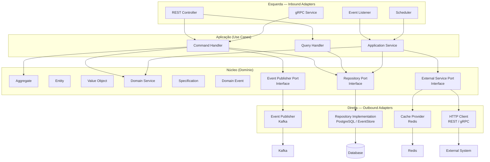

# Arquitectura Hexagonal

## Propósito

Descrever a aplicação do padrão de Arquitectura Hexagonal (Ports and Adapters) na Junta Observatory Platform, garantindo que o núcleo de domínio permanece isolado de frameworks, bases de dados e sistemas externos.

## Responsabilidades

- Definir a estrutura hexagonal padrão para cada microserviço
- Estabelecer as portas (ports) de entrada e saída
- Documentar os adaptadores (adapters) de infraestrutura
- Garantir a testabilidade do domínio sem dependências externas

## Descrição Detalhada

### Estrutura Hexagonal



### Organização de Pacotes

```
com.juntaobservatory.servico/
│
├── application/
│   ├── port/
│   │   ├── inbound/
│   │   │   ├── CriarServicoUseCase.java
│   │   │   └── ConsultarServicoUseCase.java
│   │   └── outbound/
│   │       ├── ServicoRepository.java
│   │       └── EventPublisher.java
│   ├── command/
│   │   ├── CriarServicoCommand.java
│   │   └── AtualizarServicoCommand.java
│   ├── query/
│   │   ├── ListarServicosQuery.java
│   │   └── ObterServicoQuery.java
│   └── service/
│       ├── CriarServicoService.java
│       └── ConsultarServicoService.java
│
├── domain/
│   ├── model/
│   │   ├── Servico.java              (Aggregate Root)
│   │   ├── CategoriaServico.java      (Entity)
│   │   └── Taxa.java                  (Value Object)
│   ├── event/
│   │   └── ServicoCriadoEvent.java
│   ├── spec/
│   │   └── ServicoActivoSpec.java
│   └── service/
│       └── ValidacaoServicoService.java
│
├── infrastructure/
│   ├── adapter/
│   │   ├── inbound/
│   │   │   ├── rest/
│   │   │   │   ├── ServicoController.java
│   │   │   │   └── ServicoDTO.java
│   │   │   └── kafka/
│   │   │       └── ServicoEventConsumer.java
│   │   └── outbound/
│   │       ├── persistence/
│   │       │   ├── ServicoRepositoryJPA.java
│   │       │   ├── ServicoEntity.java
│   │       │   └── ServicoMapper.java
│   │       └── messaging/
│   │           └── ServicoEventPublisherKafka.java
│   └── config/
│       ├── BeanConfiguration.java
│       └── KafkaConfig.java
│
└── shared/
    ├── dto/
    ├── exception/
    └── util/
```

### Regras da Arquitectura Hexagonal

| Regra | Descrição | Verificação |
|---|---|---|
| **Domínio sem dependências externas** | Nenhuma importação de frameworks na camada domain | ArchTest (ArchUnit) |
| **Ports são interfaces no domínio** | Ports de saída são interfaces na camada domain | ArchTest |
| **Adapters implementam ports** | Adapters de infraestrutura implementam interfaces do domínio | ArchTest |
| **Aplicação orquestra, domínio decide** | Application chama domain, não o contrário | Código |
| **Injeção de dependência** | Adapters são injectados nas ports via DI | Spring DI |
| **DTOs na fronteira** | Adaptadores convertem entre DTOs e modelos de domínio | Código |

### Benefícios

| Benefício | Descrição |
|---|---|
| **Testabilidade** | Domínio testável sem infraestrutura (mocks nas interfaces) |
| **Troca de tecnologia** | Substituir PostgreSQL por MongoDB? Apenas o adapter muda |
| **Isolamento de frameworks** | Framework web ou BD podem mudar sem afectar o domínio |
| **Clareza de responsabilidades** | Cada camada tem um papel bem definido |
| **Evolução independente** | Adapters podem evoluir em ritmos diferentes |

## Critérios de Aceitação

- A verificação ArchUnit confirma que o domínio não depende de frameworks
- Cada serviço tem testes unitários para a camada de domínio sem mocks
- É possível substituir a base de dados sem alterar a camada de domínio

## Documentos Relacionados

- [Diagrama de Componentes](diagrama-de-componentes.md)
- [Microserviços](microservicos.md)
- [12 — Normas de Código](../12-desenvolvimento/normas-codigo.md)
- [12 — Testes Unidade](../12-desenvolvimento/testes-unidade.md)
