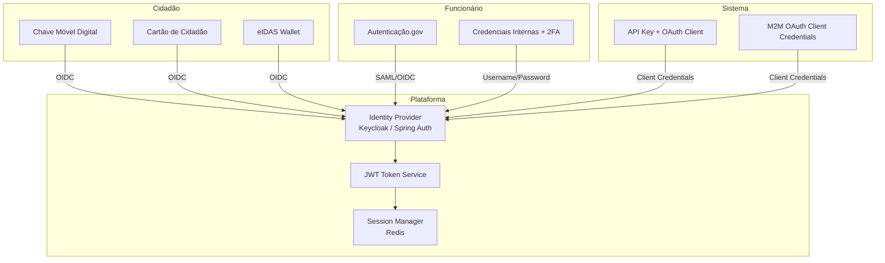

# Autenticação

## Propósito

Descrever o modelo de autenticação da Junta Observatory Platform, suportando múltiplos métodos de autenticação para diferentes tipos de utilizadores, incluindo cidadãos, funcionários públicos e sistemas externos.

## Responsabilidades

- Definir os fluxos de autenticação para cada tipo de utilizador
- Integrar com sistemas de identidade nacionais (CMD, Autenticação.gov, eIDAS)
- Gerir sessões, tokens e refresh tokens
- Garantir conformidade com os níveis de segurança eIDAS

## Descrição Detalhada

### Fluxos de Autenticação



### Métodos de Autenticação

| Método | Utilizador | Nível eIDAS | Fluxo | Tecnologia |
|---|---|---|---|---|
| **Chave Móvel Digital** | Cidadão | Substancial | OIDC Authorization Code + PKCE | REST |
| **Cartão de Cidadão** | Cidadão | Alto | OIDC com leitor de CC | REST / Local |
| **eIDAS Wallet** | Cidadão UE | Alto | OIDC | REST |
| **Autenticação.gov** | Funcionário | Substancial | SAML 2.0 / OIDC | SAML |
| **Credenciais Internas** | Funcionário | Baixo | Username + Password + 2FA | Formulário |
| **API Key + OAuth** | Sistema | — | Client Credentials | OAuth 2.0 |
| **M2M** | Microserviço | — | mTLS + JWT | gRPC |

### Token JWT

```json
{
  "iss": "https://auth.juntaobservatory.pt",
  "sub": "a1b2c3d4-e5f6-7890-abcd-ef1234567890",
  "aud": ["https://api.juntaobservatory.pt"],
  "exp": 1712345678,
  "iat": 1712342078,
  "tenant_id": "junta-alfa",
  "user_id": "u-98765",
  "roles": ["funcionario_atendimento", "chefe_departamento"],
  "permissions": ["casos:read", "casos:write", "documentos:read"],
  "auth_method": "cmd",
  "eidas_level": "substantial",
  "name": "João Silva",
  "email": "joao.silva@junta-alfa.pt"
}
```

### Políticas de Token

| Parâmetro | Valor | Justificação |
|---|---|---|
| Access Token TTL | 60 minutos | Equilíbrio segurança/UX |
| Refresh Token TTL | 24 horas (confidencial) | Renovação sem reautenticação |
| Refresh Token TTL | 7 dias (público) | Aplicações móveis |
| JWT Algorithm | RS256 | RSA com chave assimétrica |
| JWKS Rotation | A cada 90 dias | Boa prática |
| Session Timeout | 8 horas (inactividade) | Segurança |
| Max Sessions | 5 por utilizador | Prevenir abuso |

### 2FA para Funcionários

| Factor | Implementação |
|---|---|
| **Algo que sabe** | Password (mín. 12 chars, complexidade) |
| **Algo que tem** | TOTP (Google Authenticator / Authy) |
| **Algo que é** | (opcional) Cartão de Cidadão / biometria |

## Regras de Negócio

- Cidadãos autenticam-se exclusivamente via CMD, CC ou eIDAS (sem passwords)
- Funcionários autenticam-se via Autenticação.gov (quando disponível) ou credenciais internas + 2FA
- Sistemas externos autenticam-se via OAuth 2.0 Client Credentials
- O refresh token é revogado após utilização (rotation)

## Critérios de Aceitação

- Autenticação via CMD é concluída em menos de 5 segundos
- O JWT inclui tenant_id, roles e permissions para autorização offline
- A rotação de chaves JWKS não provoca downtime
- 2FA é activado para todos os funcionários com acesso administrativo

## Documentos Relacionados

- [Autorização](autorizacao.md)
- [Gestão de Identidade](gestao-de-identidade.md)
- [API Gateway](api-gateway.md)
- [10 — Chave Móvel Digital](../10-integracoes/chave-movel-digital.md)
- [10 — Autenticação.gov](../10-integracoes/autenticacao-gov.md)
