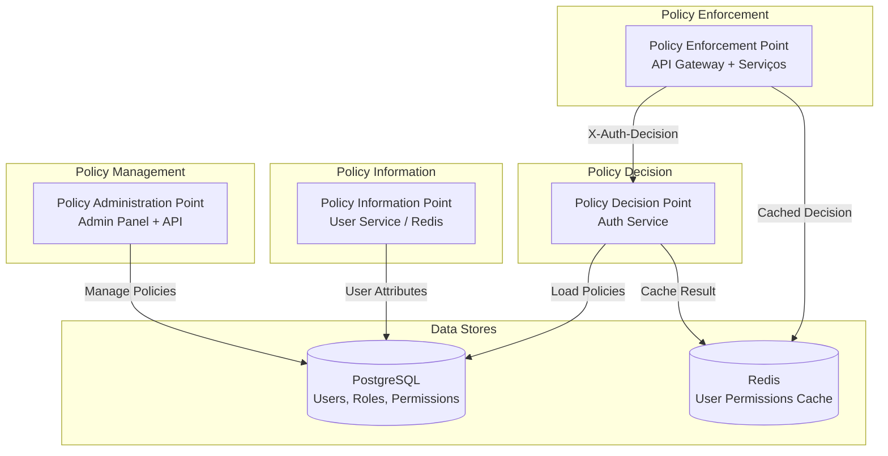
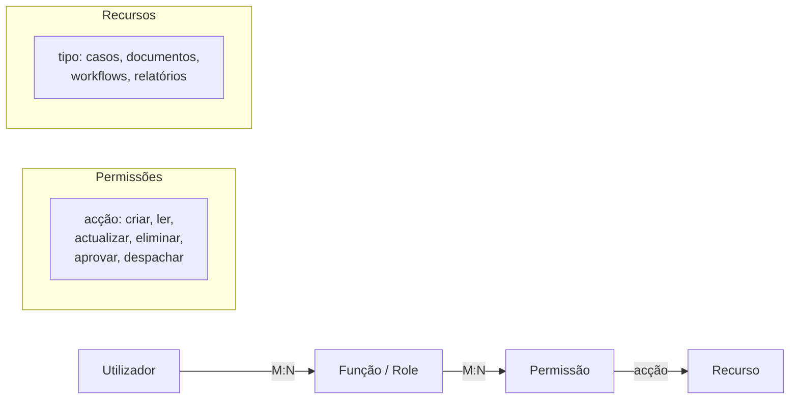
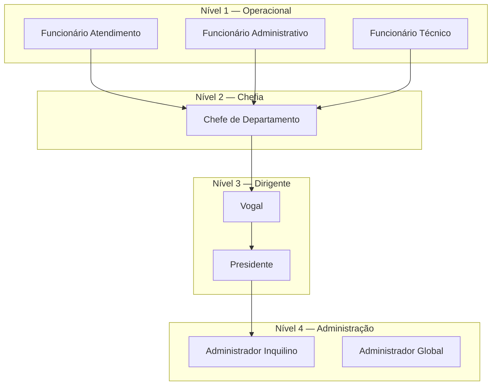

# Autorização

## Propósito

Descrever o modelo de autorização da Junta Observatory Platform, baseado em RBAC (Role-Based Access Control) com suporte a segregação de funções (SoD) e políticas de controlo de acesso a recursos.

## Responsabilidades

- Definir o modelo RBAC global
- Implementar segregação de funções para conformidade legal
- Gerir políticas de acesso a nível de recurso
- Fornecer avaliação de permissões em tempo real

## Descrição Detalhada

### Arquitectura de Autorização



### Modelo RBAC



### Hierarquia de Funções



### Segregação de Funções (SoD)

| Função A | Função B | Conflito | Razão |
|---|---|---|---|
| Funcionário Administrativo | Vogal | Segregação instrução/decisão | CPA |
| Funcionário Técnico (parecer) | Vogal (despacho) | Segregação parecer/decisão | CPA |
| Chefe de Departamento | Vogal | Segregação supervisão/decisão | CPA |
| Administrador Inquilino | Qualquer função operacional | Segregação configuração/execução | Boa prática |

### Políticas de Acesso a Recursos

| Recurso | Acção | Funções | Condição |
|---|---|---|---|
| Caso | criar | Atendimento, Admin, Chefe | — |
| Caso | consultar (próprio) | Cidadão | Dono do caso |
| Caso | consultar (qualquer) | Chefe, Vogal, Presidente, Admin | — |
| Caso | instruir | Func. Administrativo, Func. Técnico | Atribuído ao utilizador |
| Caso | decidir (despachar) | Vogal, Presidente | Pelouro corresponde ao caso |
| Documento | consultar | Todas as funções | Associado ao caso com acesso |
| Documento | eliminar | Administrador | Soft delete obrigatório |
| Workflow | modelar | Administrador, Chefe | — |
| Workflow | publicar | Administrador | — |
| Relatório | gerar | Chefe, Vogal, Presidente, Admin | — |
| Relatório | gerar (executivo) | Presidente, Admin | — |

### Avaliação de Permissões

```java
// Exemplo de avaliação de permissão
boolean podeAceder = authorizationService
    .user(userId)
    .tenant(tenantId)
    .action("casos:decidir")
    .resource("caso", casoId)
    .attribute("pelouro", pelouroUtilizador)
    .attribute("departamento", departamentoCaso)
    .evaluate();
```

### Cache de Permissões

| Cache | TTL | Quando Invalidar |
|---|---|---|
| Permissões do utilizador | 5 minutos | Alteração de role/permissão |
| Funções do utilizador | 10 minutos | Nova atribuição |
| Políticas de SoD | 60 minutos | Alteração de política |
| Decisão de autorização | 2 minutos | Contexto específico |

## Regras de Negócio

- A avaliação de permissões é feita em tempo real para cada acção
- A cache de permissões é invalidada quando as funções do utilizador mudam
- Nenhum utilizador pode alterar as suas próprias permissões
- O Administrador Global tem acesso a todos os inquilinos (apenas para suporte técnico)

## Critérios de Aceitação

- A avaliação de autorização demora menos de 2ms (cache hit) / 20ms (cache miss)
- As regras de SoD impedem a atribuição de funções conflituantes
- É possível auditar todas as decisões de autorização (permitir/negar)
- A alteração de permissões propaga para todos os serviços em menos de 60 segundos

## Documentos Relacionados

- [Autenticação](autenticacao.md)
- [Gestão de Identidade](gestao-de-identidade.md)
- [API Gateway](api-gateway.md)
- [01 — Matriz de Permissões](../01-analise-de-negocio/matriz-permissoes.md)
- [04 — Plataforma / Utilizadores](../04-servicos-plataforma/plataforma-utilizadores.md)
