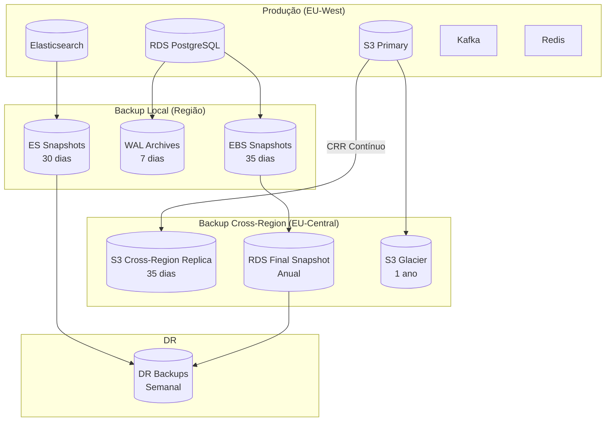

# Backup

## Propósito

Definir a política e estratégia de backup da Junta Observatory Platform, garantindo a capacidade de recuperação de dados em caso de falha, corrupção ou desastre.

## Responsabilidades

- Definir as políticas de backup por tipo de dados
- Estabelecer schedules e períodos de retenção
- Garantir a integridade e testabilidade dos backups

## Descrição Detalhada

### Política de Backup por Tipo de Dados

| Tipo de Dados | Método | Frequência | Retenção | Armazenamento |
|---|---|---|---|---|
| **PostgreSQL (RDS)** | Snapshots automáticos + WAL contínuo | Snapshot: 6h / WAL: 5 min | Snapshots: 35 dias / WAL: 7 dias | S3 (encriptado) |
| **Event Store (RDS)** | Snapshots automáticos + WAL | Snapshot: 6h / WAL: 5 min | Snapshots: 35 dias / WAL: 30 dias | S3 (encriptado) |
| **Kafka (MSK)** | Replicação entre clusters | Contínua | 7 dias | Cluster MSK + S3 |
| **Elasticsearch** | Snapshots (S3) | 12h | 30 dias | S3 (encriptado) |
| **Documentos (S3)** | Versionamento + Cross-region | Síncrono | Versionamento: ∞ / CRR: 35 dias | S3 (versões + CRR) |
| **Redis** | RDB snapshot + AOF | 1h (RDB) + contínuo (AOF) | 7 dias | S3 |
| **Configurações (IaC)** | Git versionado | A cada commit | ∞ | Git + S3 backup |
| **Certificados** | Export + S3 | Semanal | 1 ano | S3 Glacier |

### Estratégia de Backup

### Schedule de Backups

| Hora | Segunda | Terça | Quarta | Quinta | Sexta | Sábado | Domingo |
|---|---|---|---|---|---|---|---|
| 00h | Snapshot RDS | Snapshot RDS | Snapshot RDS | Snapshot RDS | Snapshot RDS | Snapshot RDS | Snapshot RDS |
| 06h | Snapshot RDS | Snapshot RDS | Snapshot RDS | Snapshot RDS | Snapshot RDS | Snapshot RDS | Snapshot RDS |
| 12h | Snapshot RDS | Snapshot RDS | Snapshot RDS | Snapshot RDS | Snapshot RDS | Snapshot RDS | Snapshot RDS |
| 18h | Snapshot RDS | Snapshot RDS | Snapshot RDS | Snapshot RDS | Snapshot RDS | Snapshot RDS | Snapshot RDS |
| 00h | — | — | — | — | ES Snapshot | — | ES Snapshot |
| 04h | — | — | — | — | — | Export Certs | — |
| 08h | — | Redis RDB | — | Redis RDB | — | Redis RDB | — |

### Teste de Restauro

| Tipo | Frequência | SLA | Acção |
|---|---|---|---|
| **Restauro pontual (PITR)** | Mensal | < 4h | Restaurar BD de produção para staging |
| **Restauro de documento** | Trimestral | < 1h | Recuperar versão específica de documento |
| **Restauro completo** | Semestral | < 8h | Restaurar ambiente completo a partir de backups |
| **Recuperação de desastre** | Trimestral | < 4h | Failover para DR + restauro de dados |

### Monitorização de Backups

| Métrica | Alerta | Acção |
|---|---|---|
| **Snapshot falhou** | Crítico | Notificar equipa de infra |
| **WAL gap > 30 min** | Crítico | Verificar replicação |
| **Espaço de backup** | Warning (> 80%) | Aumentar retenção / capacidade |
| **Restauro não testado** | Warning (> 45 dias) | Agendar teste de restauro |
| **CRR atrasado > 1h** | Crítico | Verificar replicação cross-region |

## Regras de Negócio

- Todos os backups são encriptados (AES-256) antes de sair da região primária
- A política de retenção mínima é de 35 dias para dados transaccionais
- Backups de dados pessoais seguem o RGPD (retenção máxima definida por tipo de dados)
- Nenhum backup é armazenado na mesma região que o ambiente de produção (cross-region)
- O teste de restauro é obrigatório e documentado

## Critérios de Aceitação

- O restauro pontual (PITR) recupera dados com precisão de 5 minutos
- O restauro completo é concluído em menos de 8 horas
- 100% dos backups são encriptados e verificados
- O teste de restauro mensal é concluído com sucesso

## Documentos Relacionados

- [Disponibilidade](disponibilidade.md)
- [Recuperação de Desastre](recuperacao-de-desastre.md)
- [Infraestrutura](infraestrutura.md)
- [13 — RGPD](../13-governanca-conformidade/rgpd.md)
