# Bounded Contexts

## Propósito

Definir e delimitar os Bounded Contexts (contextos delimitados) da Junta Observatory Platform segundo a metodologia Domain-Driven Design (DDD), identificando as fronteiras de cada modelo de domínio, as suas responsabilidades e as relações entre contextos.

## Responsabilidades

- Mapear os contextos delimitados da plataforma
- Definir as fronteiras de cada modelo de domínio
- Estabelecer as relações e padrões de integração entre contextos
- Identificar contextos core, supporting e generic

## Descrição Detalhada

### Mapa de Contextos

```mermaid
flowchart TD
    subgraph "Contextos Core"
        Atendimento[Atendimento<br/>ao Munícipe]
        Processos[Gestão de<br/>Processos]
        Documentos[Gestão<br/>Documental]
        Workflows[Motor de<br/>Workflows]
    end

    subgraph "Contextos de Suporte"
        Catálogo[Catálogo de<br/>Serviços]
        Tarefas[Gestão de<br/>Tarefas]
        Notificações[Notificações]
        Formulários[Formulários<br/>Digitais]
        Conhecimento[Base de<br/>Conhecimento]
    end

    subgraph "Contextos Genéricos"
        Identidade[Identidade<br/>e Acesso]
        Administração[Administração]
        Facturação[Facturação]
        Integração[Integração]
    end

    subgraph "Contextos de Observação"
        Auditoria[Auditoria]
        Métricas[Métricas e<br/>KPIs]
        Relatórios[Relatórios e<br/>Dashboards]
        ProcessMining[Process<br/>Mining]
        AI[Assistente IA]
    end

    subgraph "Domínios de Negócio"
        Licenciamento[Licenciamento]
        Atestados[Atestados]
        Espaços[Gestão de<br/>Espaços]
        Social[Ação Social]
        Obras[Obras]
        Ambiente[Ambiente]
        Cultura[Atividades<br/>Culturais]
        PC[Proteção Civil]
        Feiras[Feiras e<br/>Mercados]
        Cemitérios[Cemitérios]
        Financeiro[Financeiro]
        RH[Recursos<br/>Humanos]
        Protocolo[Protocolo]
    end

    Atendimento --> Processos
    Processos --> Workflows
    Workflows --> Tarefas
    Processos --> Documentos
    Processos --> Notificações
    Processos --> Formulários
    Processos --> Auditoria
    Processos --> Métricas
    Identidade --> Processos
    Identidade --> Administração
    Administração --> Catálogo

    Processos --> ProcessMining
    Processos --> AI
    Conhecimento --> AI
    Documentos --> AI
    Auditoria --> Métricas

    Licenciamento --> Processos
    Atestados --> Processos
    Espaços --> Processos
    Social --> Processos
    Obras --> Processos
    Ambiente --> Processos
    Cultura --> Processos
    PC --> Processos
    Feiras --> Processos
    Cemitérios --> Processos
    Financeiro --> Processos
    RH --> Processos
    Protocolo --> Processos

    Licenciamento --> Catálogo
    Atestados --> Catálogo
```

### Relações entre Contextos

| Contexto A | Contexto B | Relação | Padrão de Integração |
|---|---|---|---|
| Atendimento | Processos | Upstream/Downstream | Eventos (pedido submetido → processo criado) |
| Processos | Workflows | Part-Of | Chamada local (mesmo serviço) |
| Workflows | Tarefas | Part-Of | Eventos (passo executado → tarefa criada) |
| Processos | Documentos | ACL (Anticorruption Layer) | Eventos + API |
| Processos | Notificações | Customer/Supplier | Eventos (transição de estado → notificação) |
| Processos | Auditoria | Conformist | Eventos (toda a acção → evento de auditoria) |
| Identidade | Todos | Shared Kernel | API (validação de token, permissões) |
| Domínios Negócio | Catálogo | Customer/Supplier | API (registo de serviços do domínio) |

### Tipologia

| Tipo | Contextos |
|---|---|
| **Core** (vantagem competitiva) | Processos, Workflows, Atendimento, Observabilidade, AI |
| **Supporting** (necessários mas não diferenciadores) | Catálogo, Documentos, Notificações, Tarefas, Formulários |
| **Generic** (existentes no mercado) | Identidade, Facturação, Integração |

## Regras de Negócio

- Cada Bounded Context é candidato natural a um microserviço
- A comunicação entre contextos core utiliza eventos assíncronos
- Contextos genéricos podem ser substituídos por soluções externas (ex: Keycloak para identidade)
- O modelo de domínio de cada contexto é privado e não exposto directamente a outros contextos
- A integração entre contextos utiliza ACL ou Open-Host Service com Published Language

## Critérios de Aceitação

- O mapa de contextos está validado pela equipa de arquitectura
- Cada contexto tem um modelo de domínio claramente delimitado
- As relações entre contextos estão documentadas e implementadas
- Não existem dependências cíclicas entre contextos core

## Melhorias Futuras

- Event storming para refinamento contínuo dos contextos
- Meshing de contextos com service mesh (Istio)
- Contextos de terceiros no marketplace

## Documentos Relacionados

- [Modelo de Domínio](modelo-de-dominio.md)
- [Microserviços](microservicos.md)
- [Comunicação entre Serviços](comunicacao-entre-servicos.md)
- [05 — Domínios de Negócio](../05-dominios-negocio/index.md)
