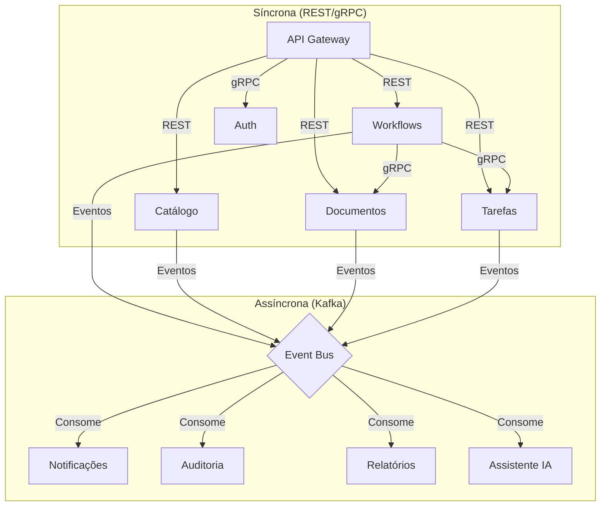
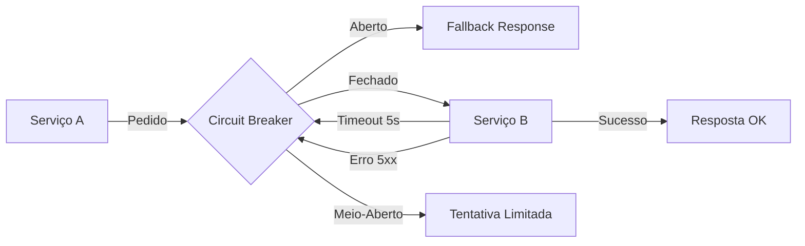

# Comunicação entre Serviços

## Propósito

Definir os padrões de comunicação entre microserviços na Junta Observatory Platform, incluindo protocolos síncronos e assíncronos, garantindo resiliência, observabilidade e evolução independente.

## Responsabilidades

- Estabelecer os padrões de comunicação síncrona (REST, gRPC)
- Definir o modelo de comunicação assíncrona (eventos, mensagens)
- Documentar os padrões de resiliência (circuit breaker, retry, timeout)
- Garantir a observabilidade de toda a comunicação

## Descrição Detalhada

### Mapa de Comunicação



### Padrões Síncronos

| Aspecto | REST | gRPC |
|---|---|---|
| **Uso** | API pública, operações CRUD | Comunicação interna entre serviços |
| **Formato** | JSON (JSON:API) | Protobuf |
| **Transporte** | HTTP/1.1 ou HTTP/2 | HTTP/2 |
| **Contrato** | OpenAPI 3.1 | Proto files (.proto) |
| **Code Generation** | OpenAPI Generator | protoc + buf |
| **Streaming** | Não suportado nativamente | Server/client/bidirectional streaming |
| **Performance** | Bom (JSON) | Excelente (binário) |
| **Browser compat** | Sim | Não (necessita proxy) |

### Padrões Assíncronos

| Aspecto | Eventos (Kafka) | Mensagens (RabbitMQ) |
|---|---|---|
| **Uso** | Event Sourcing, integrações core | Workflows, notificações |
| **Modelo** | Log distribuído (publish-subscribe) | Queue (point-to-point) |
| **Retenção** | Configurável (7-90 dias) | Até consumo |
| **Ordenação** | Por partição (key) | Por fila |
| **Replay** | Suportado nativamente | Limitado |
| **Garantia** | At-least-once | At-least-once / Exactly-once |
| **Casos de Uso** | Event Store, mudanças de estado | Notificações, tarefas agendadas |

### Eventos de Domínio

```json
{
  "specversion": "1.0",
  "type": "pt.juntaobservatory.processos.caso.criado",
  "source": "/api/processos/v2/casos",
  "id": "e1a2b3c4-d5e6-7890-abcd-ef1234567890",
  "time": "2026-07-15T10:30:00Z",
  "datacontenttype": "application/json",
  "data": {
    "casoId": "CAS-2026-12345",
    "servicoId": "SERV-001",
    "requerenteId": "CID-98765"
  },
  "traceparent": "00-4bf92f3577b34da6a3ce929d0e0e4736-00f067aa0ba902b7-01"
}
```

### Resiliência



| Padrão | Configuração | Acção em Falha |
|---|---|---|
| **Circuit Breaker** | 5 falhas em 10s, half-open após 30s | Retornar erro 503 ou cache |
| **Retry** | 3 tentativas, backoff exponencial (100ms, 200ms, 400ms) | Log de aviso |
| **Timeout** | 5s (requests), 30s (streaming) | Log de erro, notificar |
| **Bulkhead** | Pool de conexões por dependência (max 10) | Isolar falha |
| **Cache** | Cache local (Caffeine) + Redis | Servir stale data |
| **Fallback** | Resposta padrão ou dados em cache | Evitar falha em cascata |

### Observabilidade

| Aspecto | Implementação |
|---|---|
| **Tracing** | OpenTelemetry spans com propagação de contexto (traceparent) |
| **Métricas** | Prometheus: request count, latency, error rate, circuit breaker state |
| **Logs** | JSON estruturado com traceId, spanId, service, operation |
| **Health Checks** | /health (liveness), /readiness (dependências ok) |

## Regras de Negócio

- Toda a comunicação entre serviços inclui tracing context (traceparent header)
- Chamadas síncronas têm timeout obrigatório configurado
- Eventos de domínio seguem o formato CloudEvents 1.0
- Serviços não devem assumir que outros serviços estão sempre disponíveis

## Critérios de Aceitação

- A comunicação assíncrona substitui a síncrona sempre que não é necessária resposta imediata
- Circuit breakers estão configurados em todas as chamadas síncronas entre serviços
- O tracing distribuído permite seguir um pedido através de 5+ serviços
- A falha de um serviço não propaga para outros serviços

## Documentos Relacionados

- [API Gateway](api-gateway.md)
- [Event Sourcing](event-sourcing.md)
- [Saga](saga.md)
- [08 — Tracing Distribuído](../08-observabilidade/tracing-distribuido.md)
- [10 — Arquitectura API](../10-integracoes/arquitetura-api.md)
