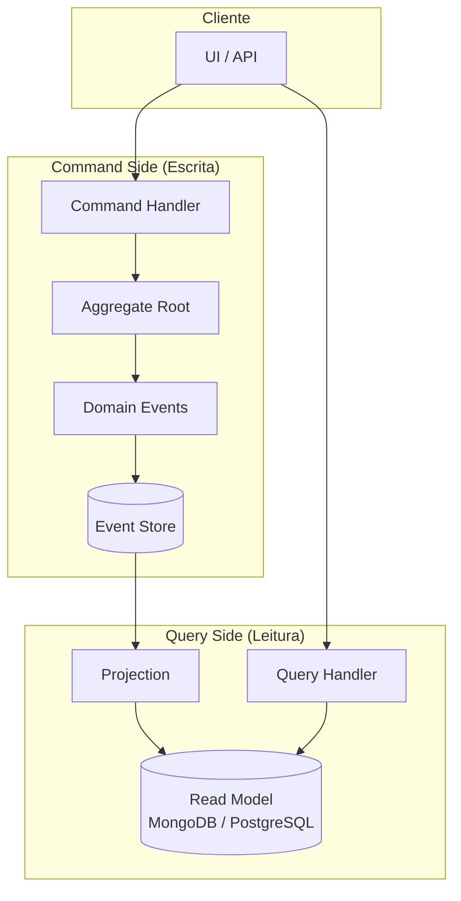

# CQRS — Command Query Responsibility Segregation

## Propósito

Descrever a aplicação do padrão CQRS na Junta Observatory Platform, separando os modelos de leitura (queries) e escrita (commands) para optimizar desempenho, escalabilidade e complexidade.

## Responsabilidades

- Separar a responsabilidade de comandos (escrita) e queries (leitura)
- Optimizar o modelo de leitura para consultas específicas
- Garantir consistência eventual entre os modelos de escrita e leitura

## Descrição Detalhada

### Arquitectura CQRS



### Quando Aplicar CQRS

| Cenário | CQRS | Alternativa |
|---|---|---|
| Modelo de leitura diferente do modelo de escrita | Sim | — |
| Alta frequência de leituras vs escritas | Sim | Read replicas |
| Múltiplas visualizações dos mesmos dados | Sim | Vistas materializadas |
| CRUD simples, mesma representação | Não | Repositório padrão |
| Equipa pequena, complexidade baixa | Não | Consultas optimizadas |

### Modelos de Leitura

| Projecção | Fonte | Database | Finalidade |
|---|---|---|---|
| `casos_resumo` | Eventos de Caso | MongoDB | Listagem de casos com filtros |
| `casos_detalhe` | Eventos de Caso + Documento | MongoDB | Página de detalhe do caso |
| `dashboard_kpi` | Eventos agregados | Redis | Métricas em tempo real |
| `relatorio_mensal` | Todos os eventos | PostgreSQL | Tabela agregada mensal |
| `search_index` | Documentos + Casos | Elasticsearch | Pesquisa full-text |

### Exemplo: Caso

**Command (Escrita):**

```json
// POST /api/v1/casos
{
  "servicoId": "SERV-001",
  "requerente": {
    "nome": "João Silva",
    "nif": "123456789",
    "email": "joao@email.pt"
  },
  "canal": "PORTAL",
  "documentos": ["doc1.pdf", "doc2.jpg"]
}
```

**Eventos Gerados:**

```
1. caso.criado - { casoId, servicoId, requerente, canal }
2. workflow.iniciado - { casoId, workflowId, versao }
3. tarefa.atribuida - { casoId, tarefaId, responsavel }
```

**Read Model (Leitura):**

```json
// GET /api/v1/casos/CAS-2026-12345
{
  "id": "CAS-2026-12345",
  "servico": {
    "id": "SERV-001",
    "nome": "Licenciamento de Obras"
  },
  "requerente": {
    "nome": "João Silva",
    "nif": "123456789"
  },
  "estado": "EM_INSTRUCAO",
  "passos": [
    { "nome": "Submissão", "estado": "CONCLUIDO", "data": "2026-07-15" },
    { "nome": "Análise", "estado": "EM_CURSO", "responsavel": "Maria", "deadline": "2026-07-25" },
    { "nome": "Decisão", "estado": "PENDENTE" }
  ],
  "documentos": [
    { "nome": "doc1.pdf", "tipo": "REQUERIMENTO" },
    { "nome": "doc2.jpg", "tipo": "COMPROVATIVO" }
  ],
  "timeline": [
    { "data": "2026-07-15T10:30", "evento": "Pedido submetido" },
    { "data": "2026-07-15T10:32", "evento": "Workflow iniciado" },
    { "data": "2026-07-16T09:00", "evento": "Tarefa atribuída a Maria" }
  ],
  "prazos": {
    "inicio": "2026-07-15",
    "deadline": "2026-09-15",
    "dias_restantes": 62
  }
}
```

### Consistência

| Estratégia | Descrição | Latência |
|---|---|---|
| **Eventual** | Projecção actualizada após evento (padrão) | < 1s |
| **Immediate** | Escrita + leitura na mesma transacção | Transaccional |
| **Scheduled** | Projecção actualizada por batch | 5-15 min |

## Regras de Negócio

- Comandos invalidam ou forçam actualização de projecções (através de eventos)
- Queries apenas lêem dos modelos de leitura, nunca do event store
- A consistência eventual é aceitável para todos os casos de uso excepto operações críticas
- As projecções são idempotentes e podem ser reconstruídas a partir dos eventos

## Critérios de Aceitação

- A separação command/query está implementada em todos os serviços
- Projecções são actualizadas em menos de 1 segundo (p95)
- A reconstrução de uma projecção a partir dos eventos não perde dados
- Não existem queries contra o event store em produção (apenas projecções)

## Documentos Relacionados

- [Event Sourcing](event-sourcing.md)
- [Arquitectura Hexagonal](arquitetura-hexagonal.md)
- [08 — Observabilidade / Modelo de Eventos](../08-observabilidade/modelo-de-eventos.md)
- [RF-018 — Event Sourcing](../02-requisitos/funcionais/rf018-event-sourcing.md)
