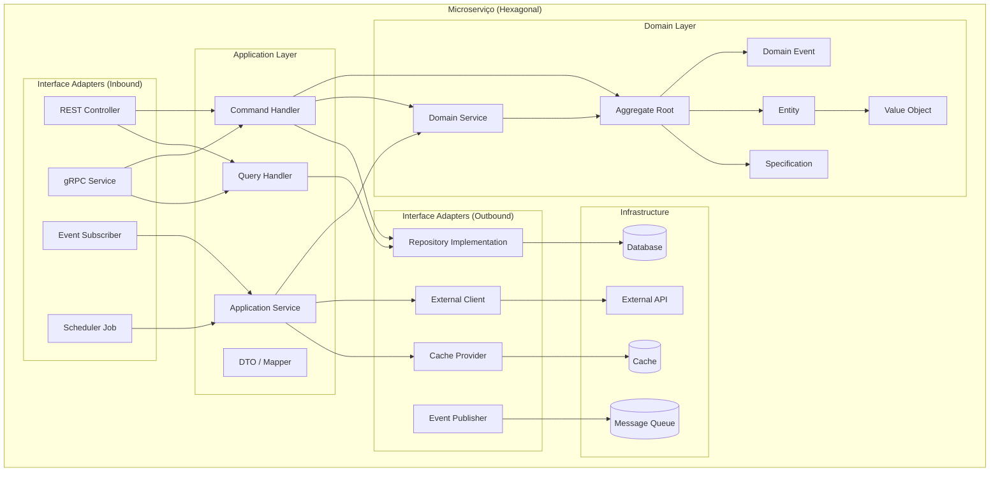
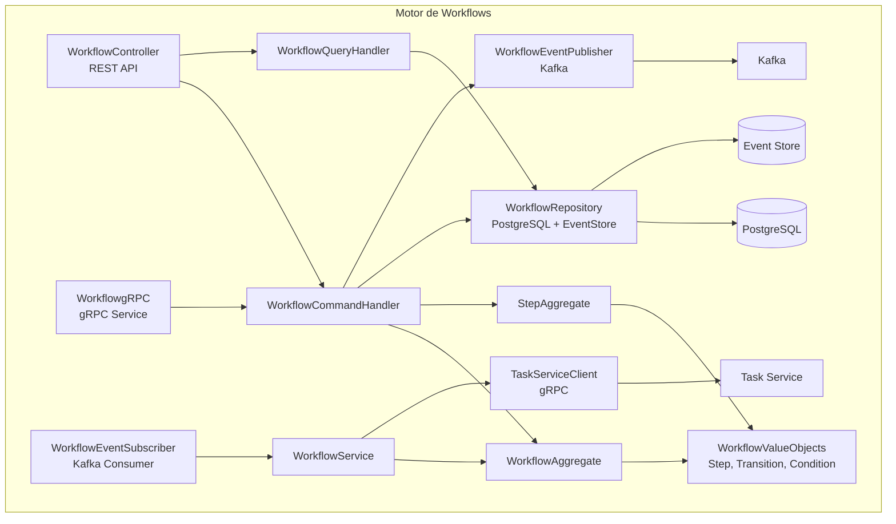

# Diagrama de Componentes (C4 Nível 3)

## Propósito

Decompor cada contentor (microserviço) nos seus componentes internos, mostrando a estrutura, responsabilidades e relações entre camadas.

## Responsabilidades

- Mostrar o desenho interno de cada microserviço
- Documentar o padrão de Arquitectura Hexagonal
- Estabelecer a separação entre domínio, aplicação e infraestrutura

## Descrição Detalhada

### Componentes Comuns a Cada Microserviço

### Exemplo: Componentes do Motor de Workflows

### Padrão por Camada

| Camada | Responsabilidade | Tecnologia | Testabilidade |
|---|---|---|---|
| **Interface Adapters (Inbound)** | Receber pedidos, validar input, serializar resposta | Spring MVC, gRPC, Kafka Listener | Testes de integração |
| **Application Layer** | Orquestrar casos de uso, transacções, autorização | Spring Service, @Transactional | Testes de integração |
| **Domain Layer** | Lógica de negócio, regras, invariantes, eventos | Plain Java/Kotlin | Testes unitários (sem mock) |
| **Interface Adapters (Outbound)** | Persistência, publicação de eventos, chamadas externas | Spring Data, Kafka Template, RestClient | Testes de integração |
| **Infrastructure** | Base de dados, message queue, cache | PostgreSQL, Kafka, Redis | Testes de contrato |

### Regras por Camada

| Regra | Descrição |
|---|---|
| A camada de domínio não depende de nenhuma framework ou biblioteca externa | Pure Java/Kotlin |
| A camada de aplicação não contém lógica de negócio | Apenas orquestração |
| A camada de interface adapters não contém lógica de negócio | Apenas validação e serialização |
| A comunicação entre camadas é feita por interfaces (ports) | Ports in/out |
| A implementação dos ports (adapters) é injectada por DI | Spring DI |

## Critérios de Aceitação

- Cada microserviço segue a mesma estrutura de componentes
- A camada de domínio é testável sem infraestrutura (mocks zero)
- As portas (ports) estão definidas como interfaces na camada de domínio

## Documentos Relacionados

- [Arquitectura Hexagonal](arquitetura-hexagonal.md)
- [Diagrama de Contentores](diagrama-de-contentores.md)
- [Comunicação entre Serviços](comunicacao-entre-servicos.md)
- [12 — Normas de Código](../12-desenvolvimento/normas-codigo.md)
