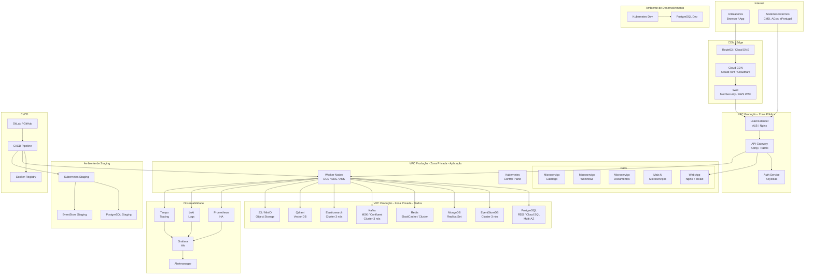

# Diagrama de Implantação (C4 Nível 4)

## Propósito

Descrever a infraestrutura de implantação da Junta Observatory Platform, incluindo a topologia de rede, distribuição geográfica, ambientes e componentes físicos/virtuais.

## Responsabilidades

- Documentar a topologia de implantação
- Definir os ambientes (dev, staging, produção)
- Estabelecer a estratégia de rede, DNS e certificados
- Servir como referência para a equipa de operações

## Descrição Detalhada

### Ambientes

| Ambiente | Propósito | Replicação | SLA |
|---|---|---|---|
| **Produção** | Operação real, dados reais | Multi-AZ, cluster | 99.9% |
| **Staging** | Testes de integração, UAT | Single-AZ | Best effort |
| **Desenvolvimento** | Desenvolvimento diário | Single-AZ, limitado | Best effort |
| **DR (Disaster Recovery)** | Recuperação em caso de desastre | Região secundária | RTO ≤ 4h, RPO ≤ 15min |

### Topologia de Rede

| Recurso | Especificação |
|---|---|
| **Cloud Provider** | AWS, Azure ou GCP (cloud-agnostic) |
| **Região Primária** | EU-WEST (Portugal, Irlanda, Frankfurt) |
| **Região DR** | EU-CENTRAL (Alemanha) |
| **VPC** | 10.0.0.0/16 com subnets públicas e privadas |
| **Subnets Públicas** | Load balancers, API Gateway, NAT Gateways |
| **Subnets Privadas** | Kubernetes, bases de dados, cache, message broker |
| **TLS** | TLS 1.3+ com certificados ACME / Let's Encrypt |

### Dimensionamento (Produção)

| Recurso | Especificação | Escalabilidade |
|---|---|---|
| Kubernetes Workers | 6-12 nós (t3.large / Standard_D2s_v3) | Auto-scaling (3-20 nós) |
| PostgreSQL | 2+ nós (db.r6g.large), Multi-AZ | Read replicas (3+) |
| Kafka | 3+ nós (m5.large), Multi-AZ | Partições por tópico |
| Redis | 2+ nós (cache.r6g.large), Cluster | Sharding automático |
| Elasticsearch | 3+ nós (m5.large) | Sharding por índice |

## Critérios de Aceitação

- A infraestrutura é replicável via Infrastructure as Code (Terraform)
- O tempo de provisionamento de um ambiente completo é ≤ 60 minutos
- A recuperação de desastre é testada trimestralmente
- O escalonamento automático está activo e testado para picos de carga

## Documentos Relacionados

- [Infraestrutura](infraestrutura.md)
- [Disponibilidade](disponibilidade.md)
- [Backup](backup.md)
- [Recuperação de Desastre](recuperacao-de-desastre.md)
- [11 — Operações](../11-operacoes/index.md)
