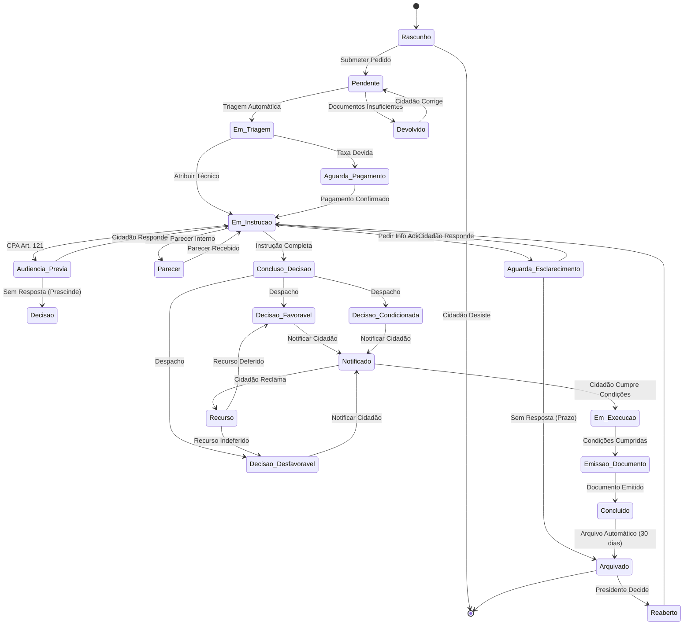
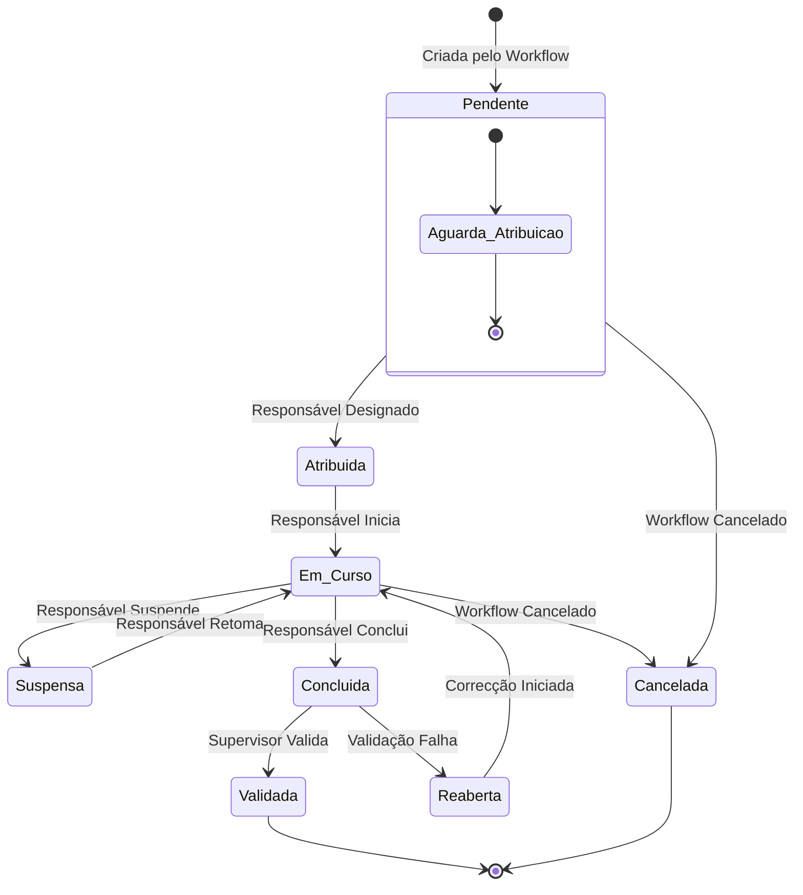
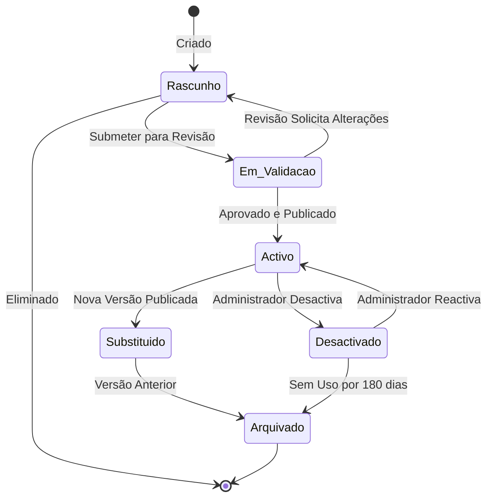
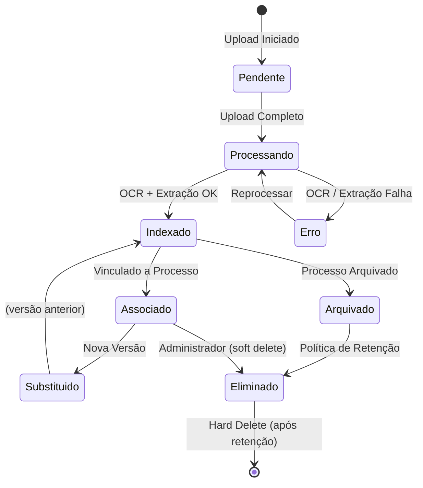
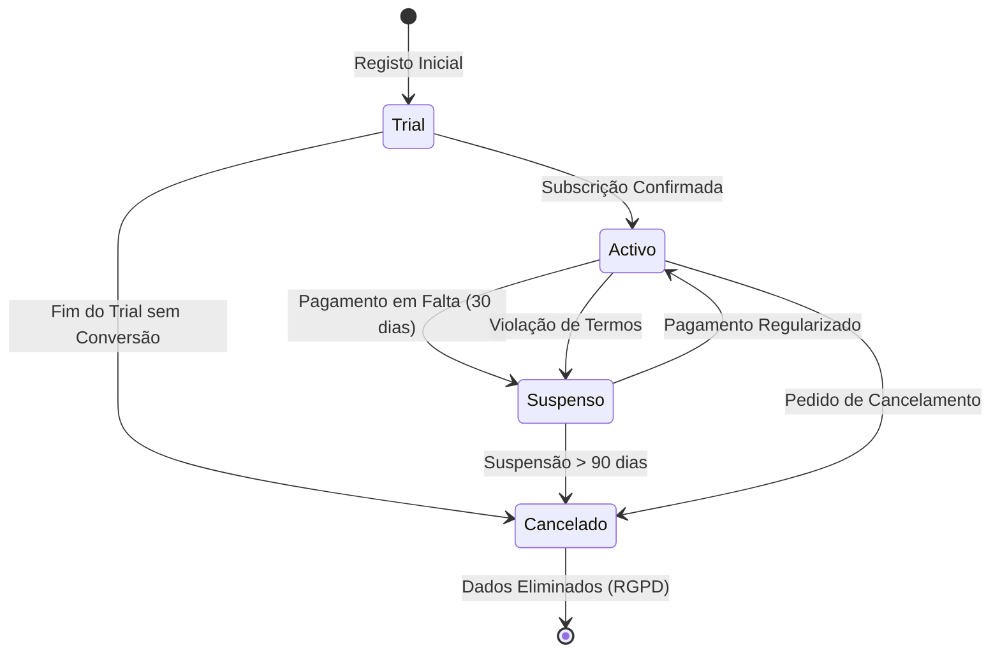

# Diagramas de Estado

## Propósito

Documentar as máquinas de estado dos principais agregados da Junta Observatory Platform, definindo os estados, transições, eventos e regras de cada entidade.

## Responsabilidades

- Definir a máquina de estado de cada agregado
- Garantir que as transições são válidas e consistentes
- Servir como especificação para implementação do motor de workflows

## Descrição Detalhada

### Caso (Processo)

### Tarefa

### Workflow

### Documento

### Inquilino

## Regras de Negócio

- As transições não especificadas nos diagramas são inválidas por definição
- Cada transição requer um evento válido e autorização do responsável
- Transições entre estados não adjacentes são bloqueadas (excepto rollback autorizado)
- Estados finais (Arquivado, Cancelado, Eliminado) são irreversíveis excepto com autorização especial
- O histórico de todas as transições é registado no event store

## Critérios de Aceitação

- Todas as transições possíveis estão representadas nos diagramas
- O motor de workflows implementa exactamente as transições documentadas
- Transições inválidas retornam erro com a regra violada
- É possível auditar o histórico de estados de qualquer entidade

## Documentos Relacionados

- [Modelo de Domínio](modelo-de-dominio.md)
- [Ciclo de Vida de Processos](../01-analise-de-negocio/ciclo-de-vida-processos.md)
- [04 — Plataforma / Workflow](../04-servicos-plataforma/plataforma-workflow.md)
- [06 — Dados / Caso](../06-dados/processos/entidade-caso.md)
