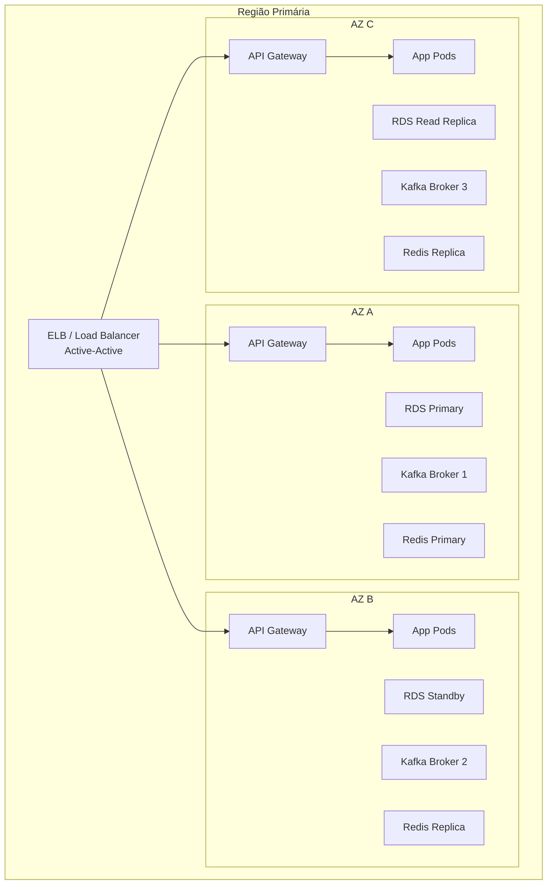

# Disponibilidade

## Propósito

Definir a estratégia de alta disponibilidade da Junta Observatory Platform, garantindo a continuidade do serviço dentro dos SLAs acordados.

## Responsabilidades

- Definir a arquitectura de alta disponibilidade
- Estabelecer SLAs de disponibilidade por componente
- Coordenar a estratégia de failover e disaster recovery

## Descrição Detalhada

### SLAs de Disponibilidade

| Componente | SLA Alvo | Janela de Manutenção | Estratégia |
|---|---|---|---|
| **Portal Cidadão** | 99.9% | 4h/mês (00h-06h) | Multi-AZ, rolling updates |
| **Portal Funcionário** | 99.9% | 4h/mês (00h-06h) | Multi-AZ, rolling updates |
| **API Pública** | 99.95% | 2h/mês | Multi-AZ, blue-green |
| **Motor de Workflows** | 99.9% | 4h/mês | Multi-AZ, event-driven |
| **Base de Dados** | 99.95% | 1h/mês (failover) | Multi-AZ, réplicas |
| **Kafka** | 99.9% | — | Cluster multi-AZ (3 brokers) |
| **Object Storage** | 99.99% | — | SLA do provider |
| **Sistema Completo** | 99.9% | 4h/mês | — |

### Arquitectura Multi-AZ

### Estratégia de Failover

| Cenário | Impacto | RTO | RPO | Acção |
|---|---|---|---|---|
| **Falha de 1 Pod** | Nenhum | 0 | 0 | K8s restart, HPA |
| **Falha de 1 AZ** | Mínimo (50% capacidade) | < 30s | 0 | DNS failover, RDS failover |
| **Falha de Região Primária** | Interrupção total | < 15 min | < 5 min | DR failover |
| **Corrupção de Dados** | Funcional (backup) | < 4h | < 1h | Restore point-in-time |
| **Ataque DDoS** | Degradação | < 10 min | 0 | WAF + scaling |

### Manutenção Programada

| Tipo | Frequência | Janela | Impacto |
|---|---|---|---|
| **Patching de segurança** | Mensal | 00h-04h (Domingo) | Nenhum (rolling update) |
| **Upgrade K8s** | Trimestral | 00h-06h (Sábado) | Nenhum (rolling update) |
| **Upgrade RDS** | Anual | 00h-04h (Sábado) | < 1 min (failover) |
| **Upgrade Kafka** | Semestral | 00h-04h (Sábado) | Nenhum (rolling restart) |

### Health Checks e Monitorização

| Componente | Health Check | Intervalo | Acção |
|---|---|---|---|
| **API Gateway** | HTTP /health | 10s | Remove do pool se falhar |
| **Serviços** | HTTP /health + /ready | 10s | K8s liveness + readiness |
| **Base de Dados** | RDS Health + query | 30s | RDS automatic failover |
| **Kafka** | JMX metrics | 30s | Rebalance consumidores |
| **Redis** | PING + memory | 15s | Promote replica |
| **Elasticsearch** | Cluster health | 30s | Reroute shards |

## Regras de Negócio

- A falha de um único componente não causa interrupção do serviço
- A falha de uma AZ não causa perda de dados (RPO = 0)
- As manutenções programadas não devem exceder o tempo de indisponibilidade acordado
- O failover para a região DR é testado trimestralmente

## Critérios de Aceitação

- O failover de AZ é automático e ocorre em menos de 30 segundos
- O failover regional é semi-automático (aprovação manual) e conclui em menos de 15 minutos
- O RPO real é inferior a 5 minutos (validado trimestralmente)
- 99.9% de disponibilidade medida mensalmente (excluindo manutenção programada)

## Documentos Relacionados

- [Infraestrutura](infraestrutura.md)
- [Escalabilidade](escalabilidade.md)
- [Backup](backup.md)
- [Recuperação de Desastre](recuperacao-de-desastre.md)
- [11 — Operações](../11-operacoes/index.md)
