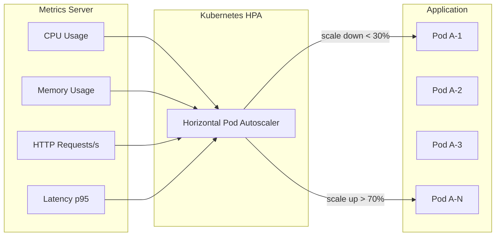

# Escalabilidade

## Propósito

Descrever a estratégia de escalabilidade da Junta Observatory Platform, garantindo que o sistema responde ao crescimento de volume de processos, utilizadores e dados sem degradação de performance.

## Responsabilidades

- Definir a estratégia de escalabilidade horizontal e vertical
- Estabelecer políticas de auto-scaling
- Identificar bottlenecks e estratégias de mitigação

## Descrição Detalhada

### Estratégia de Escalabilidade

| Camada | Abordagem | Gatilho |
|---|---|---|
| **Aplicação (Web)** | Horizontal (K8s HPA) | CPU > 70%, Memória > 80%, Latência p95 > 500ms |
| **Aplicação (Workers)** | Horizontal (KEDA) | Fila Kafka > 1000 mensagens, Lag > 10000 |
| **Base de Dados (Reads)** | Réplicas de leitura (3 nós) | Leituras > 80% da capacidade |
| **Base de Dados (Writes)** | Vertical (upgrade) + Sharding futuro | Escrita > 70% IOPS |
| **Cache (Redis)** | Cluster mode (6 shards) | Evictions > 100/s |
| **Kafka** | Partições (3 por tópico) | Lag > 50000 por partição |
| **Elasticsearch** | Hot-Warm-Cold (3+ nós) | Capacidade de disco > 75% |
| **Object Storage** | Praticamente ilimitada (S3) | — |

### Auto-Scaling (Kubernetes HPA)

| Serviço | Min Pods | Max Pods | Métrica | Comportamento |
|---|---|---|---|---|
| **API Gateway** | 2 | 10 | CPU 70% | Scale up rápido, scale down lento |
| **Serviço Casos** | 2 | 20 | CPU 70% + Latência p95 | Scale up gradual |
| **Workflow Engine** | 2 | 15 | Lag Kafka | Scale up linear |
| **Notificações** | 1 | 5 | Fila de envio | Scale up conforme fila |
| **Documentos** | 2 | 10 | CPU + Memória | Previsível (pouco scaling) |
| **Process Mining** | 0 | 3 | Job (batch) | Zero quando ocioso (KEDA) |

### Capacidade Estimada

| Métrica | Lançamento | 1 Ano | 3 Anos | 5 Anos |
|---|---|---|---|---|
| **Juntas clientes** | 10 | 50 | 150 | 308 |
| **Processos/mês** | 5.000 | 50.000 | 200.000 | 500.000 |
| **Documentos/mês** | 15.000 | 150.000 | 600.000 | 1.5M |
| **Utilizadores activos** | 200 | 2.000 | 8.000 | 20.000 |
| **Eventos/dia** | 10.000 | 100.000 | 500.000 | 1.5M |
| **Armazenamento** | 500 GB | 5 TB | 20 TB | 50 TB |

### Bottlenecks e Mitigações

| Bottleneck | Sintoma | Mitigação |
|---|---|---|
| **Base de dados (escrita)** | IOPS elevado, lock contention | Event Sourcing (escritas sequenciais), Sharding (futuro) |
| **Kafka (throughput)** | Lag crescente | Aumentar partições, consumidores paralelos |
| **Elasticsearch (indexação)** | Rejeição de indexação | Cluster hot-warm-cold, ILM policies |
| **Process Mining (CPU)** | Job demora horas | Processamento em batch, paralelização por tenant |
| **Geração de PDFs** | Fila lenta | Workers dedicados, cache de templates |

## Regras de Negócio

- Todos os serviços stateless podem escalar horizontalmente sem restrições
- Os serviços stateful (RDS, Kafka, ES) escalam verticalmente ou via clustering
- O scale down é mais lento que o scale up para evitar flapping
- O custo de scaling é monitorizado e orçamentado por tenant (para facturação futura)

## Critérios de Aceitação

- O sistema mantém latência p95 < 500ms com carga 2x a estimada
- O auto-scaling responde em menos de 2 minutos a picos de carga
- Não há degradação perceptível durante scaling (rolling update)
- O custo de infraestrutura é previsível (budget alerts)

## Documentos Relacionados

- [Infraestrutura](infraestrutura.md)
- [Disponibilidade](disponibilidade.md)
- [11 — Operações](../11-operacoes/index.md)
- [14 — Performance](../14-qualidade/criterios-aceitacao-globais.md)
