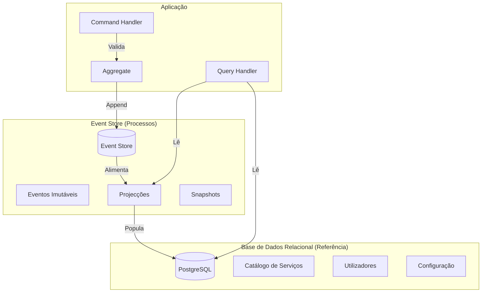

# Event Sourcing

## Propósito

Descrever a estratégia de Event Sourcing na Junta Observatory Platform, incluindo o modelo híbrido adoptado (event store para processos + base de dados relacional para dados de referência), o formato de eventos, a gestão de projecções e o versionamento de schemas.

## Responsabilidades

- Definir o modelo de persistência baseado em eventos para o motor de processos
- Estabelecer o formato e schema dos eventos de domínio
- Definir a estratégia de projecções (read models)
- Documentar as políticas de versionamento e evolução de eventos

## Descrição Detalhada

### Modelo Híbrido



### Formato do Evento

```json
{
  "specversion": "1.0",
  "type": "pt.juntaobservatory.processos.pedido.submetido",
  "source": "/api/processos/v1/pedidos",
  "id": "a1b2c3d4-e5f6-7890-abcd-ef1234567890",
  "time": "2026-07-15T10:30:00Z",
  "datacontenttype": "application/json",
  "data": {
    "pedidoId": "PED-2026-12345",
    "servicoId": "SERV-001",
    "requerenteId": "CID-98765",
    "canal": "PORTAL",
    "timestamp": "2026-07-15T10:30:00Z"
  },
  "data_schema": "https://schemas.juntaobservatory.pt/eventos/v1/pedido-submetido.json",
  "subject": "PED-2026-12345",
  "traceparent": "00-4bf92f3577b34da6a3ce929d0e0e4736-00f067aa0ba902b7-01"
}
```

### Tipos de Eventos

| Categoria | Exemplos | Persistência |
|---|---|---|
| **Eventos de Processo** | PedidoSubmetido, ProcessoInstruido, DecisaoFavoravel, ProcessoArquivado | Event Store |
| **Eventos de Workflow** | PassoIniciado, PassoConcluido, WorkflowSuspenso, WorkflowCancelado | Event Store |
| **Eventos de Documento** | DocumentoCarregado, DocumentoAssinado, DocumentoEliminado | Event Store |
| **Eventos de Tarefa** | TarefaAtribuida, TarefaConcluida, TarefaReaberta | Event Store |
| **Eventos de Auditoria** | AcessoConcedido, PermissaoAlterada, ConfiguracaoModificada | Event Store |
| **Eventos de Domínio** | LicencaEmitida, AtestadoGerado, EspacoReservado | Event Store |

### Projecções

| Projecção | Fonte | Armazenamento | Finalidade |
|---|---|---|---|
| ProcessoResumo | Eventos de Processo | PostgreSQL | Listagem e consulta rápida |
| ProcessoDetalhe | Eventos de Processo | MongoDB | Detalhe completo com histórico |
| DashboardTempoReal | Eventos de Processo e Tarefa | Redis | Métricas em tempo real |
| RelatorioMensal | Todos os eventos | PostgreSQL (tabela agregada) | Relatórios operacionais |
| SearchIndex | Eventos de Documento e Processo | Elasticsearch | Pesquisa full-text e semântica |

### Snapshots

- Snapshots são criados a cada 50 eventos por agregado
- O snapshot armazena o estado completo do agregado no momento
- A reconstrução começa pelo snapshot mais recente e aplica eventos posteriores
- Snapshots são armazenados no mesmo event store

### Versionamento de Eventos

| Estratégia | Descrição |
|---|---|
| **New Event Type** | Novo tipo de evento para nova versão (recomendado) |
| **Upcasting** | Transformação de eventos antigos para schema actual |
| **Tolerant Reader** | Campos novos são opcionais; leitores ignoram campos desconhecidos |
| **Schema Registry** | Registos de schemas com validação de compatibilidade |

## Requisitos

- O event store deve garantir ordenação total por agregado (event order)
- Projecções devem ser actualizadas com consistência eventual ≤ 1 segundo
- Snapshots devem ser criados automaticamente com intervalo configurável
- O schema registry deve validar compatibilidade antes de aceitar novos eventos

## Regras de Negócio

- Eventos não podem ser alterados ou eliminados após escritos (append-only)
- A reconstrução de estado deve ser possível a partir de qualquer ponto no tempo
- Projecções podem ser regeneradas a partir dos eventos (re-building)
- Eventos com schema incompatível são rejeitados pelo schema registry

## Critérios de Aceitação

- O replay de 10.000 eventos é concluído em menos de 3 segundos
- Projecções são actualizadas com latência ≤ 500ms
- Snapshots reduzem o tempo de reconstrução em ≥ 80%
- O schema registry rejeita eventos incompatíveis com erro claro
- A integridade dos eventos é verificável (hash chain ou equivalente)

## Melhorias Futuras

- Compaction de eventos para optimizar armazenamento
- Time-travel queries (consultas a estado histórico)
- Integração com ferramentas de event storming

## Documentos Relacionados

- [CQRS](cqrs.md)
- [Saga](saga.md)
- [RF-018 — Event Sourcing](../02-requisitos/funcionais/rf018-event-sourcing.md)
- [08 — Observabilidade / Modelo de Eventos](../08-observabilidade/modelo-de-eventos.md)
- [06 — Dados / Evento](../06-dados/observabilidade/entidade-evento.md)
