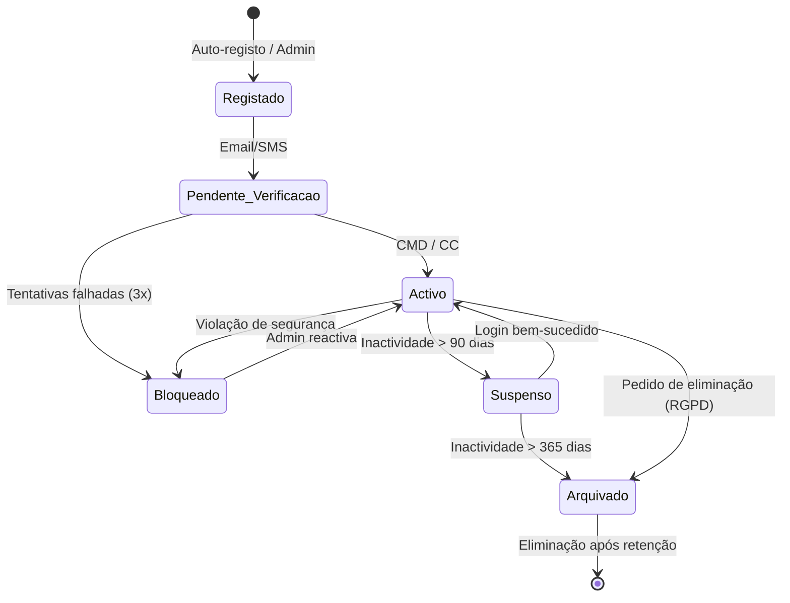
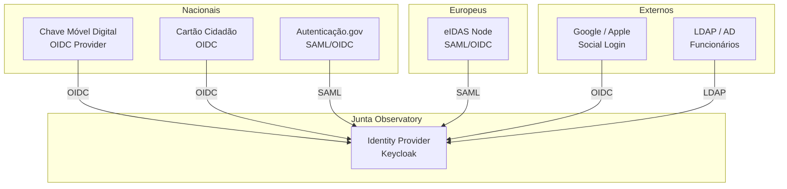

# Gestão de Identidade

## Propósito

Descrever o sistema de gestão de identidades da Junta Observatory Platform, abrangendo o ciclo de vida de identidades de utilizadores, autenticação federada, provisionamento e governança de identidades.

## Responsabilidades

- Gerir o ciclo de vida completo de identidades (criação, suspensão, eliminação)
- Integrar com sistemas de identidade nacionais e externos
- Fornecer funcionalidades de self-service (registo, recuperação de senha)
- Garantir a governança de identidades e acessos

## Descrição Detalhada

### Ciclo de Vida da Identidade

### Tipos de Identidade

| Tipo | Fonte | Provisionamento | Autenticação |
|---|---|---|---|
| **Cidadão Nacional** | CMD / Cartão Cidadão | Auto-registo | CMD / CC |
| **Cidadão UE** | eIDAS Wallet | Auto-registo | eIDAS |
| **Cidadão Estrangeiro** | NIF + Documento | Manual (presencial) | Credenciais internas |
| **Funcionário** | Autenticação.gov + RH | Provisionado pelo admin | AGov / Interna + 2FA |
| **Sistema Externo** | Registo de aplicação | Admin da plataforma | OAuth 2.0 |
| **Integrador** | Conta de serviço | Admin global | API Key + OAuth |

### Federação de Identidades

### Self-Service

| Funcionalidade | Disponível para | Descrição |
|---|---|---|
| Registo | Cidadão | Criar conta com CMD/CC |
| Recuperação de senha | Funcionário | Reset com 2FA |
| Actualização de perfil | Cidadão, Funcionário | Nome, email, contactos |
| Consentimento RGPD | Cidadão | Gerir consentimentos |
| Eliminação de conta | Cidadão | Exercer direito ao apagamento |
| Atribuição de 2FA | Funcionário | Configurar TOTP |

### Governança

| Processo | Periodicidade | Responsável |
|---|---|---|
| Revisão de acessos de funcionários | Trimestral | Chefe de Departamento |
| Revisão de contas de serviço | Mensal | Administrador |
| Re-activação de contas suspensas | Conforme necessidade | Administrador |
| Auditoria de acessos privilegiados | Trimestral | DPO |
| Remoção de contas inactivas | Automática (90 dias) | Sistema |

## Regras de Negócio

- Cada cidadão pode ter apenas uma conta activa (identificada por NIF/CMD)
- Funcionários são provisionados a partir do sistema de RH (quando integrado)
- Contas sem actividade por 90 dias são suspensas automaticamente
- Contas sem actividade por 365 dias são arquivadas
- A eliminação de conta segue o RGPD com período de retenção de 30 dias (reversível)

## Critérios de Aceitação

- O auto-registo de cidadão com CMD é concluído em menos de 2 minutos
- O provisionamento de funcionário é feito em menos de 1 hora (via RH)
- A notificação de suspensão é enviada 7 dias antes da suspensão automática
- O direito ao apagamento é executado em menos de 30 dias

## Documentos Relacionados

- [Autenticação](autenticacao.md)
- [Autorização](autorizacao.md)
- [13 — RGPD](../13-governanca-conformidade/rgpd.md)
- [13 — Privacidade](../13-governanca-conformidade/privacidade.md)
