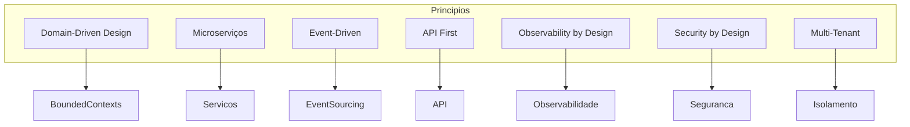

# 03 — Arquitectura

## Propósito

Esta secção descreve a arquitectura da Junta Observatory Platform, incluindo os diagramas C4, o modelo de domínio, os padrões arquitecturais (DDD, Hexagonal, Event Sourcing), o modelo de microserviços, segurança, infraestrutura e as decisões arquitecturais fundamentais.

## Responsabilidades

- Documentar a arquitectura de referência da plataforma
- Estabelecer os padrões e princípios arquitecturais
- Guiar a implementação dos microserviços e as relações entre eles
- Servir como base para análise, revisão e evolução do sistema

## Documentos

| Documento | Descrição |
|---|---|
| [Princípios](principios.md) | Princípios arquitecturais fundamentais |
| [Diagrama de Contexto](diagrama-de-contexto.md) | C4 Nível 1 — sistema e actores externos |
| [Diagrama de Contentores](diagrama-de-contentores.md) | C4 Nível 2 — microserviços e armazenamento |
| [Diagrama de Componentes](diagrama-de-componentes.md) | C4 Nível 3 — componentes internos de cada contentor |
| [Diagrama de Implantação](diagrama-de-implantacao.md) | C4 Nível 4 — deployment e infraestrutura |
| [Modelo de Domínio](modelo-de-dominio.md) | Modelo de domínio global (DDD) |
| [Bounded Contexts](bounded-contexts.md) | Mapa de contextos delimitados e relações |
| [Arquitectura Hexagonal](arquitetura-hexagonal.md) | Padrão de portas e adaptadores |
| [Microserviços](microservicos.md) | Estratégia e governance de microserviços |
| [Comunicação entre Serviços](comunicacao-entre-servicos.md) | Sincrona (REST/gRPC) e assíncrona (eventos) |
| [API Gateway](api-gateway.md) | Ponto único de entrada |
| [Event Sourcing](event-sourcing.md) | Modelo de persistência baseado em eventos |
| [CQRS](cqrs.md) | Separação de leitura e escrita |
| [Saga](saga.md) | Transacções distribuídas com compensação |
| [Autenticação](autenticacao.md) | Autenticação de utilizadores e sistemas |
| [Autorização](autorizacao.md) | RBAC e controlo de acesso |
| [Multi-Inquilino](multi-inquilino.md) | Estratégia de isolamento de inquilinos |
| [Segurança](seguranca.md) | Modelo de segurança global |
| [Diagramas de Estado](diagramas-de-estado.md) | Máquinas de estado dos agregados |
| [Diagramas de Sequência](diagramas-de-sequencia.md) | Fluxos chave do sistema |
| [Infraestrutura](infraestrutura.md) | Infraestrutura alvo |
| [Escalabilidade](escalabilidade.md) | Estratégia de escalabilidade |
| [Disponibilidade](disponibilidade.md) | Estratégia de alta disponibilidade |
| [Backup](backup.md) | Estratégia de backup e restore |
| [Recuperação de Desastre](recuperacao-de-desastre.md) | DR plan |
| [Decisões Arquitecturais](decisoes-arquiteturais.md) | ADRs (Architecture Decision Records) |

## Princípios Arquitecturais

## Stack Tecnológica (Referência)

| Camada | Tecnologia |
|---|---|
| Linguagem | Java 21+ (Kotlin opcional) |
| Framework | Spring Boot 3.x / Quarkus |
| API | REST (JSON:API), gRPC (comunicação interna) |
| Message Broker | Apache Kafka / RabbitMQ |
| Event Store | EventStoreDB / PostgreSQL (event tables) |
| Base de Dados | PostgreSQL (relacional), MongoDB (read models) |
| Cache | Redis |
| Search | Elasticsearch / OpenSearch |
| Container | Docker |
| Orquestração | Kubernetes |
| API Gateway | Kong / Traefik |
| Observabilidade | OpenTelemetry, Prometheus, Grafana, Loki |
| CI/CD | GitLab CI / GitHub Actions |
| Cloud | AWS / Azure / GCP (cloud-agnostic) |

## Documentos Relacionados

- [02 — Requisitos](../02-requisitos/index.md)
- [04 — Serviços Plataforma](../04-servicos-plataforma/index.md)
- [11 — Operações](../11-operacoes/index.md)
- [12 — Desenvolvimento](../12-desenvolvimento/index.md)
