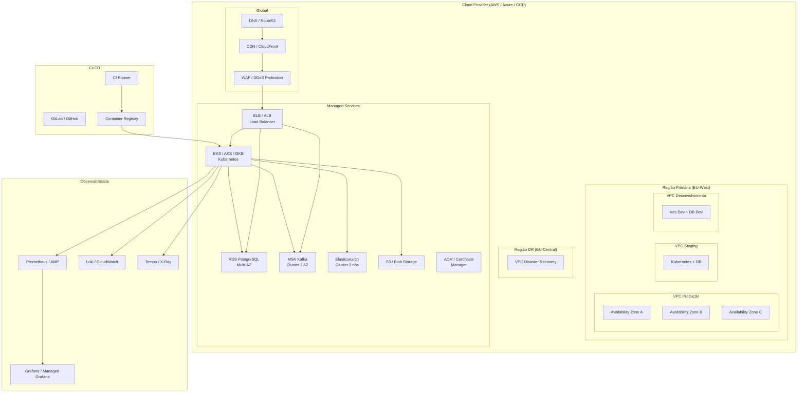

# Infraestrutura

## Propósito

Descrever a infraestrutura alvo da Junta Observatory Platform, incluindo a arquitectura cloud, recursos de computação, armazenamento, rede e serviços geridos.

## Responsabilidades

- Definir a arquitectura de infraestrutura
- Estabelecer políticas de provisionamento e configuração
- Garantir a replicabilidade dos ambientes via Infrastructure as Code

## Descrição Detalhada

### Arquitectura Cloud

### Recursos Cloud

| Recurso | Serviço AWS | Serviço Azure | Serviço GCP |
|---|---|---|---|
| **Kubernetes** | EKS | AKS | GKE |
| **PostgreSQL** | RDS PostgreSQL | Azure Database for PostgreSQL | Cloud SQL |
| **Kafka** | MSK | Event Hubs + Kafka | Pub/Sub + Kafka |
| **Elasticsearch** | OpenSearch | Elasticsearch Service | Elasticsearch on GKE |
| **Redis** | ElastiCache Redis | Azure Cache for Redis | Memorystore |
| **Object Store** | S3 | Blob Storage | Cloud Storage |
| **CDN** | CloudFront | Azure CDN | Cloud CDN |
| **DNS** | Route53 | Azure DNS | Cloud DNS |
| **Certificate** | ACM | Key Vault | Certificate Manager |
| **Monitoring** | CloudWatch | Azure Monitor | Cloud Monitoring |

### Infrastructure as Code

| Componente | Ferramenta | Repositório |
|---|---|---|
| **Terraform** | Provisionamento cloud | `infra/terraform/` |
| **Kubernetes Manifests** | Deploy de serviços | `infra/k8s/` |
| **Helm Charts** | Pacotes Kubernetes | `infra/helm/` |
| **Docker Compose** | Desenvolvimento local | `docker-compose.yml` |
| **Ansible** | Configuração de nós | `infra/ansible/` |

### Políticas de Rede

| Recurso | Política |
|---|---|
| **VPC** | 10.0.0.0/16 com subnets públicas/privadas |
| **Subnets Públicas** | Load balancers, NAT Gateways |
| **Subnets Privadas** | Kubernetes workers, bases de dados |
| **Security Groups** | Mínimo privilégio, whitelist de portas |
| **Network ACLs** | Restrição por subnet |
| **VPN** | Acesso administrativo via VPN corporativa |
| **Service Mesh** | Istio (futuro) para mTLS e observabilidade |

### Patching e Manutenção

| Recurso | Frequência | Estratégia |
|---|---|---|
| **Kubernetes** | Mensal | Rolling update com zero downtime |
| **Base de dados** | Trimestral | Upgrade com failover |
| **Imagens Docker** | Semanal | Rebuild com patches de segurança |
| **SO Base** | Automática | Immutable infrastructure (não patching, replace) |
| **Certificados TLS** | Automática (90 dias) | ACM / cert-manager |

## Regras de Negócio

- Toda a infraestrutura é provisionada via IaC (nada manual)
- Ambientes são idênticos em configuração (diferença apenas em escala)
- Acessos administrativos requerem VPN + MFA + justificação
- Nenhum ambiente de produção é acedido directamente (sempre via CI/CD)

## Critérios de Aceitação

- Um ambiente completo é provisionado em menos de 60 minutos via IaC
- A configuração entre ambientes difere apenas em parâmetros (variáveis)
- O patching de segurança não requer downtime
- O acesso à produção é registado e auditado

## Documentos Relacionados

- [Diagrama de Implantação](diagrama-de-implantacao.md)
- [Escalabilidade](escalabilidade.md)
- [Disponibilidade](disponibilidade.md)
- [Backup](backup.md)
- [11 — Operações](../11-operacoes/index.md)
