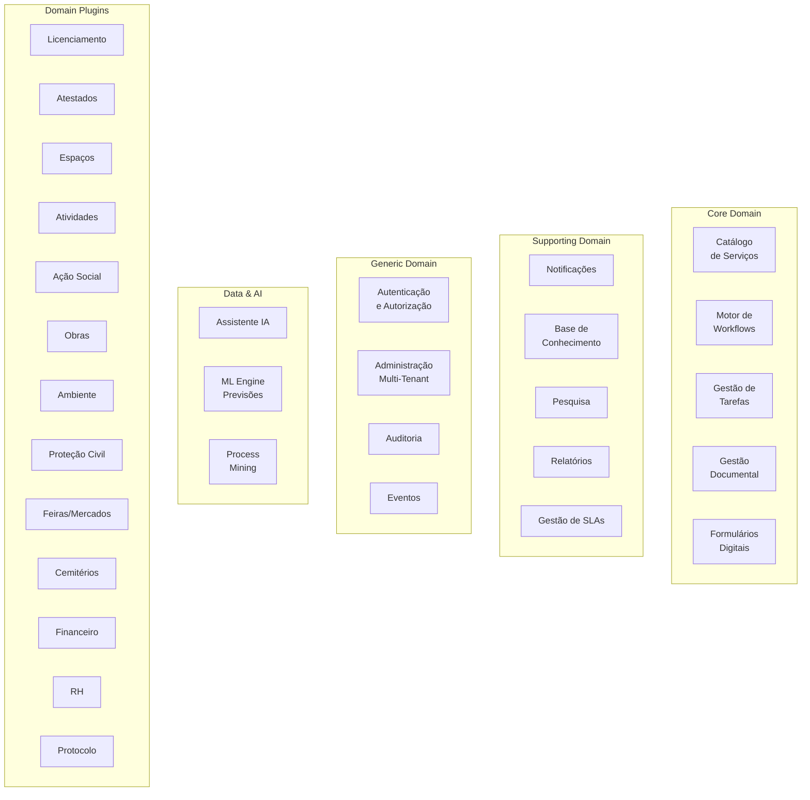

# Microserviços

## Propósito

Descrever a estratégia de microserviços da Junta Observatory Platform, incluindo a identificação, fronteiras, governança, padrões de comunicação e requisitos operacionais.

## Responsabilidades

- Definir o mapa de microserviços e as suas responsabilidades
- Estabelecer os critérios para identificação de fronteiras de serviço
- Documentar os padrões de comunicação, resiliência e observabilidade
- Servir como guia para a equipa na criação e evolução de serviços

## Descrição Detalhada

### Mapa de Microserviços



### Critérios de Granularidade

| Critério | Descrição | Exemplo |
|---|---|---|
| **Bounded Context** | Cada microserviço corresponde a um Bounded Context DDD | Workflows, Documentos |
| **Agregado Raiz** | O serviço é dono de um ou mais agregados relacionados | Caso + Pedido |
| **Frequência de Mudança** | Serviços que mudam por razões diferentes devem ser separados | Catálogo vs Workflows |
| **Escalabilidade Diferenciada** | Serviços com perfis de carga diferentes devem ser independentes | Documentos (I/O intensivo) vs Catálogo (CPU leve) |
| **Equipa Autónoma** | Cada serviço pode ser desenvolvido por uma equipa diferente | (aplicável em escala) |

### Requisitos por Serviço

| Requisito | Descrição | Obrigatório |
|---|---|---|
| **Base de dados própria** | Cada serviço tem o seu próprio schema/banco de dados | Sim |
| **API documentada** | OpenAPI 3.1 para APIs síncronas | Sim |
| **Health checks** | Endpoints /health e /readiness | Sim |
| **Métricas** | Prometheus /metrics | Sim |
| **Logs estruturados** | JSON para stdout | Sim |
| **Tracing** | OpenTelemetry spans | Sim |
| **Circuit breaker** | Resiliência a falhas de dependências | Sim |
| **Rate limiting** | Protecção contra abuso | Sim |
| **Autenticação** | Validação de tokens JWT | Sim |
| **Autorização** | Verificação de permissões RBAC | Sim |
| **Testes** | Unit ≥ 80%, Integration ≥ 60% | Sim |
| **Dockerfile** | Imagem Docker multi-stage | Sim |
| **Deploy independente** | Pode ser deployado sem outros serviços | Sim |

### Comunicação entre Serviços

| Tipo | Padrão | Uso | Tecnologia |
|---|---|---|---|
| **Síncrono** | Request-Response | Consultas, comandos imediatos | REST / gRPC |
| **Assíncrono** | Event-Driven | Notificações, projecções, integrações | Kafka |
| **Assíncrono** | Saga Coreográfica | Transacções distribuídas | Kafka + Event Store |
| **Síncrono** | API Gateway | Entrada única para clientes | Kong / Traefik |
| **Assíncrono** | Webhook | Notificações para sistemas externos | HTTP POST |

### Operações por Serviço

```
# Build
docker build -t jop/servico-workflow:1.2.3 .

# Run
docker run -p 8080:8080 jop/servico-workflow:1.2.3

# Health Check
GET /health → 200 OK
GET /readiness → 200 OK

# Metrics
GET /metrics → Prometheus format

# Logs
{"level":"INFO","service":"workflow","traceId":"abc","message":"...","timestamp":"..."}
```

## Regras de Negócio

- Um microserviço não acede directamente à base de dados de outro microserviço
- A comunicação entre serviços é sempre via API ou eventos, nunca via BD partilhada
- Cada serviço é dono dos seus dados e responsável pela sua consistência
- Serviços sem dependência de outros serviços podem ser deployados independentemente

## Critérios de Aceitação

- A remoção de um microserviço não implica alteração noutro serviço (apenas na configuração)
- É possível fazer deploy de um serviço sem fazer deploy de outros
- A falha de um serviço não derruba outros serviços (bulkhead pattern)

## Melhorias Futuras

- Service mesh (Istio) para observabilidade e segurança da comunicação
- Migration para eventos CloudEvents 1.0
- Suporte a GraphQL para consultas complexas

## Documentos Relacionados

- [Bounded Contexts](bounded-contexts.md)
- [Comunicação entre Serviços](comunicacao-entre-servicos.md)
- [API Gateway](api-gateway.md)
- [Saga](saga.md)
- [04 — Serviços Plataforma](../04-servicos-plataforma/index.md)
