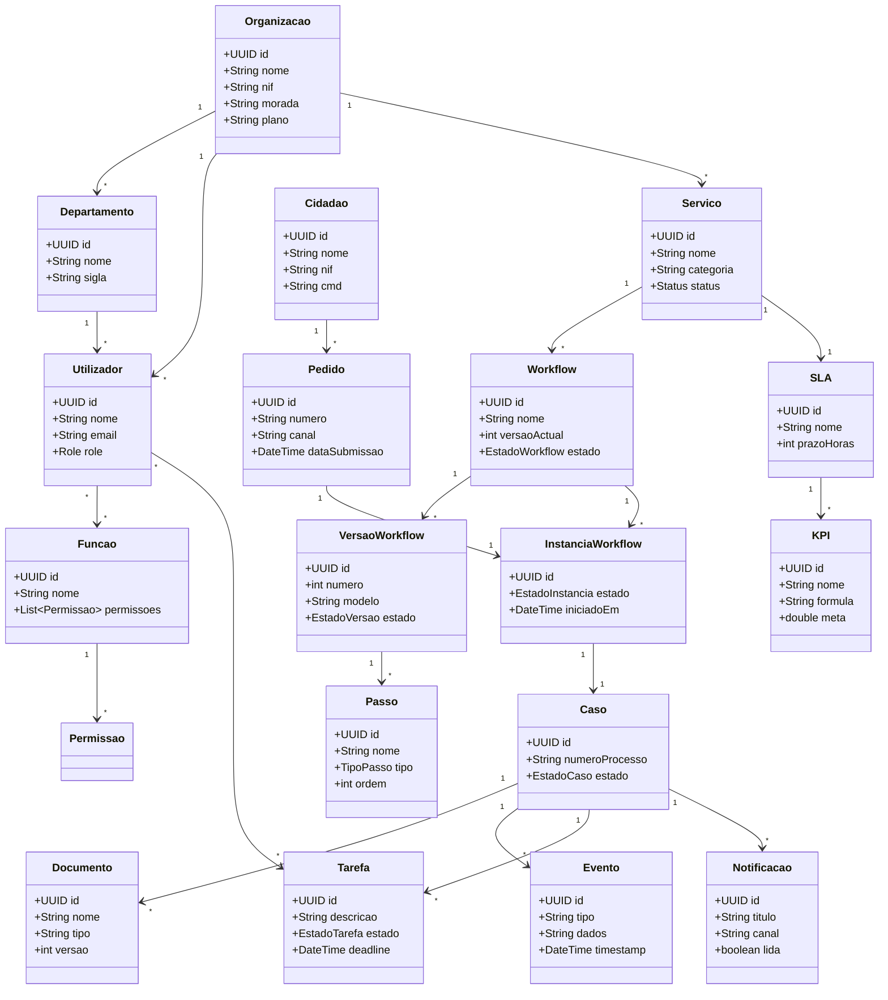
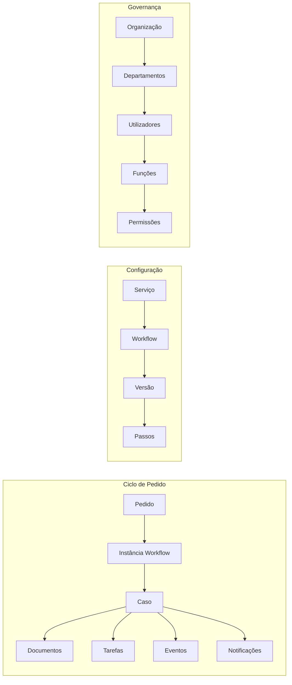

# Modelo de Domínio

## Propósito

Descrever o modelo de domínio global da Junta Observatory Platform, representando as entidades de negócio e as suas relações no nível mais abstracto, independente de implementação técnica.

## Responsabilidades

- Definir a taxonomia de entidades de domínio
- Estabelecer os relacionamentos conceptuais entre entidades
- Servir como base para a implementação dos agregados DDD

## Descrição Detalhada

### Agregados

| Agregado | Raiz | Entidades | Value Objects |
|---|---|---|---|
| **Organização** | Organizacao | Departamento, Utilizador | Morada, Contacto |
| **Serviço** | Servico | CategoriaServico | Taxa, PrazoLegal |
| **Workflow** | Workflow | VersaoWorkflow, Passo, Transicao | Condicao, Estado |
| **Instância** | Caso | Pedido, Tarefa, Documento, Evento | NumeroProcesso |
| **Identidade** | Utilizador | Funcao, Permissao | Credenciais |
| **Notificação** | Notificacao | — | Template, Canal |

### Relações Transversais

## Regras de Negócio

- Cada agregado tem um ciclo de vida bem definido com início e fim
- Agregados comunicam entre si através de eventos de domínio
- O raiz do agregado é a única entidade que garante consistência
- Referências a entidades de outros agregados são feitas por ID (não por referência objecto)

## Critérios de Aceitação

- O modelo de domínio está alinhado com os Bounded Contexts definidos
- Cada agregado tem uma raíz claramente identificada
- As relações entre agregados são por ID ou por evento

## Documentos Relacionados

- [Bounded Contexts](bounded-contexts.md)
- [Diagramas de Estado](diagramas-de-estado.md)
- [06 — Dados](../06-dados/index.md)
- [01 — Análise de Negócio](../01-analise-de-negocio/index.md)
