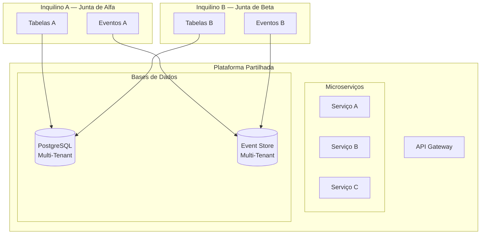

# Multi-Inquilino

## Propósito

Descrever a estratégia de multi-inquilino (multi-tenancy) da Junta Observatory Platform, garantindo isolamento de dados, segurança e personalização por Junta de Freguesia sem comprometer a eficiência da arquitectura partilhada.

## Responsabilidades

- Definir o modelo de isolamento de dados entre inquilinos
- Estabelecer as políticas de segurança e segregação
- Garantir que a personalização por inquilino é possível sem fork do código core

## Descrição Detalhada

### Modelo de Isolamento

### Estratégia de Isolamento

| Dimensão | Estratégia | Justificação |
|---|---|---|
| **Base de Dados** | Shared database, schema per tenant | Equilíbrio entre isolamento e custo |
| **Event Store** | Shared database, stream prefix per tenant | Isolamento lógico com suporte nativo |
| **Cache (Redis)** | Prefixo de chave por tenant | Isolamento lógico |
| **Search Index (ES)** | Index por tenant | Isolamento de pesquisa |
| **File Storage** | Prefixo de path por tenant | Isolamento de documentos |
| **Configuração** | Tenant ID em todas as tabelas de configuração | Isolamento de configuração |

### Identificação de Inquilino

O tenant é identificado em cada pedido através de:

1. **Subdomínio**: `alfabraga.juntaobservatory.pt`
2. **Header HTTP**: `X-Tenant-ID: junta-alfa`
3. **Claim JWT**: `tenant_id` no token de autenticação

### Personalização por Inquilino

| Aspecto | Personalizável |
|---|---|
| Logótipo e identidade visual | Sim |
| Estrutura organizacional (departamentos) | Sim |
| Catálogo de serviços | Sim |
| Workflows (modelação própria) | Sim |
| Formulários | Sim |
| Modelos de documentos | Sim |
| Regras de negócio (dentro dos limites legais) | Sim |
| Funções e permissões | Sim |
| SLAs | Sim |
| Dashboards | Sim |
| Língua | Sim (português, inglês) |

### Limites de Recurso por Inquilino

| Recurso | Limite Base | Expansível |
|---|---|---|
| Utilizadores activos | 50 | Plano Profissional+ |
| Armazenamento de documentos | 10 GB | Plano Profissional+ |
| Workflows activos | 20 | Ilimitado (Enterprise) |
| Chamadas API | 10.000/dia | Plano Profissional+ |
| Integrações activas | 5 | Plano Enterprise |

## Requisitos

- O tenant ID é injectado em todas as queries e operações
- A configuração de um inquilino não afecta outros inquilinos
- A migração entre planos não implica perda de dados
- O administrador do inquilino não acede a dados de outros inquilinos

## Regras de Negócio

- O isolamento de dados é verificado em todos os testes de integração
- Não existe rota na API que permita cross-tenant data access
- A exportação de dados de um inquilino inclui todos os dados desse inquilino
- A eliminação de um inquilino apaga todos os dados associados (com confirmação e backup)

## Critérios de Aceitação

- Testes de segurança confirmam que inquilino A não acede a dados de inquilino B
- A migração de schema é feita sem afectar inquilinos existentes
- A performance é consistente entre inquilinos (sem efeito de "vizinhança barulhenta")
- A configuração de personalização está disponível sem deploy adicional

## Melhorias Futuras

- Suporte a database-per-tenant para inquilinos Enterprise (HIPAA, requisitos especiais)
- Ferramentas de administração cross-tenant para o Administrador Global
- Métricas de utilização agregadas por plano de subscrição

## Documentos Relacionados

- [RF-016 — Multi-Inquilino](../02-requisitos/funcionais/rf016-multi-inquilino.md)
- [Autenticação](autenticacao.md)
- [Autorização](autorizacao.md)
- [Infraestrutura](infraestrutura.md)
