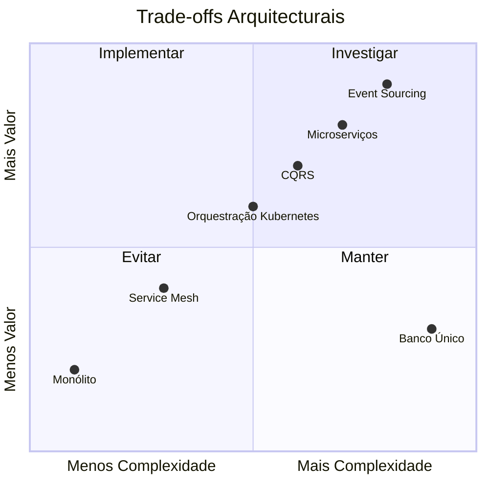

# Princípios Arquitecturais

## Propósito

Estabelecer os princípios arquitecturais fundamentais que orientam todas as decisões de design, implementação e evolução da Junta Observatory Platform.

## Responsabilidades

- Servir como guia para a equipa de arquitectura e desenvolvimento
- Garantir consistência nas decisões técnicas ao longo do ciclo de vida do projecto
- Fornecer critérios para avaliação de trade-offs arquitecturais

## Descrição Detalhada

### Princípios

| ID | Princípio | Descrição | Implicações |
|---|---|---|---|
| P-01 | **Domain-Driven Design** | O modelo de domínio é a alma do sistema. Cada Bounded Context tem o seu próprio modelo, linguagem e fronteiras. | Microserviços alinhados a contextos de negócio; modelo rico em vez de anémico; Ubiquitous Language em cada contexto |
| P-02 | **Microserviços** | Cada capacidade de negócio é um serviço autónomo, independentemente deplorável e escalável. | Serviços pequenos, focados, com base de dados própria; comunicação via API/eventos; deploy independente |
| P-03 | **Event-Driven Architecture** | A comunicação entre serviços é assíncrona sempre que possível, baseada em eventos imutáveis. | Event Store como source of truth para processos; CQRS para separação leitura/escrita; consistência eventual |
| P-04 | **API First** | Toda a funcionalidade é exposta por API desde o primeiro dia. A interface de utilizador é apenas mais um cliente. | API pública documentada (OpenAPI); contratos primeiro; versionamento semântico |
| P-05 | **Observability by Design** | Tudo o que acontece no sistema é observável: métricas, logs, tracing, eventos. | OpenTelemetry; dashboards por defeito; alertas proactivos |
| P-06 | **Security by Design** | Segurança não é uma camada adicional; está embutida em cada decisão arquitectural. | Autenticação e autorização em todos os endpoints; encriptação por defeito; princípio do menor privilégio |
| P-07 | **Multi-Tenant** | Uma plataforma, muitos inquilinos. Isolamento de dados sem sacrificar eficiência. | Schema-per-tenant; identificação de tenant em cada pedido; isolamento verificado por testes |
| P-08 | **Cloud-Native** | A plataforma tira partido de capacidades cloud: elasticidade, managed services, resiliência. | Containers; Kubernetes; storage object; DB managed; auto-scaling |
| P-09 | **Evolution over Perfection** | A arquitectura evolui com o produto. Decisões são reversíveis quando possível. | ADRs documentados; refactoring contínuo; dívida técnica gerida |
| P-10 | **Compliant by Design** | Conformidade regulatória (RGPD, eIDAS, CPA) é um requisito arquitectural, não um add-on. | Privacy by Design; registo de auditoria imutável; consentimento explícito; retenção automática |

### Trade-offs

### Decisões vs Princípios

| Decisão | Princípios Aplicados |
|---|---|
| Event Store para processos + BD relacional para referência | P-03, P-05, P-09 |
| Microserviços com Bounded Contexts | P-01, P-02 |
| API Gateway + REST + Eventos | P-03, P-04 |
| PostgreSQL + MongoDB + Elasticsearch | P-02, P-07 |
| Kubernetes + Docker | P-08 |
| OpenTelemetry + Prometheus + Grafana | P-05 |
| OAuth 2.0 + OIDC + RBAC | P-06 |

## Regras de Negócio

- Nenhuma decisão arquitectural deve violar mais de um princípio sem justificação documentada em ADR
- Os princípios são revistos semestralmente pela equipa de arquitectura
- Novos princípios requerem aprovação do arquitecto principal

## Critérios de Aceitação

- Cada decisão arquitectural está mapeada a um ou mais princípios
- Os princípios são compreensíveis por todos os membros da equipa técnica
- Existe um processo claro para propor alterações aos princípios

## Melhorias Futuras

- Automação de verificação de princípios em pipelines CI/CD
- Dashboard de conformidade arquitectural

## Documentos Relacionados

- [Decisões Arquitecturais](decisoes-arquiteturais.md)
- [Bounded Contexts](bounded-contexts.md)
- [Microserviços](microservicos.md)
- [02 — RNFs](../../02-requisitos/nao-funcionais/index.md)
