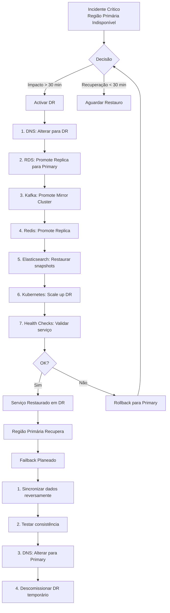

# Recuperação de Desastre

## Propósito

Definir o plano de recuperação de desastre (DR) da Junta Observatory Platform, estabelecendo procedimentos para restaurar o serviço em caso de falha catastrófica na região primária.

## Responsabilidades

- Definir a estratégia de disaster recovery (pilot light / warm standby)
- Estabelecer RTO e RPO globais e por componente
- Documentar o runbook de recuperação
- Coordenar testes periódicos de DR

## Descrição Detalhada

### Estratégia de DR

A plataforma adopta uma estratégia **Warm Standby** com os seguintes elementos:

- Região primária: AWS EU-West (Ireland) ou equivalente
- Região DR: AWS EU-Central (Frankfurt) ou equivalente
- Dados replicados continuamente com RPO < 5 minutos
- Ambiente DR semi-activo (serviços críticos em espera)
- Failover semi-automático (aprovação manual + automação)

```mermaid
flowchart TD
    subgraph "Região Primária (EU-West)"
        APP_PRI[App Kubernetes<br/>Activo]
        RDS_PRI[RDS PostgreSQL<br/>Primary]
        KAFKA_PRI[Kafka<br/>Activo]
        S3_PRI[S3 Bucket<br/>Primary]
        REDIS_PRI[Redis<br/>Primary]
    end
    subgraph "Replicação"
        WAL[WAL Shipping<br/>Contínuo]
        CRR[S3 CRR<br/>Contínuo]
        KAFKA_MIRR[Kafka MirrorMaker 2<br/>Quase em tempo real]
    end
    subgraph "Região DR (EU-Central)"
        RDS_DR[RDS PostgreSQL<br/>Standby (replica)]
        KAFKA_DR[Kafka<br/>Standby (mirror)]
        S3_DR[S3 Bucket<br/>DR (réplica)]
        REDIS_DR[Redis<br/>Standby]
        APP_DR[App Kubernetes<br/>Mínimo (2 pods)]
        DNS_DNS[DNS<br/>Standby]
    end
    RDS_PRI -->|WAL Streaming| RDS_DR
    S3_PRI -->|CRR| S3_DR
    KAFKA_PRI -->|MirrorMaker 2| KAFKA_DR
    APP_PRI -.->|Config Sync| APP_DR
```

### RTO e RPO por Componente

| Componente | RTO | RPO | Estratégia |
|---|---|---|---|
| **Portal Cidadão** | < 15 min | < 5 min | DNS failover + warm standby |
| **Portal Funcionário** | < 15 min | < 5 min | DNS failover + warm standby |
| **API Pública** | < 15 min | < 5 min | DNS failover + warm standby |
| **Base de Dados** | < 10 min | < 5 min | Promote replica |
| **Kafka** | < 30 min | < 10 min | Promote mirror cluster |
| **Documentos (S3)** | < 5 min | < 1 min | DNS + CRR |
| **Redis** | < 5 min | < 1 min | Promote replica |
| **Elasticsearch** | < 30 min | < 15 min | Restore snapshots + cross-cluster |
| **Sistema Completo** | < 60 min | < 5 min | Runbook completo |

### Runbook de Failover



### Testes de DR

| Tipo | Frequência | Objectivo | Participantes |
|---|---|---|---|
| **Tabletop exercise** | Trimestral | Validar runbook e responsáveis | Equipa infra, DPO |
| **DR parcial** | Semestral | Testar failover de BD + cache | Equipa infra |
| **DR completo** | Anual | Testar failover completo do sistema | Todas as equipas |
| **Surprise drill** | Bienal | Testar sem aviso prévio | Equipa de resposta |

### Critérios de Sucesso do DR

| Métrica | Objectivo |
|---|---|
| **RTO real** | < 60 minutos (completo) |
| **RPO real** | < 5 minutos (perda máxima) |
| **Integridade dos dados** | 100% (verificação após failover) |
| **Consistência de eventos** | 100% (event store íntegro) |
| **Notificações** | 100% dos afectados notificados em < 30 min |

## Regras de Negócio

- O failover para DR requer aprovação do Director de Operações ou substituto
- O failback para a região primária é planeado (não automático)
- Após o failover, o ambiente DR torna-se a nova região primária (não há split-brain)
- Todos os dados sensíveis na região DR seguem a mesma política de segurança da região primária
- O teste de DR anual é documentado e as lições aprendidas são incorporadas no plano

## Critérios de Aceitação

- O failover completo é concluído em menos de 60 minutos
- A perda de dados não excede 5 minutos (RPO)
- O sistema em DR serve pedidos com performance aceitável (latência < 2x normal)
- O failback é concluído com zero perda de dados adicionais

## Documentos Relacionados

- [Disponibilidade](disponibilidade.md)
- [Backup](backup.md)
- [Infraestrutura](infraestrutura.md)
- [11 — Operações](../11-operacoes/index.md)
