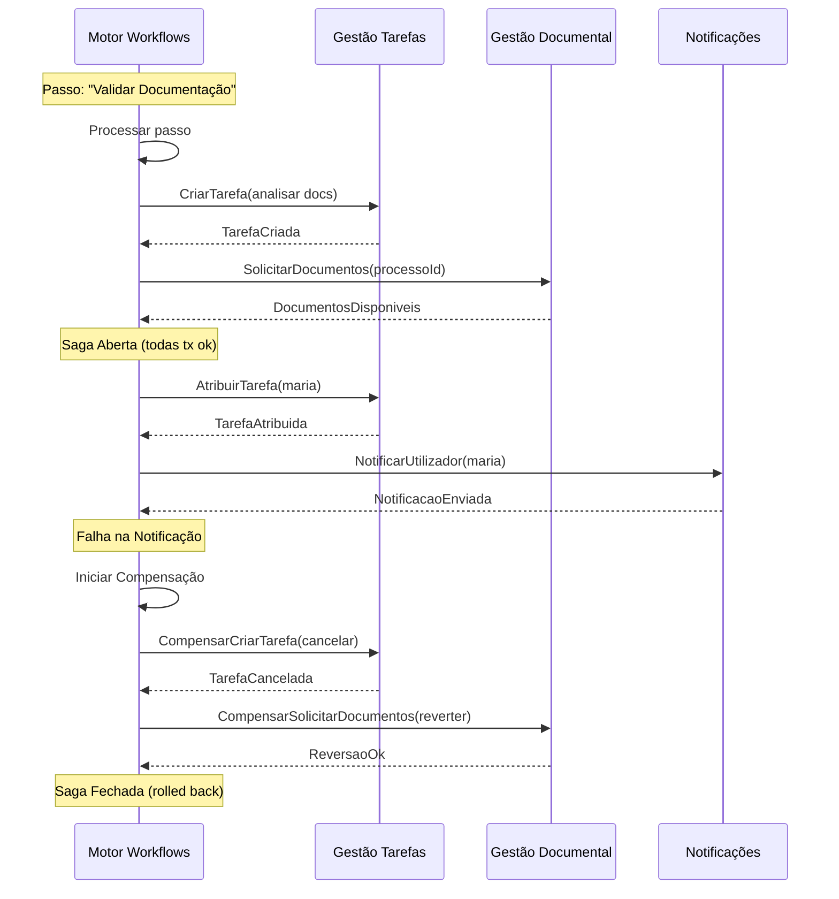
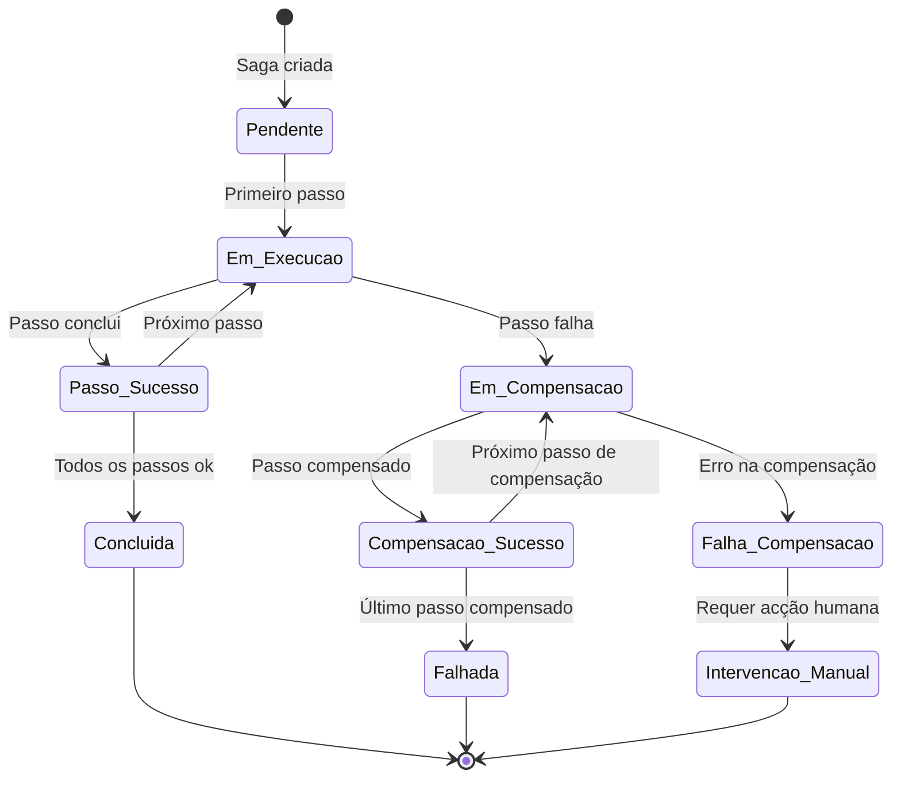

# Saga

## Propósito

Descrever a aplicação do padrão Saga para gestão de transacções distribuídas na Junta Observatory Platform, garantindo consistência de dados através de múltiplos microserviços sem recorrer a transacções distribuídas (2PC).

## Responsabilidades

- Definir o padrão de coordenação de transacções entre serviços
- Documentar as estratégias de compensação para cenários de falha
- Garantir a consistência eventual dos dados distribuídos

## Descrição Detalhada

### Abordagem Coreográfica



### Definição de Saga

```json
{
  "sagaId": "SAGA-LIC-2026-12345",
  "tipo": "LICENCIAMENTO_OBRAS",
  "passos": [
    {
      "ordem": 1,
      "nome": "Validar Documentação",
      "comando": "solicitarDocumentos",
      "servico": "documentos",
      "compensacao": "cancelarSolicitacaoDocumentos"
    },
    {
      "ordem": 2,
      "nome": "Atribuir Técnico",
      "comando": "atribuirTarefa",
      "servico": "tarefas",
      "compensacao": "cancelarAtribuicao"
    },
    {
      "ordem": 3,
      "nome": "Notificar Técnico",
      "comando": "notificarUtilizador",
      "servico": "notificacoes",
      "compensacao": "cancelarNotificacao"
    }
  ],
  "estado": "ABERTA",
  "passoAtual": 2
}
```

### Estratégias de Compensação

| Acção | Compensação | Notas |
|---|---|---|
| Criar tarefa | Cancelar tarefa | Marcar como cancelada, não eliminar |
| Enviar notificação | Registar revogação | SMS/email não podem ser "retirados" |
| Criar documento | Marcar como eliminado | Soft delete com motivo |
| Alterar estado de processo | Registar reversão de estado | Evento de compensação no event store |
| Agendar vistoria | Cancelar agendamento | Notificar envolvidos |
| Reservar espaço | Libertar reserva | Reembolso se aplicável |

### Ciclo de Vida da Saga



### Tratamento de Falhas

| Tipo de Falha | Acção |
|---|---|
| **Timeout** no passo actual | Aguardar + retry (3x); se persistir, iniciar compensação |
| **Erro de negócio** no passo actual | Iniciar compensação imediatamente |
| **Falha na compensação** | Registar erro, notificar administrador, intervenção manual |
| **Saga em estado inconsistente** | Job de reconciliação periódica |
| **Serviço indisponível** | Dead letter queue + retry programado |

## Regras de Negócio

- Toda a saga é registada como uma sequência de eventos imutáveis
- A compensação deve ser sempre possível (nenhuma acção é irreversível sem alternativa)
- A compensação de notificações (email/SMS) é informativa (não pode reverter o envio)
- A intervenção manual em saga falhada é registada e auditável

## Critérios de Aceitação

- Sagas são executadas com consistência eventual em menos de 10 segundos
- A compensação reverte todas as acções do passo falhado e anteriores
- Sagas em estado inconsistente são detectadas pelo job de reconciliação
- A intervenção manual está documentada e é accionável a partir do painel administrativo

## Documentos Relacionados

- [Event Sourcing](event-sourcing.md)
- [CQRS](cqrs.md)
- [Comunicação entre Serviços](comunicacao-entre-servicos.md)
- [04 — Plataforma / Workflow](../04-servicos-plataforma/plataforma-workflow.md)
