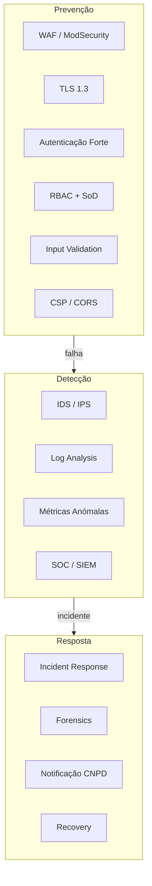
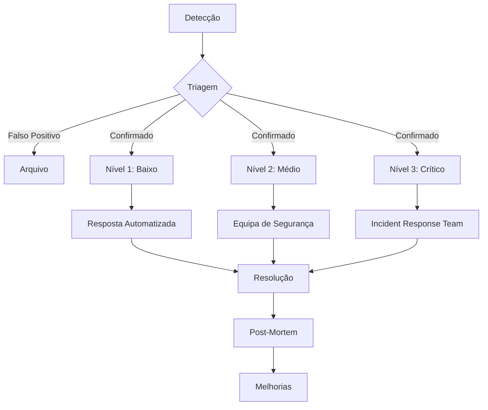

# Segurança

## Propósito

Descrever o modelo de segurança da Junta Observatory Platform, abrangendo segurança de rede, aplicação, dados, identidade e operações, garantindo a confidencialidade, integridade e disponibilidade do sistema.

## Responsabilidades

- Definir as políticas e controlos de segurança
- Garantir conformidade com OWASP, ISO 27001 e RGPD
- Proteger dados em repouso, em trânsito e em processamento
- Estabelecer processos de resposta a incidentes

## Descrição Detalhada

### Controlos de Segurança

### Matriz de Segurança

| Dimensão | Controlo | Implementação |
|---|---|---|
| **Rede** | Firewall, WAF, VPN | AWS Security Groups, CloudFront WAF |
| **Transporte** | TLS 1.3+ | Certificados ACM, mTLS entre serviços |
| **Aplicação** | OWASP Top 10 | SAST, DAST, SCA, code review |
| **Dados** | Encriptação repouso | AES-256 (RDS, S3, Kafka) |
| **Dados** | Encriptação trânsito | TLS 1.3+ |
| **Dados** | Pseudonimização | Dados pessoais pseudonimizados em analytics |
| **Identidade** | MFA, JWT, OAuth | Autenticação.gov, 2FA |
| **Auditoria** | Logs imutáveis | Event Store, CloudTrail |
| **Infraestrutura** | Hardening, patching | CIS benchmarks, Auto-patching |
| **Dados** | Backup encriptado | AES-256, backup offsite |

### OWASP Top 10 — Mitigações

| Risco | Mitigação |
|---|---|
| **A01 — Broken Access Control** | RBAC + avaliação centralizada + testes de autorização |
| **A02 — Cryptographic Failures** | TLS 1.3+, AES-256, gestão de chaves com KMS |
| **A03 — Injection** | ORM (JPA), input validation, parameterised queries |
| **A04 — Insecure Design** | Security review em todas as ADRs, threat modeling |
| **A05 — Security Misconfiguration** | Infrastructure as Code, CIS benchmarks |
| **A06 — Vulnerable Components** | SCA (Trivy, Snyk), actualizações automáticas |
| **A07 — Auth Failures** | OIDC, MFA, rate limiting, account lockout |
| **A08 — Data Integrity Failures** | Event Store imutável, CI/CD signing |
| **A09 — Logging Failures** | Logs centralizados, alertas de segurança |
| **A10 — SSRF** | Network segmentation, allowlists |

### Gestão de Chaves e Segredos

| Segredo | Localização | Rotação |
|---|---|---|
| Chaves JWT (privadas) | KMS + Vault | 90 dias |
| Chaves JWT (públicas) | JWKS endpoint | 90 dias |
| API Keys | HashiCorp Vault | 180 dias |
| Database passwords | AWS Secrets Manager | 30 dias |
| TLS certificates | ACM / cert-manager | Automática (90 dias) |
| Encryption keys (AES) | KMS (customer master key) | Anual |

### Resposta a Incidentes

| Nível | Descrição | SLA Resposta | SLA Resolução |
|---|---|---|---|
| **N1 — Baixo** | Scan, tentativa de acesso | 8h (úteis) | 72h |
| **N2 — Médio** | Acesso não autorizado (sem dados) | 2h | 24h |
| **N3 — Crítico** | Violação de dados, Ransomware | 15min | 4h (contenção) |

### Segurança no Ciclo de Desenvolvimento

| Fase | Prática |
|---|---|
| **Requisitos** | Threat modeling, security stories |
| **Design** | Security review, Architecture Decision Records |
| **Desenvolvimento** | SAST (SonarQube), SCA (Trivy), code review |
| **Testes** | DAST (OWASP ZAP), penetration testing |
| **Deploy** | Image scanning (Trivy), infrastructure scanning |
| **Operação** | Runtime monitoring, SIEM, vulnerability scanning |

## Regras de Negócio

- Todo o acesso a dados pessoais é registado em log de auditoria
- Nenhum segredo é armazenado em código fonte ou configuração versionada
- O princípio do menor privilégio aplica-se a todos os acessos
- A encriptação é aplicada por defeito (em repouso e em trânsito)

## Critérios de Aceitação

- SAST detecta 100% das vulnerabilidades críticas em código novo
- DAST (pentest) não encontra vulnerabilidades críticas/altas
- A politíca de segurança está documentada e aprovada pelo DPO
- O tempo de resposta a incidentes críticos é inferior a 15 minutos

## Documentos Relacionados

- [Autenticação](autenticacao.md)
- [Autorização](autorizacao.md)
- [13 — Segurança de Dados](../13-governanca-conformidade/seguranca-dados.md)
- [13 — Privacidade](../13-governanca-conformidade/privacidade.md)
- [12 — Testes de Segurança](../12-desenvolvimento/testes-seguranca.md)
