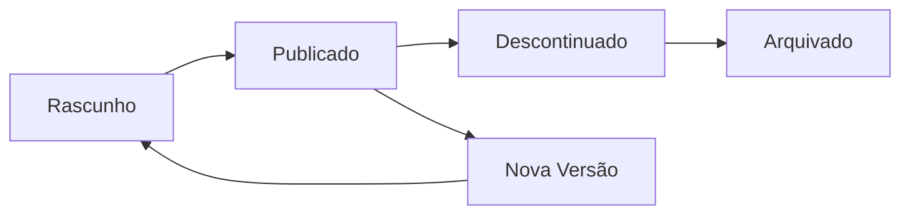

# Plataforma — Catálogo

## Propósito

Gerir o catálogo de serviços disponibilizados por cada junta na Junta Observatory Platform, permitindo configurar quais os serviços prestados, respectivos workflows, formulários e taxas.

## Responsabilidades

- Definir e manter o catálogo de serviços por inquilino
- Associar workflows, formulários e documentos a cada serviço
- Gerir versões do catálogo
- Disponibilizar o catálogo para consulta cidadã

## Descrição Detalhada

### Estrutura do Catálogo

| Nível | Descrição | Exemplo |
|---|---|---|
| **Grupo** | Categoria de serviços | Licenciamento |
| **Serviço** | Serviço prestado | Licença de Obra |
| **Sub-serviço** | Variação do serviço | Obra Menor / Obra Maior |
| **Workflow** | Processo associado | workflow_licenca_obra |
| **Formulário** | Formulário de pedido | form_licenca_obra_v3 |
| **Taxa** | Taxa aplicável | taxa_obra_maior_2024 |

### Ciclo de Vida

## Documentos Relacionados

- [02 — RF001](../02-requisitos/funcionais/rf001.md)
- [04 — Workflow](plataforma-workflow.md)
- [04 — Formulários](plataforma-formularios.md)
