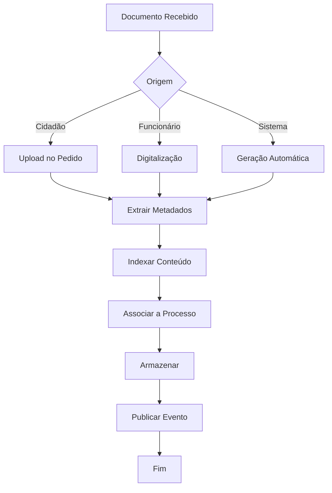

# Serviço: Gestão Documental

## Descrição

Serviço responsável pelo armazenamento, organização, pesquisa, versionamento e ciclo de vida de documentos na plataforma. Suporta modelos de documentos, templates, geração automática, assinatura digital e políticas de retenção.

## Objectivo

Garantir que todos os documentos da Junta de Freguesia são geridos digitalmente, com controlo de versões, acesso seguro e conformidade com as obrigações legais de arquivo e conservação.

## Inputs

- Documentos carregados por utilizadores ou cidadãos
- Templates de documentos configurados por administradores
- Comandos de geração (preencher template com dados de um processo)
- Comandos de assinatura (assinatura digital simples ou qualificada)

## Outputs

- Documentos armazenados com metadados e indexação full-text
- Documentos gerados automaticamente a partir de templates
- Documentos assinados digitalmente
- Versões anteriores preservadas e acessíveis
- Eventos de documento publicados (criação, modificação, eliminação)

## Workflow

## Tarefas

| Tarefa | Descrição | Executor |
|---|---|---|
| Carregar documento | Upload de ficheiro | Utilizador |
| Digitalizar documento | Scan + OCR | Funcionário |
| Criar template | Definir modelo de documento | Administrador |
| Gerar documento | Preencher template com dados | Sistema |
| Assinar documento | Aplicar assinatura digital | Responsável |
| Substituir versão | Carregar nova versão | Utilizador |
| Eliminar documento | Eliminar lógico (com justificação) | Administrador |

## Subtarefas

- Validar formato e tamanho do ficheiro
- Extrair texto (OCR se imagem)
- Extrair metadados automáticos (tipo, data, processo)
- Verificar políticas de retenção
- Aplicar carimbo digital (data, hora, número de processo)

## Responsáveis

| Função | Responsabilidades |
|---|---|
| Funcionário Atendimento | Digitalizar documentos de cidadãos |
| Funcionário Administrativo | Gerir documentos de processos |
| Administrador | Gerir templates e políticas de retenção |
| Dirigente | Assinar documentos decisórios |

## Documentos Necessários

- Ficheiro digital (PDF, DOCX, XLSX, PNG, JPG)
- Template de documento (formato DOCX com placeholders)
- Regras de preenchimento (mapeamento template → dados)

## Documentos Gerados

- Documento preenchido a partir de template
- Documento assinado digitalmente
- Versão anterior do documento
- Relatório de documentos por processo/período

## Pontos de Decisão

| Ponto | Decisão | Responsável |
|---|---|---|
| Tipo de documento | Classificação (alvará, certidão, ofício, etc.) | Sistema + Utilizador |
| Nível de acesso | Quem pode ver o documento | Configuração por tipo |
| Política de retenção | Prazo de conservação | Configuração por inquilino |
| Necessita assinatura | Documento requer assinatura? | Workflow do processo |

## Riscos

| Risco | Impacto | Mitigação |
|---|---|---|
| Perda de documento | Dano ao processo | Backup automático; imutabilidade do event store |
| Acesso não autorizado | Violação RGPD | Controlo de acesso por permissões |
| Formato não suportado | Impossibilidade de abrir | Validação na submissão; conversão automática |
| Corrupção de ficheiro | Documento ilegível | Checksum no upload; verificação periódica |

## Excepções

| Excepção | Tratamento |
|---|---|
| Ficheiro excede tamanho máximo | Rejeitar com mensagem clara |
| Formato não permitido | Rejeitar com lista de formatos aceites |
| OCR falha | Notificar; prosseguir com imagem original |
| Template inválido | Rejeitar com indicação do erro |

## SLAs

| Métrica | SLA | Medição |
|---|---|---|
| Upload de documento | ≤ 5s (10 MB) | Por ficheiro |
| Geração de documento | ≤ 3s | Por geração |
| Indexação + OCR | ≤ 10s após upload | Por documento |
| Pesquisa full-text | ≤ 2s | Por pesquisa |

## Métricas

- Número de documentos armazenados (total e por tipo)
- Armazenamento utilizado (GB)
- Documentos gerados automaticamente vs carregados manualmente
- Tempo médio de processamento (upload → indexado)
- Documentos por processo (média)

## KPIs

| KPI | Fórmula | Meta |
|---|---|---|
| % documentos digitais | Documentos digitais / total | 100% |
| Tempo médio de geração | Soma tempo / nº docs gerados | ≤ 3s |
| Taxa de OCR sucedido | OCR com sucesso / total | ≥ 95% |
| Conformidade de retenção | Docs dentro da política / total | 100% |

## Eventos

| Evento | Trigger | Payload |
|---|---|---|
| `documento.carregado` | Upload completo | documentoId, processoId, tipo, tamanho |
| `documento.gerado` | Geração a partir de template | documentoId, templateId, processoId |
| `documento.assinado` | Assinatura aplicada | documentoId, assinante, timestamp |
| `documento.substituido` | Nova versão carregada | documentoId, versaoAnterior, novaVersao |
| `documento.eliminado` | Eliminação lógica | documentoId, motivo |

## Auditoria

- Cada operação sobre documentos é registada
- O histórico de versões é preservado integralmente
- Acessos a documentos confidenciais são registados com detalhe
- A eliminação é sempre lógica (soft delete) com justificação obrigatória

## Possíveis Automações

| Automação | Trigger | Acção |
|---|---|---|
| Classificação automática | Documento carregado | Detectar tipo por conteúdo/metadados |
| OCR automático | Imagem carregada | Extrair texto e indexar |
| Geração de documentos | Passo de workflow | Gerar documento a partir de template |
| Arquivamento automático | Processo arquivado | Aplicar política de retenção |
| Notificação de expiração | Documento próximo do prazo | Notificar administrador |

## Oportunidades IA

| Oportunidade | Descrição | Impacto |
|---|---|---|
| Classificação inteligente | IA classifica documento por conteúdo | Precisão na organização |
| Extração de dados | IA extrai campos estruturados de documentos | Redução de entrada manual |
| Detecção de duplicados | IA identifica documentos duplicados | Qualidade do repositório |
| Sumarização | IA sumariza documentos longos | Produtividade |
| Geração de resumo de processo | IA compila documentos num relatório | Eficiência |

## Documentos Relacionados

- [RF-004 — Gestão Documental](../02-requisitos/funcionais/rf004-gestao-documental.md)
- [Plataforma — Formulários](plataforma-formularios.md)
- [Plataforma — Versões](plataforma-versoes.md)
- [06 — Dados / Documento](../06-dados/documentos/entidade-documento.md)
