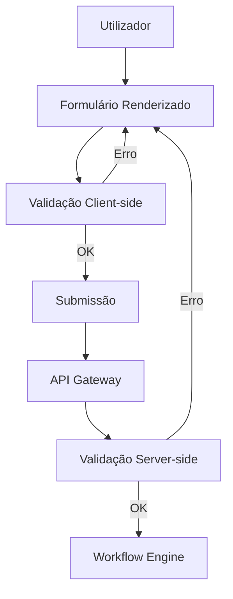

# Plataforma — Formulários

## Propósito

Gerir os formulários dinâmicos da Junta Observatory Platform, permitindo a configuração de formulários para cada serviço sem necessidade de desenvolvimento.

## Responsabilidades

- Definir formulários dinâmicos por serviço
- Suportar validação de campos (obrigatórios, formato, limites)
- Gerar versões de formulários
- Integrar com o motor de workflows

## Descrição Detalhada

### Componentes do Formulário

| Componente | Descrição | Validação |
|---|---|---|
| **Texto** | Campo de texto livre | Tamanho, regex |
| **Número** | Campo numérico | Min, max, casas decimais |
| **Data** | Selecção de data | Intervalo, dias úteis |
| **Selecção** | Lista de opções (dropdown) | Valor obrigatório |
| **Multi-selecção** | Checklist | Mínimo/máximo selecções |
| **Ficheiro** | Upload de documento | Tipo, tamanho, quantidade |
| **Condicional** | Grupo que aparece conforme resposta anterior | Lógica condicional |
| **Assinatura** | Assinatura digital | CMD, CC, eIDAS |

### Motor de Formulários

## Documentos Relacionados

- [02 — RF002](../02-requisitos/funcionais/rf002.md)
- [04 — Catálogo](plataforma-catalogo.md)
- [04 — Workflow](plataforma-workflow.md)
