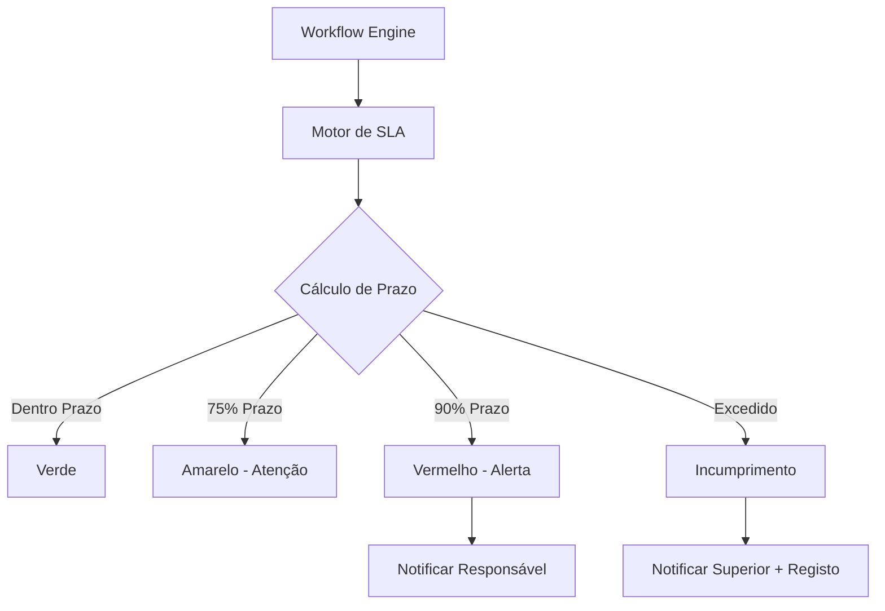

# Plataforma — SLAs

## Propósito

Definir e monitorizar os Acordos de Nível de Serviço (SLA) da Junta Observatory Platform, tanto os internos (prazos legais) como os contratuais (disponibilidade, performance).

## Responsabilidades

- Monitorizar o cumprimento de prazos legais por serviço
- Calcular métricas de SLA em tempo real
- Alertar quando um SLA está em risco de incumprimento
- Gerar relatórios de SLA

## Descrição Detalhada

### SLAs por Serviço

| Serviço | Prazo Legal | SLA Alvo | Penalidade |
|---|---|---|---|
| **Licença de Obra** | 20 dias úteis | 95% dentro do prazo | Isenção de taxa |
| **Atestado de Residência** | 10 dias úteis | 98% | — |
| **Atendimento** | Resposta inicial: 5 dias | 99% | — |
| **Recurso** | 30 dias | 90% | Resposta prioritária |

### Níveis de SLA

| Nível | Descrição | Aplicação |
|---|---|---|
| **Crítico** | Prazo legal com implicações | Todos os processos com prazo |
| **Alto** | Prazo regulatório | Prestação de contas |
| **Médio** | SLA contratual | Resposta a cidadão |
| **Baixo** | SLA interno | Tarefas administrativas |

### Monitorização

## Documentos Relacionados

- [04 — Workflow](plataforma-workflow.md)
- [04 — Dashboards](plataforma-dashboards.md)
- [14 — Qualidade](../14-qualidade/index.md)
