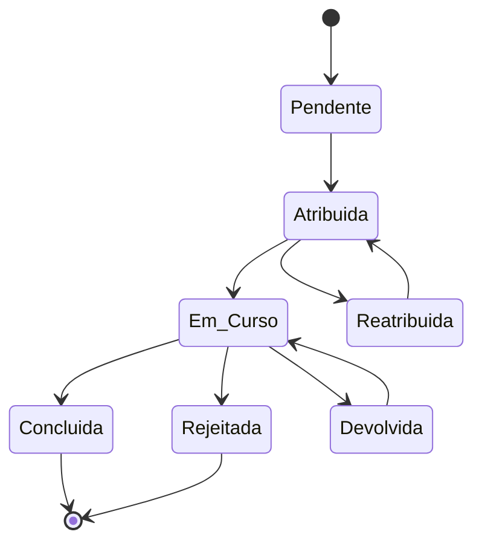

# Plataforma — Tarefas

## Propósito

Gerir o sistema de tarefas da Junta Observatory Platform, permitindo a atribuição, acompanhamento e conclusão de tarefas dentro dos workflows processuais.

## Responsabilidades

- Criar tarefas a partir do motor de workflows
- Atribuir tarefas a utilizadores ou grupos
- Gerir prazos e prioridades
- Disponibilizar filas de trabalho para funcionários

## Descrição Detalhada

### Ciclo de Vida da Tarefa

### Tipos de Tarefa

| Tipo | Descrição | Responsável |
|---|---|---|
| **Análise** | Analisar documentação submetida | Técnico |
| **Parecer** | Emitir parecer técnico | Técnico especialista |
| **Despacho** | Decidir sobre o processo | Dirigente |
| **Notificação** | Notificar cidadão | Automática |
| **Validação** | Validar documento | Técnico |
| **Pagamento** | Confirmar pagamento | Financeiro |

### Prioridades

| Prioridade | Tempo de Resposta | Cor |
|---|---|---|
| **Crítica** | < 4h | Vermelho |
| **Alta** | < 24h | Laranja |
| **Normal** | < 5 dias | Azul |
| **Baixa** | < 15 dias | Cinza |

## Documentos Relacionados

- [04 — Workflow](plataforma-workflow.md)
- [03 — Diagramas de Estado](../03-arquitetura/diagramas-de-estado.md)
- [05 — Core / Gestão de Processos](../05-dominios-negocio/core/dominio-gestao-processos/index.md)
