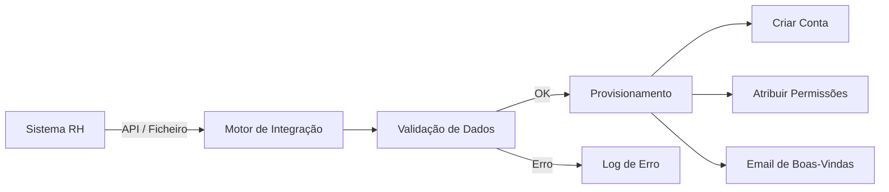

# Plataforma — Utilizadores

## Propósito

Gerir o ciclo de vida dos utilizadores na Junta Observatory Platform, incluindo registo, perfis, permissões e preferências.

## Responsabilidades

- Gerir contas de utilizador (criação, activação, suspensão, eliminação)
- Gerir perfis e permissões
- Suportar self-service para cidadãos
- Integrar com sistemas de identidade externos

## Descrição Detalhada

### Tipos de Utilizador

| Tipo | Registo | Autenticação | Perfil |
|---|---|---|---|
| **Cidadão** | Self-service (CMD/CC) | OIDC | Dados pessoais, morada, contactos |
| **Funcionário** | Provisionado (admin) | Interna + 2FA | Dados profissionais, pelouro, cargo |
| **Dirigente** | Provisionado (admin) | Interna + 2FA | Dados profissionais, responsabilidades |
| **Administrador** | Provisionado (admin global) | Interna + 2FA | Acesso total ao inquilino |

### Perfil do Utilizador

| Secção | Campos | Edição |
|---|---|---|
| **Identificação** | Nome, NIF, CC/CMD | Cidadão (self-service) |
| **Contacto** | Email, telefone, morada | Cidadão (self-service) |
| **Profissional** | Cargo, pelouro, matrícula | Admin |
| **Preferências** | Idioma, notificações, tema | Utilizador |
| **Consentimentos** | RGPD, marketing, partilha | Cidadão |
| **Segurança** | 2FA, sessões activas, histórico | Utilizador |

### Provisionamento de Funcionários

## Documentos Relacionados

- [03 — Gestão de Identidade](../03-arquitetura/gestao-de-identidade.md)
- [03 — Autenticação](../03-arquitetura/autenticacao.md)
- [03 — Autorização](../03-arquitetura/autorizacao.md)
- [01 — Mapeamento de Atores](../01-analise-de-negocio/mapeamento-atores.md)
