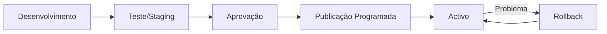

# Plataforma — Versões

## Propósito

Gerir o versionamento de configurações, workflows, formulários e catálogos na Junta Observatory Platform, garantindo a rastreabilidade de alterações e a capacidade de rollback.

## Responsabilidades

- Versionar todas as configurações mutáveis (workflows, formulários, catálogos)
- Suportar publicação programada de novas versões
- Permitir rollback para versões anteriores
- Auditar o histórico de alterações

## Descrição Detalhada

### Itens Versionados

| Item | Estratégia | Retenção |
|---|---|---|
| **Workflows** | Semântico (major.minor.patch) | Últimas 10 versões |
| **Formulários** | Semântico | Últimas 10 versões |
| **Catálogo de Serviços** | Semântico | Últimas 5 versões |
| **Templates de Notificação** | Hash (git-like) | Últimas 20 versões |
| **Regras de Negócio** | Semântico | Últimas 10 versões |
| **Configuração do Inquilino** | Snapshot | Últimos 30 dias |

### Publicação

## Documentos Relacionados

- [04 — Workflow](plataforma-workflow.md)
- [04 — Catálogo](plataforma-catalogo.md)
- [04 — Formulários](plataforma-formularios.md)
- [12 — CI/CD](../12-desenvolvimento/index.md)
