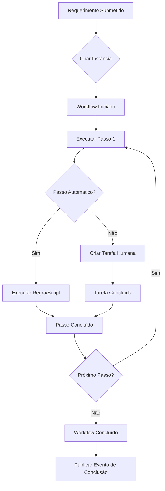

# Serviço: Motor de Workflows

## Descrição

Serviço central que modela, executa, versiona e monitoriza workflows de processo. Implementa o motor de execução baseado em máquinas de estado, com suporte para passos humanos, automáticos, condições, paralelismo, prazos e notificações.

## Objectivo

Permitir que cada Junta de Freguesia modele e execute digitalmente todos os seus processos internos, garantindo rastreabilidade, cumprimento de prazos legais e melhoria contínua.

## Inputs

- Definição do workflow (modelo BPMN simplificado via UI Builder)
- Comando de início de instância (submissão de pedido)
- Comandos de execução (avançar passo, decidir, delegar)
- Eventos externos (resposta de cidadão, parecer de entidade)

## Outputs

- Instância de workflow executada com histórico completo
- Eventos de transição de estado publicados no event store
- Tarefas criadas e atribuídas a responsáveis
- Notificações emitidas em pontos definidos do workflow
- Métricas de execução (tempo por passo, duração total)

## Workflow

## Tarefas

| Tarefa | Descrição | Executor |
|---|---|---|
| Modelar workflow | Criar/editar diagrama de workflow | Administrador |
| Publicar versão | Publicar nova versão de workflow | Administrador |
| Iniciar instância | Iniciar nova instância de workflow | Sistema (trigger) |
| Executar passo manual | Concluir passo com intervenção humana | Utilizador responsável |
| Delegar passo | Transferir responsabilidade de passo | Responsável |
| Suspender workflow | Suspender instância temporariamente | Administrador |
| Cancelar workflow | Cancelar instância definitivamente | Administrador |

## Subtarefas

| Subtarefa | Da Tarefa | Descrição |
|---|---|---|
| Validar dados de entrada | Executar passo manual | Verificar se inputs são válidos |
| Solicitar esclarecimento | Executar passo manual | Pedir info adicional ao cidadão |
| Emitir parecer | Executar passo manual | Elaborar parecer técnico |
| Registar decisão | Executar passo manual | Registar despacho |

## Responsáveis

| Função | Responsabilidades |
|---|---|
| Administrador | Modelar, publicar, gerir versões, suspender/cancelar |
| Chefe de Departamento | Validar workflows, delegar passos críticos |
| Funcionário | Executar passos manuais, concluir tarefas |
| Sistema | Executar passos automáticos, iniciar instâncias, emitir eventos |

## Documentos Necessários

- Definição do workflow (modelo BPMN/JSON)
- Regras de negócio para passos automáticos
- Matriz de responsabilidades por passo

## Documentos Gerados

- Diagrama do workflow (exportável para BPMN, PNG, SVG)
- Histórico de execução da instância
- Relatório de desempenho do workflow

## Pontos de Decisão

| Ponto | Decisão | Responsável |
|---|---|---|
| Início do workflow | Que versão do workflow usar? | Sistema (versão activa) |
| Passo condicional | Qual caminho seguir? | Sistema (avalia condição) |
| Passo humano | Aprovar ou rejeitar? | Utilizador responsável |
| Deadline | O que fazer se o prazo expirar? | Sistema (regra configurada) |

## Riscos

| Risco | Impacto | Mitigação |
|---|---|---|
| Workflow mal modelado (loop infinito) | Instância nunca conclui | Validação ao publicar; limite de execuções |
| Passo sem responsável atribuído | Instância parada | Validação ao publicar; alerta ao administrador |
| Condição ambígua | Caminho incorrecto | Testes de workflow antes de publicar |
| Timeout em passo humano | Atraso no processo | Escalação automática após deadline |

## Excepções

| Excepção | Tratamento |
|---|---|
| Passo sem responsável | Notificar administrador; atribuir a chefe de departamento |
| Instância parada > prazo | Escalação automática; notificar superior |
| Erro em passo automático | Log de erro; notificar administrador; instância suspensa |
| Workflow cancelado | Registar motivo; notificar interessados; publicar evento |

## SLAs

| Métrica | SLA | Medição |
|---|---|---|
| Duração total do workflow | Conforme prazo legal do serviço | Por instância |
| Resposta em passo humano | ≤ 5 dias úteis | Por passo |
| Execução de passo automático | ≤ 1 segundo | Por execução |
| Disponibilidade do motor | 99.9% | Mensal |

## Métricas

- Número de instâncias iniciadas/concluídas/canceladas (por período)
- Duração média, mediana e percentis (p50, p95, p99) por workflow
- Taxa de cumprimento de prazo por workflow
- Topologia de transições (caminhos mais frequentes)
- Gargalos por passo (tempo médio em cada passo)

## KPIs

| KPI | Fórmula | Meta |
|---|---|---|
| Taxa de conclusão no prazo | Instâncias no prazo / total | ≥ 90% |
| Tempo médio de processo | Soma duração / nº instâncias | Reduzir 10% trimestre |
| Taxa de automação | Passos automáticos / total | ≥ 30% |
| Taxa de instâncias canceladas | Canceladas / iniciadas | ≤ 5% |

## Eventos

| Evento | Trigger | Payload |
|---|---|---|
| `workflow.iniciado` | Instância criada | workflowId, versão, input |
| `workflow.passo.iniciado` | Passo começa | instanciaId, passoId |
| `workflow.passo.concluido` | Passo termina | instanciaId, passoId, output |
| `workflow.suspenso` | Suspensão | instanciaId, motivo |
| `workflow.concluido` | Conclusão | instanciaId, resultado |
| `workflow.cancelado` | Cancelamento | instanciaId, motivo |
| `workflow.deadline.excedido` | Prazo expirado | instanciaId, passoId |

## Auditoria

- Cada transição de estado é registada como evento imutável no event store
- Cada modificação ao modelo de workflow é versionada
- Cada decisão humana é registada com timestamp e identificação do responsável
- O log de auditoria inclui: quem, quando, o quê, em que instância, valores anteriores/novos

## Possíveis Automações

| Automação | Trigger | Acção |
|---|---|---|
| Criação automática de processo | Submissão de formulário | Iniciar instância de workflow |
| Atribuição automática de tarefa | Passo inicia | Atribuir a responsável (round-robin, competência) |
| Envio de notificação | Transição de estado | Notificar responsável/interessado |
| Escalação de prazo | Deadline excedido | Reatribuir a superior hierárquico |
| Arquivamento automático | Workflow concluído há 30 dias | Mover para arquivo definitivo |

## Oportunidades IA

| Oportunidade | Descrição | Impacto |
|---|---|---|
| Sugestão de próximo passo | IA sugere o próximo passo com base no contexto | Redução de erros |
| Predição de duração | IA prevê duração total com base em dados históricos | Planeamento |
| Detecção de desvios | IA detecta instâncias que fogem ao padrão esperado | Qualidade |
| Recomendação de optimização | IA sugere alterações ao workflow para reduzir TAT | Melhoria contínua |
| Geração automática de workflow | IA gera workflow a partir de descrição textual | Produtividade |

## Documentos Relacionados

- [RF-002 — Motor de Workflows](../02-requisitos/funcionais/rf002-motor-de-workflows.md)
- [03 — Arquitectura / Event Sourcing](../03-arquitetura/event-sourcing.md)
- [Plataforma — Tarefas](plataforma-tarefas.md)
- [Plataforma — Automação](plataforma-automacao.md)
- [06 — Dados / Workflow](../06-dados/servicos/entidade-workflow.md)
