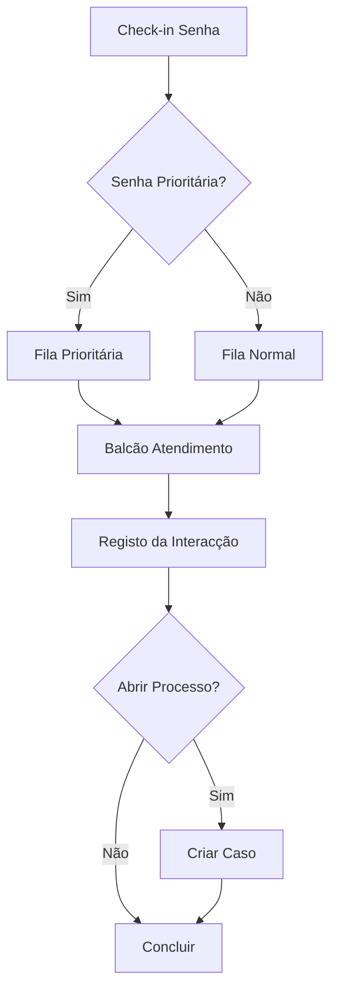

# Atendimento — Fluxos de Trabalho

## Fluxos

| Workflow | Descrição |
|---|---|
| **atendimento-presencial** | Atendimento presencial com senha e fila |
| **atendimento-telefonico** | Atendimento por chamada telefónica |
| **atendimento-digital** | Resposta a pedido submetido online |
| **gestao-reclamacao** | Registo e tratamento de reclamações |

### Fluxo de Atendimento Presencial

## Documentos Relacionados

- [Processos](processos.md)
- [04 — Workflow](../../../04-servicos-plataforma/plataforma-workflow.md)
