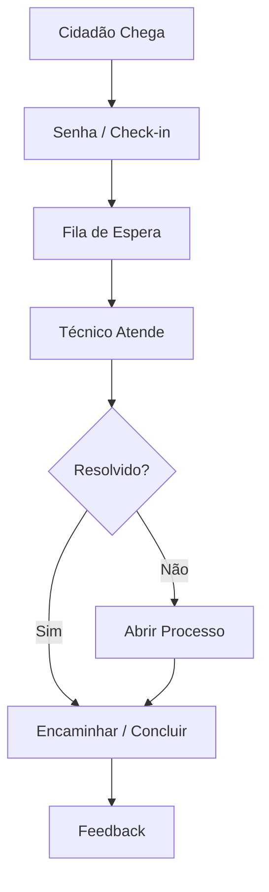

# Atendimento — Processos

## Processos

| Processo | Descrição | Gatilho |
|---|---|---|
| **Atendimento Presencial** | Atendimento na loja de cidadão / junta | Cidadão presencial |
| **Atendimento Telefónico** | Atendimento por chamada telefónica | Chamada recebida |
| **Atendimento Digital** | Pedido submetido via portal | Formulário online |
| **Agendamento** | Marcação de atendimento presencial | Cidadão agenda |
| **Reclamação** | Registo e tratamento de reclamação | Cidadão reclama |
| **Sugestão** | Registo de sugestão | Cidadão sugere |

### Atendimento Presencial

## Documentos Relacionados

- [Serviços](servicos.md)
- [Tarefas](tarefas.md)
- [Fluxos de Trabalho](fluxos-de-trabalho.md)
