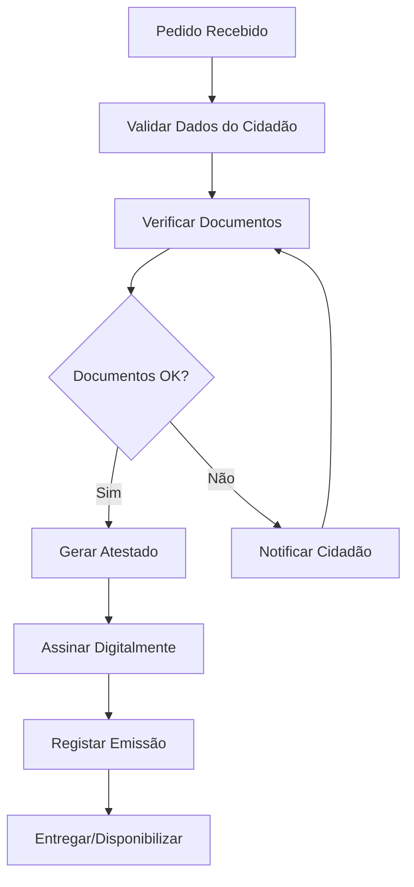

# Atestados — Fluxos de Trabalho

## Fluxos

| Workflow | Descrição |
|---|---|
| **atestado-residencia** | Emissão de atestado de residência |
| **atestado-vida** | Emissão de atestado de vida |
| **atestado-insuficiencia-economica** | Emissão de atestado de insuficiência económica |
| **declaracao-generica** | Emissão de declaração |

### Fluxo de Emissão

## Documentos Relacionados

- [04 — Workflow](../../../04-servicos-plataforma/plataforma-workflow.md)
