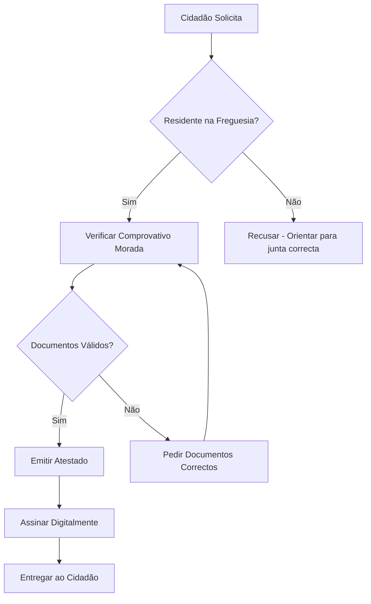

# Atestados — Processos

## Processos

| Processo | Descrição | Prazo |
|---|---|---|
| **Emissão de Atestado de Residência** | Comprovar morada na freguesia | 3 dias úteis |
| **Emissão de Atestado de Vida** | Comprovar que está vivo | Imediato |
| **Emissão de Atestado de Insuficiência Económica** | Comprovar baixos rendimentos | 5 dias úteis |
| **Emissão de Declaração** | Declaração genérica | 1 dia útil |
| **Segunda Via** | Reemissão de atestado | 1 dia útil |

### Emissão de Atestado de Residência

## Documentos Relacionados

- [Serviços](servicos.md)
- [Tarefas](tarefas.md)
