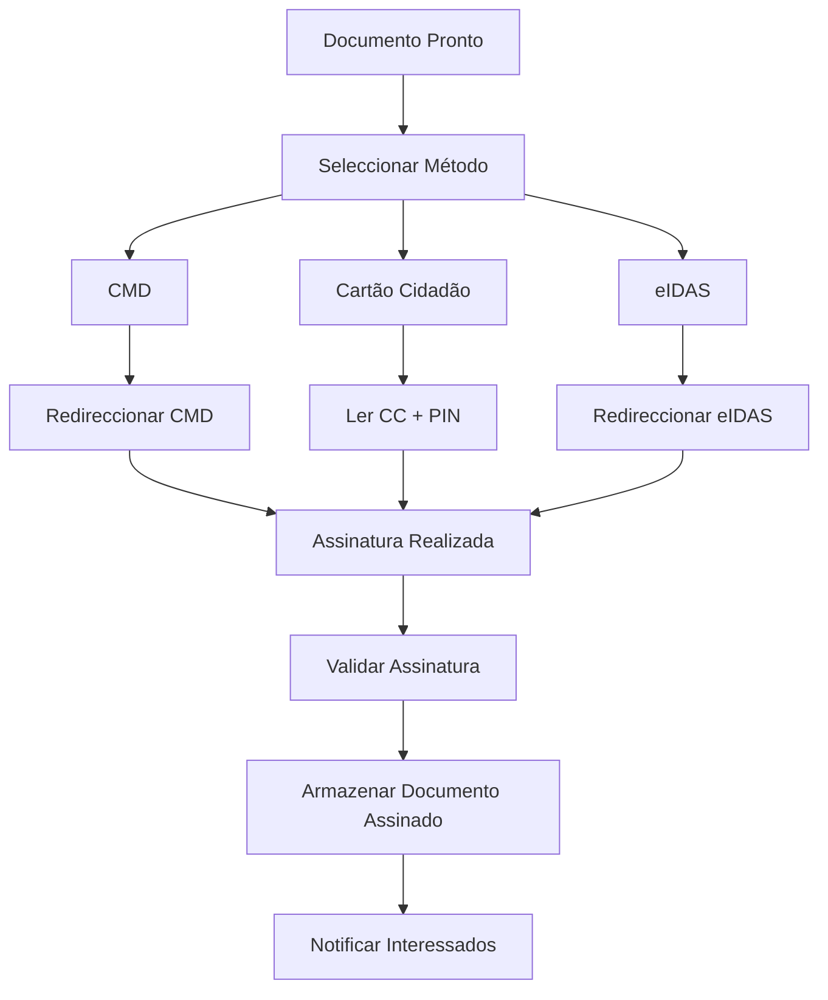

# Documentos — Fluxos de Trabalho

## Fluxos

| Workflow | Descrição |
|---|---|
| **upload-documento** | Submissão, validação e processamento |
| **assinatura-digital** | Assinatura com CMD/CC/eIDAS |
| **partilha-externa** | Partilha com entidades externas |
| **eliminacao-programada** | Eliminação conforme política de retenção |

### Fluxo de Assinatura Digital

## Documentos Relacionados

- [04 — Workflow](../../../04-servicos-plataforma/plataforma-workflow.md)
