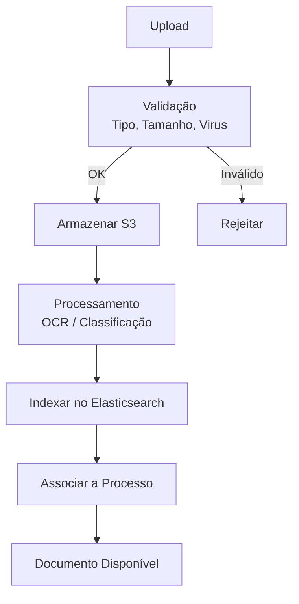

# Documentos — Processos

## Processos

| Processo | Descrição |
|---|---|
| **Upload de Documento** | Submissão de documento por cidadão ou funcionário |
| **Processamento de Documento** | OCR, classificação, extração de metadados |
| **Assinatura Digital** | Assinatura com CMD, CC ou eIDAS |
| **Partilha de Documento** | Disponibilização a terceiros autorizados |
| **Eliminação de Documento** | Eliminação conforme política de retenção |

### Upload e Processamento

## Documentos Relacionados

- [Serviços](servicos.md)
- [04 — Documentos](../../../04-servicos-plataforma/plataforma-documentos.md)
