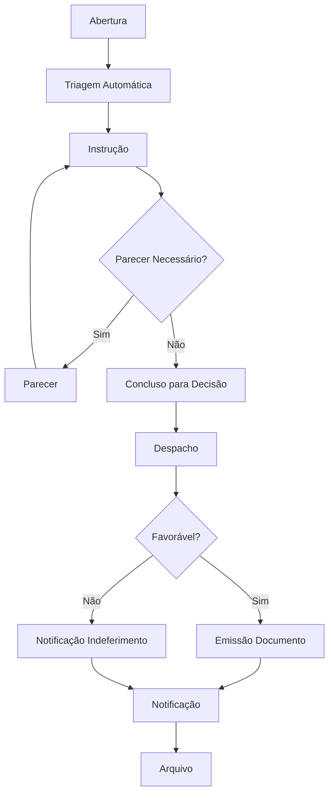

# Gestão de Processos — Fluxos de Trabalho

## Fluxos

| Workflow | Descrição |
|---|---|
| **processo-generico** | Workflow genérico para processos administrativos |
| **processo-urgente** | Workflow com prazos reduzidos (urgência) |
| **processo-simplificado** | Workflow simplificado (instrução mínima) |
| **recurso** | Workflow de recurso hierárquico |

### Fluxo Genérico

## Documentos Relacionados

- [04 — Workflow](../../../04-servicos-plataforma/plataforma-workflow.md)
- [03 — Diagramas de Estado](../../../03-arquitetura/diagramas-de-estado.md)
