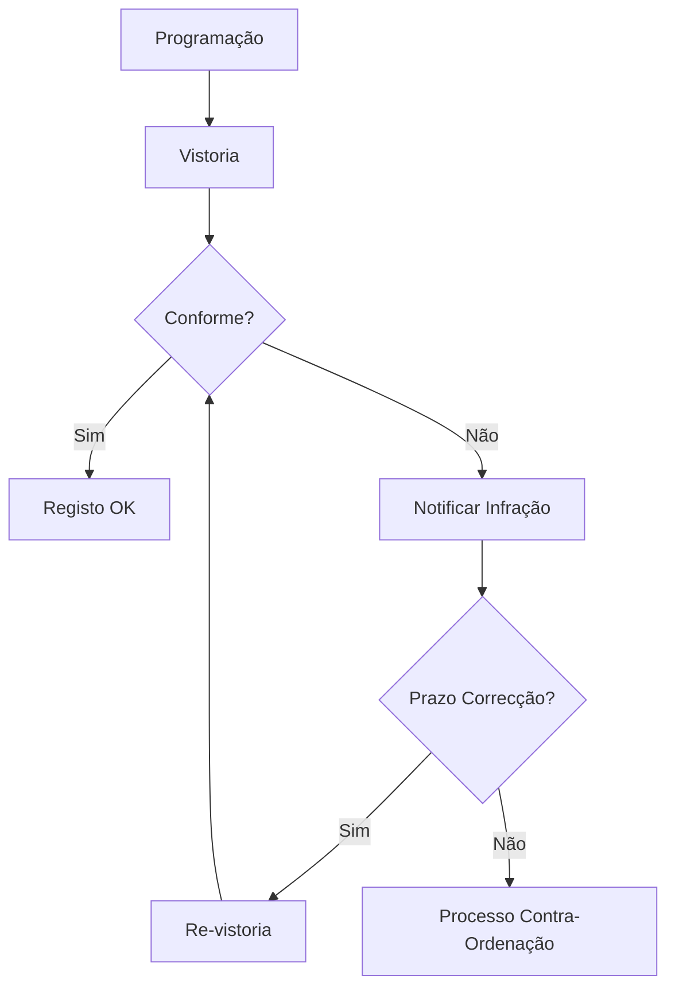

# Licenciamento — Fluxos de Trabalho

## Fluxos

| Workflow | Descrição |
|---|---|
| **licenca-obra-menor** | Licenciamento de obra menor (delegação na junta) |
| **licenca-obra-maior** | Licenciamento de obra maior (parecer CM) |
| **ocupacao-via-publica** | Ocupação de via pública |
| **actividades-eventuais** | Licenciamento de actividades eventuais |
| **publicidade** | Licenciamento de publicidade |
| **fiscalizacao** | Acções de fiscalização pós-emissão |

### Fluxo de Fiscalização

## Documentos Relacionados

- [04 — Workflow](../../../04-servicos-plataforma/plataforma-workflow.md)
